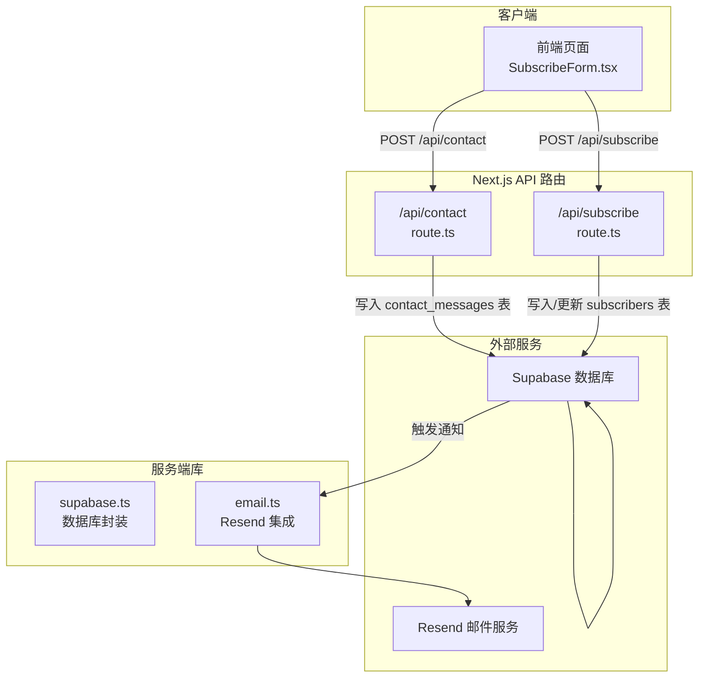
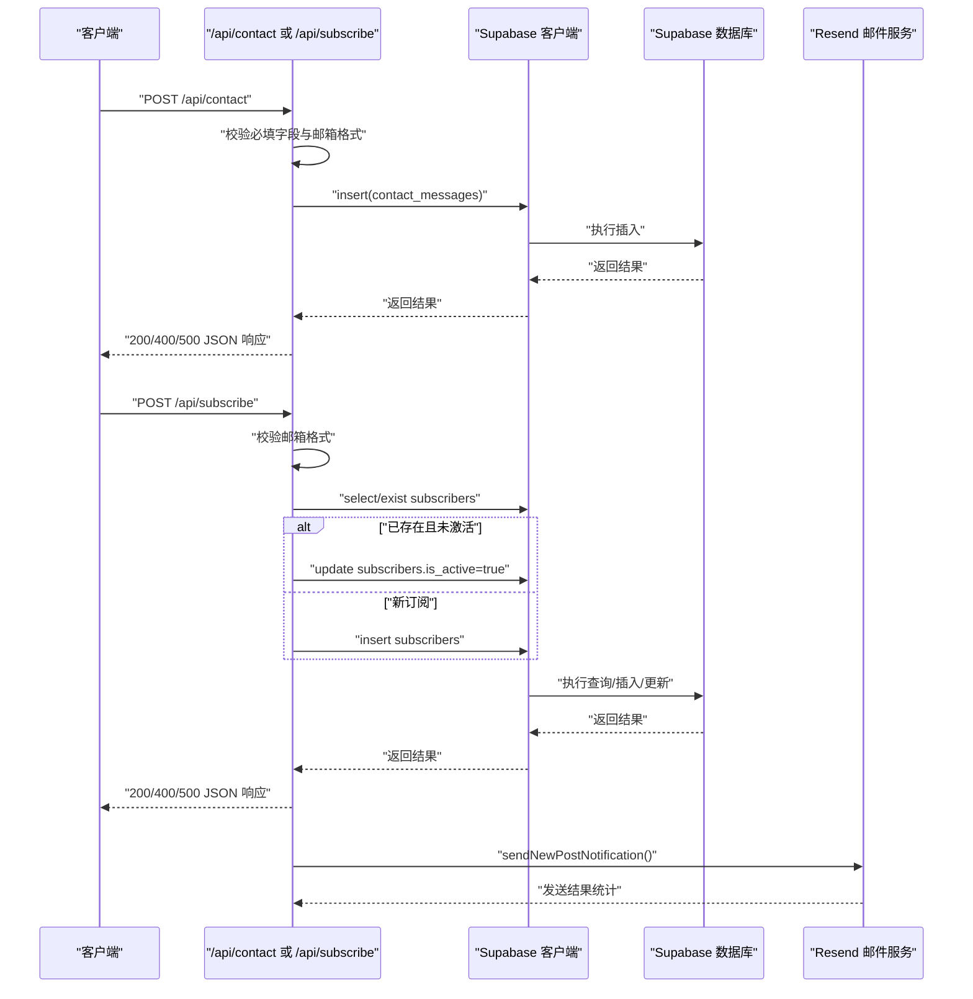
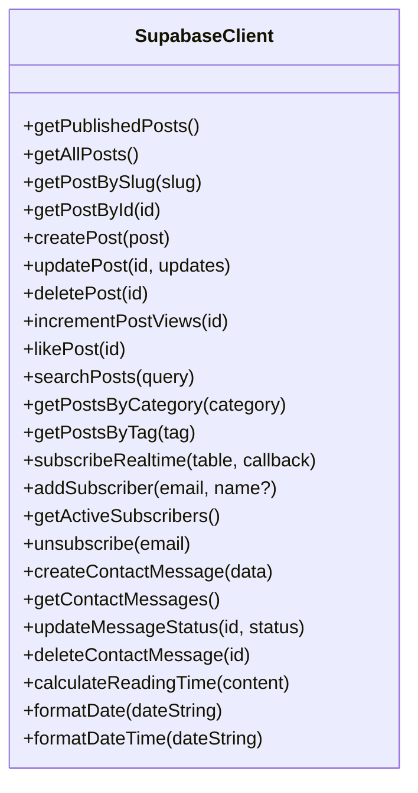
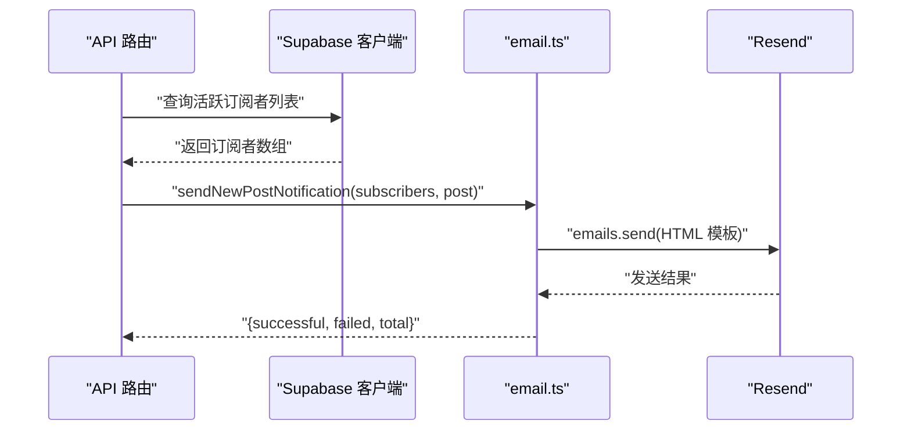
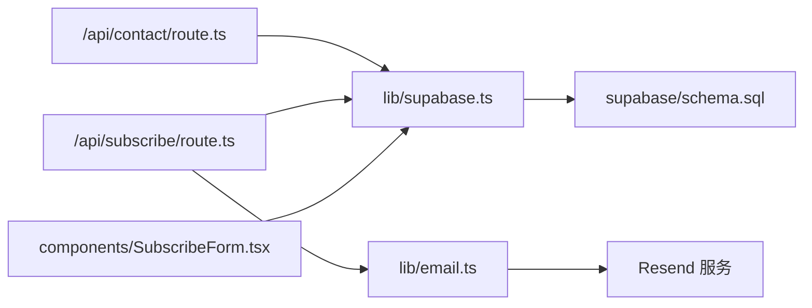

# API集成

<cite>
**本文引用的文件**
- [src/app/api/contact/route.ts](file://src/app/api/contact/route.ts)
- [src/app/api/subscribe/route.ts](file://src/app/api/subscribe/route.ts)
- [src/lib/supabase.ts](file://src/lib/supabase.ts)
- [src/lib/email.ts](file://src/lib/email.ts)
- [src/components/SubscribeForm.tsx](file://src/components/SubscribeForm.tsx)
- [next.config.ts](file://next.config.ts)
- [package.json](file://package.json)
- [supabase/schema.sql](file://supabase/schema.sql)
</cite>

## 目录
1. [简介](#简介)
2. [项目结构](#项目结构)
3. [核心组件](#核心组件)
4. [架构总览](#架构总览)
5. [详细组件分析](#详细组件分析)
6. [依赖关系分析](#依赖关系分析)
7. [性能考虑](#性能考虑)
8. [故障排查指南](#故障排查指南)
9. [结论](#结论)
10. [附录](#附录)

## 简介
本文件为博客项目的API集成文档，聚焦以下目标：
- 为/contact和/subscribe两个公开API端点提供RESTful规范说明：HTTP方法（POST/DELETE）、请求体结构（JSON格式）、响应状态码及错误处理机制。
- 详细说明supabase.ts中封装的数据库操作API，覆盖查询、插入、更新、删除方法的使用方式与行为边界。
- 说明email.ts如何集成Resend等第三方邮件服务发送通知。
- 提供安全实践建议：输入验证、速率限制、CORS配置思路。
- 提供curl示例与前端调用参考路径，帮助开发者快速集成与调试。

## 项目结构
该项目基于Next.js App Router，API路由位于src/app/api目录下；数据库访问通过src/lib/supabase.ts统一封装；邮件发送通过src/lib/email.ts集成Resend；前端订阅表单位于src/components/SubscribeForm.tsx。

图表来源
- [src/app/api/contact/route.ts](file://src/app/api/contact/route.ts#L1-L69)
- [src/app/api/subscribe/route.ts](file://src/app/api/subscribe/route.ts#L1-L145)
- [src/lib/supabase.ts](file://src/lib/supabase.ts#L1-L708)
- [src/lib/email.ts](file://src/lib/email.ts#L1-L104)

章节来源
- [src/app/api/contact/route.ts](file://src/app/api/contact/route.ts#L1-L69)
- [src/app/api/subscribe/route.ts](file://src/app/api/subscribe/route.ts#L1-L145)
- [src/lib/supabase.ts](file://src/lib/supabase.ts#L1-L708)
- [src/lib/email.ts](file://src/lib/email.ts#L1-L104)
- [src/components/SubscribeForm.tsx](file://src/components/SubscribeForm.tsx#L1-L155)
- [next.config.ts](file://next.config.ts#L1-L24)
- [package.json](file://package.json#L1-L40)

## 核心组件
- /contact REST API：接收联系表单提交，进行必填字段与邮箱格式校验，可选地写入Supabase的contact_messages表，并返回标准JSON响应。
- /subscribe REST API：接收订阅请求，进行邮箱格式校验；若Supabase可用则检查重复订阅并支持重新激活；支持DELETE取消订阅；返回标准JSON响应。
- 数据库封装（supabase.ts）：提供文章、歌单、相册、照片、日记、订阅者、联系消息等表的查询、插入、更新、删除方法；包含实时订阅通道与辅助函数。
- 邮件服务（email.ts）：通过Resend发送新文章通知与订阅确认邮件，支持批量异步发送并统计结果。

章节来源
- [src/app/api/contact/route.ts](file://src/app/api/contact/route.ts#L1-L69)
- [src/app/api/subscribe/route.ts](file://src/app/api/subscribe/route.ts#L1-L145)
- [src/lib/supabase.ts](file://src/lib/supabase.ts#L1-L708)
- [src/lib/email.ts](file://src/lib/email.ts#L1-L104)

## 架构总览
下面的序列图展示了/contact与/subscribe端点的典型调用流程，以及与数据库和邮件服务的交互。

图表来源
- [src/app/api/contact/route.ts](file://src/app/api/contact/route.ts#L1-L69)
- [src/app/api/subscribe/route.ts](file://src/app/api/subscribe/route.ts#L1-L145)
- [src/lib/supabase.ts](file://src/lib/supabase.ts#L1-L708)
- [src/lib/email.ts](file://src/lib/email.ts#L1-L104)

## 详细组件分析

### /contact 端点（REST规范）
- 方法：POST
- 路径：/api/contact
- 请求头：Content-Type: application/json
- 请求体（JSON）：
  - name: 字符串，必填
  - email: 字符串，必填，需符合邮箱格式
  - subject: 字符串，必填
  - message: 字符串，必填
- 成功响应（200）：
  - 结构：{ message: "消息已发送成功！我们会尽快回复您。" }
- 错误响应（400）：
  - 结构：{ error: "请填写所有必填字段" 或 "请输入有效的邮箱地址" }
- 错误响应（500）：
  - 结构：{ error: "保存消息失败，请稍后重试" 或 "服务器错误，请稍后重试" }
- 行为说明：
  - 若NEXT_PUBLIC_SUPABASE_URL与NEXT_PUBLIC_SUPABASE_ANON_KEY均配置，则写入contact_messages表；否则仅记录日志。
  - 写入字段包含name、email、subject、message、is_read、created_at等。
- curl示例：
  - curl -X POST http://localhost:3000/api/contact -H "Content-Type: application/json" -d '{"name":"张三","email":"zhang@example.com","subject":"咨询","message":"你好"}'

章节来源
- [src/app/api/contact/route.ts](file://src/app/api/contact/route.ts#L1-L69)
- [supabase/schema.sql](file://supabase/schema.sql#L155-L176)

### /subscribe 端点（REST规范）
- 方法：POST
  - 路径：/api/subscribe
  - 请求头：Content-Type: application/json
  - 请求体（JSON）：
    - email: 字符串，必填，需符合邮箱格式
  - 成功响应（200）：
    - 结构：{ message: "订阅成功！感谢您的关注。" }
  - 错误响应（400）：
    - 结构：{ error: "请输入邮箱地址" 或 "请输入有效的邮箱地址" 或 "该邮箱已订阅" }
  - 错误响应（500）：
    - 结构：{ error: "订阅失败，请稍后重试" 或 "服务器错误，请稍后重试" }
- 方法：DELETE
  - 路径：/api/subscribe
  - 查询参数：email（必填）
  - 成功响应（200）：
    - 结构：{ message: "已取消订阅" }
  - 错误响应（400）：
    - 结构：{ error: "请提供邮箱地址" }
  - 错误响应（500）：
    - 结构：{ error: "取消订阅失败" 或 "服务器错误" }
- 行为说明：
  - POST：若Supabase可用，先查询是否存在相同邮箱；若存在但未激活则重新激活；否则插入新订阅记录。
  - DELETE：根据email将subscribers表对应记录的is_active设为false。
- curl示例：
  - 订阅：curl -X POST http://localhost:3000/api/subscribe -H "Content-Type: application/json" -d '{"email":"user@example.com"}'
  - 取消订阅：curl -X DELETE "http://localhost:3000/api/subscribe?email=user@example.com"

章节来源
- [src/app/api/subscribe/route.ts](file://src/app/api/subscribe/route.ts#L1-L145)
- [supabase/schema.sql](file://supabase/schema.sql#L155-L176)

### 数据库API封装（supabase.ts）
- 客户端初始化：使用NEXT_PUBLIC_SUPABASE_URL与NEXT_PUBLIC_SUPABASE_ANON_KEY创建Supabase客户端实例。
- 文章相关：
  - 查询：getPublishedPosts、getAllPosts、getPostBySlug、getPostById、searchPosts、getPostsByCategory、getPostsByTag
  - 新增：createPost（自动补slug、views、likes）
  - 更新：updatePost
  - 删除：deletePost
  - 其他：incrementPostViews（RPC）、likePost（优先RPC，回退普通更新）
- 订阅者相关：
  - 新增：addSubscriber（重复邮箱抛出特定错误）
  - 查询：getActiveSubscribers
  - 取消：unsubscribe
- 联系消息相关：
  - 新增：createContactMessage
  - 查询：getContactMessages
  - 更新状态：updateMessageStatus
  - 删除：deleteContactMessage
- 实时订阅：
  - subscribeRealtime：监听指定表的变更事件
- 辅助函数：
  - calculateReadingTime：基于字符数估算阅读时长
  - formatDate/formatDateTime：本地化日期/时间格式化
  - moodIcons/weatherIcons/platformIcons：表情与图标映射

图表来源
- [src/lib/supabase.ts](file://src/lib/supabase.ts#L1-L708)

章节来源
- [src/lib/supabase.ts](file://src/lib/supabase.ts#L1-L708)

### 邮件服务集成（email.ts）
- Resend初始化：使用RESEND_API_KEY创建客户端实例。
- 功能：
  - sendNewPostNotification：向所有订阅者发送新文章通知，HTML模板内含标题、摘要、链接与取消订阅链接。
  - sendSubscriptionConfirmation：向订阅者发送订阅确认邮件。
- 返回值：sendNewPostNotification返回对象包含successful、failed、total计数，便于监控发送质量。

图表来源
- [src/app/api/subscribe/route.ts](file://src/app/api/subscribe/route.ts#L1-L145)
- [src/lib/supabase.ts](file://src/lib/supabase.ts#L318-L337)
- [src/lib/email.ts](file://src/lib/email.ts#L1-L104)

章节来源
- [src/lib/email.ts](file://src/lib/email.ts#L1-L104)
- [src/lib/supabase.ts](file://src/lib/supabase.ts#L318-L337)

### 前端集成参考
- 订阅表单（SubscribeForm.tsx）：
  - 使用addSubscriber(email)发起订阅请求，内部处理加载态、成功态与错误提示。
  - 支持inline与card两种变体，输入邮箱后提交。
- 参考调用路径：
  - 组件导入：import { addSubscriber } from '@/lib/supabase'
  - 表单提交：handleSubmit中调用addSubscriber(email.trim())

章节来源
- [src/components/SubscribeForm.tsx](file://src/components/SubscribeForm.tsx#L1-L155)
- [src/lib/supabase.ts](file://src/lib/supabase.ts#L306-L319)

## 依赖关系分析
- 外部依赖：
  - @supabase/supabase-js：数据库访问与实时订阅
  - resend：邮件发送
  - next：App Router API 路由
- 项目内依赖：
  - /api/* 路由依赖supabase.ts进行数据库操作
  - email.ts被API层调用以发送通知
  - SubscribeForm.tsx调用supabase.ts的addSubscriber进行前端订阅

图表来源
- [src/app/api/contact/route.ts](file://src/app/api/contact/route.ts#L1-L69)
- [src/app/api/subscribe/route.ts](file://src/app/api/subscribe/route.ts#L1-L145)
- [src/lib/supabase.ts](file://src/lib/supabase.ts#L1-L708)
- [src/lib/email.ts](file://src/lib/email.ts#L1-L104)
- [src/components/SubscribeForm.tsx](file://src/components/SubscribeForm.tsx#L1-L155)
- [supabase/schema.sql](file://supabase/schema.sql#L1-L354)

章节来源
- [package.json](file://package.json#L1-L40)
- [next.config.ts](file://next.config.ts#L1-L24)

## 性能考虑
- 数据库查询：
  - 使用索引与排序（如按published_at、created_at）减少扫描成本。
  - 复合条件查询（如contains、ilike）可能较慢，建议在高频场景下配合缓存或分页。
- RPC函数：
  - increment_post_views与increment_post_likes通过RPC原子更新，避免竞态；若数据库不支持RPC，代码回退到普通更新。
- 邮件发送：
  - sendNewPostNotification使用Promise.allSettled并发发送，提高吞吐；返回统计便于监控失败率。
- 前端：
  - SubscribeForm.tsx在提交时禁用按钮与显示加载态，改善用户体验。

[本节为通用性能建议，不直接分析具体文件]

## 故障排查指南
- /contact常见问题：
  - 缺少必填字段或邮箱格式不正确：返回400，检查请求体字段与邮箱正则。
  - Supabase写入失败：检查NEXT_PUBLIC_SUPABASE_URL与NEXT_PUBLIC_SUPABASE_ANON_KEY是否配置，查看控制台错误日志。
- /subscribe常见问题：
  - 邮箱为空或格式不正确：返回400。
  - 重复订阅且未激活：重新激活后返回200。
  - Supabase写入失败：检查数据库连接与权限策略。
  - 取消订阅失败：确认email参数与数据库记录匹配。
- 邮件发送：
  - RESEND_API_KEY未配置：sendNewPostNotification不会发送邮件。
  - HTML模板链接：确保NEXT_PUBLIC_SITE_URL配置正确，以便生成正确的文章链接与取消订阅链接。
- CORS与速率限制：
  - 当前代码未显式设置CORS与速率限制中间件。建议在生产环境通过Next.js中间件或边缘网关添加CORS白名单与限流策略，防止滥用与跨域问题。

章节来源
- [src/app/api/contact/route.ts](file://src/app/api/contact/route.ts#L1-L69)
- [src/app/api/subscribe/route.ts](file://src/app/api/subscribe/route.ts#L1-L145)
- [src/lib/email.ts](file://src/lib/email.ts#L1-L104)

## 结论
本项目提供了简洁可靠的REST API与数据库封装，结合Resend邮件服务实现了订阅通知闭环。/contact与/subscribe端点具备完善的输入校验与错误处理；supabase.ts提供了丰富的数据访问能力；email.ts支持批量通知发送。建议在生产环境中补充CORS与速率限制策略，并完善日志与监控体系以提升稳定性与可观测性。

[本节为总结性内容，不直接分析具体文件]

## 附录

### curl示例汇总
- /contact
  - curl -X POST http://localhost:3000/api/contact -H "Content-Type: application/json" -d '{"name":"张三","email":"zhang@example.com","subject":"咨询","message":"你好"}'
- /subscribe（POST）
  - curl -X POST http://localhost:3000/api/subscribe -H "Content-Type: application/json" -d '{"email":"user@example.com"}'
- /subscribe（DELETE）
  - curl -X DELETE "http://localhost:3000/api/subscribe?email=user@example.com"

### 前端调用参考路径
- 订阅表单组件：src/components/SubscribeForm.tsx
- 数据库封装：src/lib/supabase.ts
- 邮件服务：src/lib/email.ts

### 数据库表结构要点
- subscribers：email唯一、is_active布尔、subscribed_at时间戳
- contact_messages：name、email、subject、message、is_read、created_at
- posts、playlists、albums、photos、diaries、categories等详见schema.sql

章节来源
- [supabase/schema.sql](file://supabase/schema.sql#L1-L354)