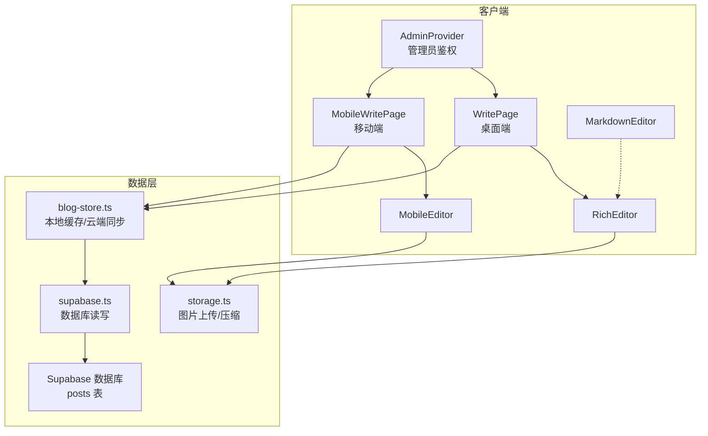
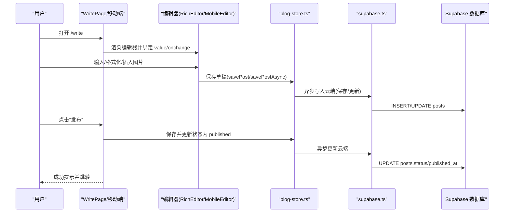
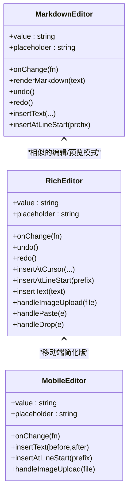
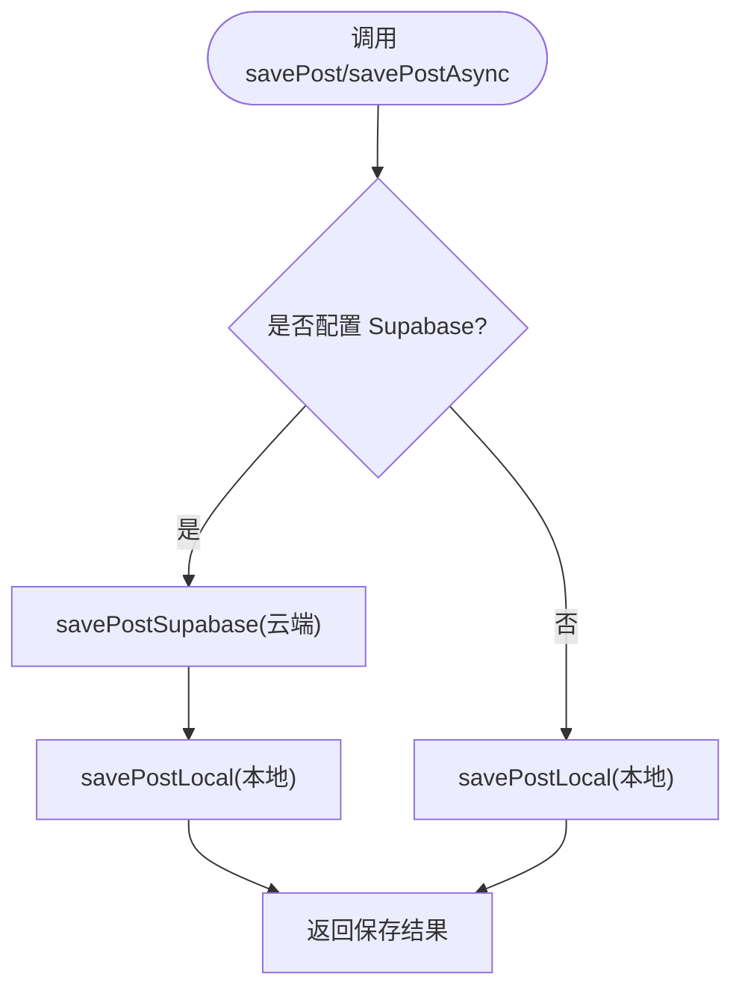
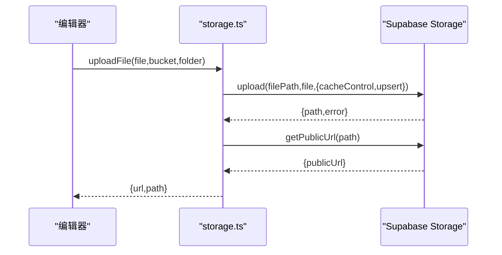
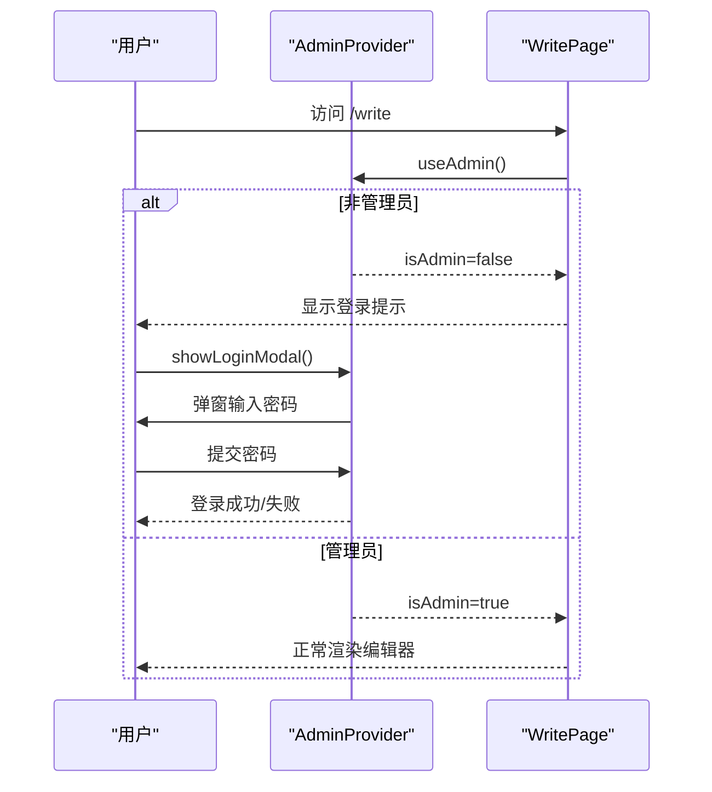
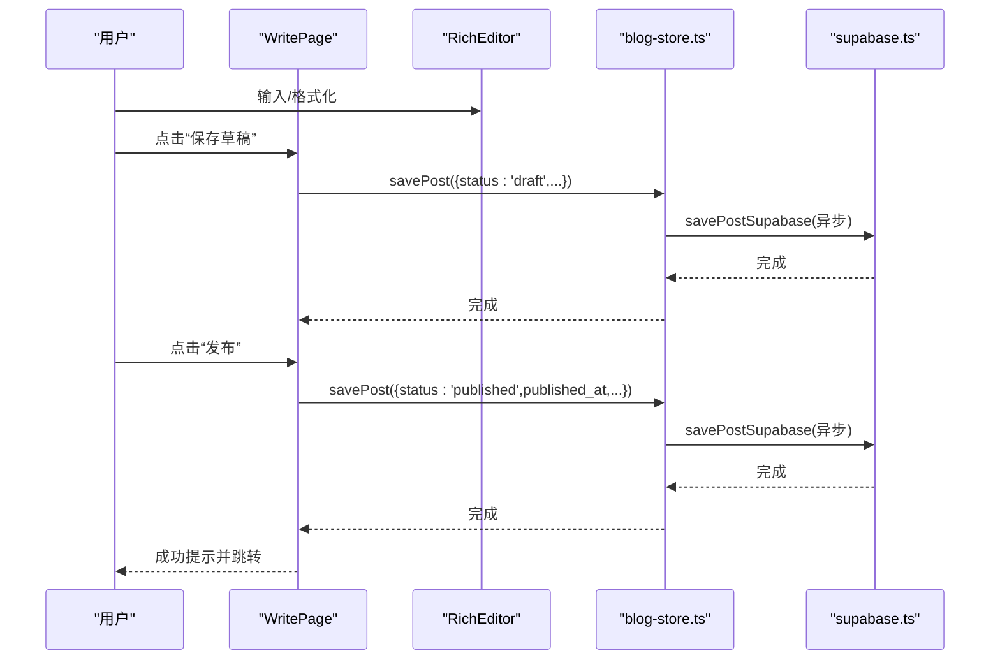
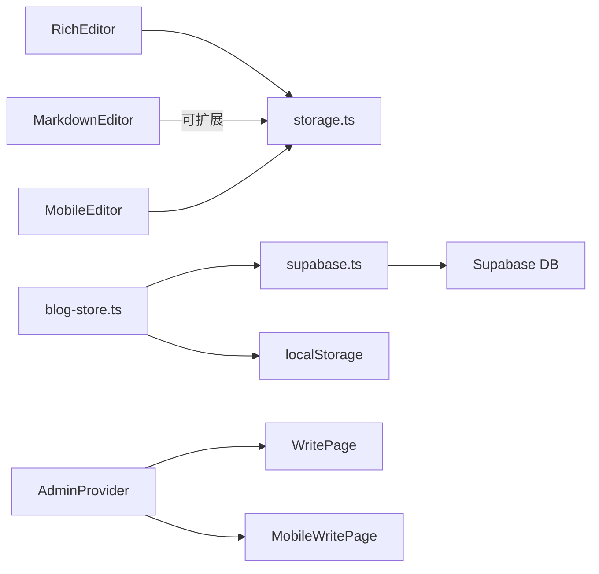

# 内容管理

<cite>
**本文引用的文件**
- [src/app/write/page.tsx](file://src/app/write/page.tsx)
- [src/app/write/mobile/page.tsx](file://src/app/write/mobile/page.tsx)
- [src/components/MarkdownEditor.tsx](file://src/components/MarkdownEditor.tsx)
- [src/components/RichEditor.tsx](file://src/components/RichEditor.tsx)
- [src/components/MobileEditor.tsx](file://src/components/MobileEditor.tsx)
- [src/lib/blog-store.ts](file://src/lib/blog-store.ts)
- [src/lib/storage.ts](file://src/lib/storage.ts)
- [src/lib/supabase.ts](file://src/lib/supabase.ts)
- [src/lib/types.ts](file://src/lib/types.ts)
- [src/components/AdminProvider.tsx](file://src/components/AdminProvider.tsx)
- [supabase/schema.sql](file://supabase/schema.sql)
</cite>

## 目录
1. [简介](#简介)
2. [项目结构](#项目结构)
3. [核心组件](#核心组件)
4. [架构总览](#架构总览)
5. [详细组件分析](#详细组件分析)
6. [依赖关系分析](#依赖关系分析)
7. [性能考量](#性能考量)
8. [故障排查指南](#故障排查指南)
9. [结论](#结论)
10. [附录](#附录)

## 简介
本文件围绕博客系统的“写文章”页面（/write）进行深入文档化，重点说明以下方面：
- MarkdownEditor 与 RichEditor 组件如何满足不同写作偏好，包括实时预览、快捷键、工具栏与富文本格式化能力
- 文章数据在 blog-store.ts 中的本地缓存与云端同步机制
- 从草稿创建、内容编辑到发布上线的完整工作流
- 版本控制与自动保存的实现细节
- 管理员用户的操作指南（文章审核、分类管理、元数据编辑）

## 项目结构
/write 页面由桌面端与移动端两套实现组成，均通过统一的数据层与权限控制协作完成内容创作与管理。

图表来源
- [src/app/write/page.tsx](file://src/app/write/page.tsx#L1-L696)
- [src/app/write/mobile/page.tsx](file://src/app/write/mobile/page.tsx#L1-L344)
- [src/components/RichEditor.tsx](file://src/components/RichEditor.tsx#L1-L669)
- [src/components/MobileEditor.tsx](file://src/components/MobileEditor.tsx#L1-L203)
- [src/lib/blog-store.ts](file://src/lib/blog-store.ts#L1-L395)
- [src/lib/storage.ts](file://src/lib/storage.ts#L1-L132)
- [src/lib/supabase.ts](file://src/lib/supabase.ts#L108-L180)
- [supabase/schema.sql](file://supabase/schema.sql#L12-L36)

章节来源
- [src/app/write/page.tsx](file://src/app/write/page.tsx#L1-L696)
- [src/app/write/mobile/page.tsx](file://src/app/write/mobile/page.tsx#L1-L344)

## 核心组件
- 写作编辑器
  - MarkdownEditor：提供 Markdown 语法支持、实时预览、快捷键、工具栏、撤销/重做与全屏模式
  - RichEditor：提供富文本格式化、快捷键、图片上传（粘贴/拖拽）、表格/代码块/链接插入、预览与全屏
  - MobileEditor：移动端轻量编辑器，支持基础 Markdown 语法与图片上传
- 数据与存储
  - blog-store.ts：统一导出本地缓存与云端同步接口；包含草稿/发布状态管理、分类信息与辅助函数
  - storage.ts：封装 Supabase Storage 的上传、压缩、删除与公共 URL 获取
  - supabase.ts：封装 Supabase 数据库 posts 表的查询、创建、更新、删除与视图计数 RPC
- 权限控制
  - AdminProvider：管理员登录态管理与弹窗，仅管理员可发布文章

章节来源
- [src/components/MarkdownEditor.tsx](file://src/components/MarkdownEditor.tsx#L1-L281)
- [src/components/RichEditor.tsx](file://src/components/RichEditor.tsx#L1-L669)
- [src/components/MobileEditor.tsx](file://src/components/MobileEditor.tsx#L1-L203)
- [src/lib/blog-store.ts](file://src/lib/blog-store.ts#L1-L395)
- [src/lib/storage.ts](file://src/lib/storage.ts#L1-L132)
- [src/lib/supabase.ts](file://src/lib/supabase.ts#L108-L180)
- [src/components/AdminProvider.tsx](file://src/components/AdminProvider.tsx#L1-L166)

## 架构总览
/write 页面采用“编辑器组件 + 数据层 + 权限控制”的分层设计：
- 编辑器组件负责输入与格式化，RichEditor 提供富文本体验，MarkdownEditor 提供纯文本 Markdown 体验
- 数据层通过 blog-store.ts 统一管理本地缓存与云端同步，优先使用本地缓存，同时异步同步至 Supabase
- 权限控制通过 AdminProvider 保证只有管理员可发布文章
- 图片上传通过 storage.ts 与 Supabase Storage 协作，支持压缩与粘贴/拖拽

图表来源
- [src/app/write/page.tsx](file://src/app/write/page.tsx#L120-L206)
- [src/app/write/mobile/page.tsx](file://src/app/write/mobile/page.tsx#L79-L151)
- [src/lib/blog-store.ts](file://src/lib/blog-store.ts#L280-L337)
- [src/lib/supabase.ts](file://src/lib/supabase.ts#L147-L177)
- [supabase/schema.sql](file://supabase/schema.sql#L12-L36)

## 详细组件分析

### 写作编辑器组件对比
- MarkdownEditor
  - 功能要点：工具栏按钮、快捷键（Ctrl/Cmd+B/I/Z）、行首插入、撤销/重做、预览模式、全屏模式、字符/词数/阅读时长统计
  - 实时预览：基于简单 Markdown 渲染规则，将输入转换为 HTML 并在预览区渲染
  - 历史记录：维护固定长度的历史栈，支持撤销/重做
- RichEditor
  - 功能要点：富文本工具栏、快捷键（Ctrl/Cmd+B/I/K/Z）、图片上传（粘贴/拖拽/文件选择）、表格/代码块/链接插入弹窗、预览模式、全屏模式
  - 实时预览：使用 react-markdown + remark-gfm 进行 GFM 渲染
  - 历史记录：使用防抖延迟保存历史，限制最大长度
- MobileEditor
  - 功能要点：移动端工具栏、基础 Markdown 语法插入、图片上传、预览切换、键盘高度适配

图表来源
- [src/components/MarkdownEditor.tsx](file://src/components/MarkdownEditor.tsx#L1-L281)
- [src/components/RichEditor.tsx](file://src/components/RichEditor.tsx#L1-L669)
- [src/components/MobileEditor.tsx](file://src/components/MobileEditor.tsx#L1-L203)

章节来源
- [src/components/MarkdownEditor.tsx](file://src/components/MarkdownEditor.tsx#L1-L281)
- [src/components/RichEditor.tsx](file://src/components/RichEditor.tsx#L1-L669)
- [src/components/MobileEditor.tsx](file://src/components/MobileEditor.tsx#L1-L203)

### 文章数据与缓存/同步机制（blog-store.ts）
- 本地缓存
  - 使用 localStorage 存储文章集合，键为 blog_posts
  - 提供 getAllPosts/getPostById/getPublishedPosts/getDraftPosts 等本地查询接口
- 云端同步
  - 当环境变量配置了 Supabase 时，优先使用云端数据；若失败则回退到本地缓存
  - 提供 savePost/savePostAsync/deletePost/deletePostAsync 等异步接口，内部同时更新本地与云端
- 状态管理
  - 支持草稿与已发布两种状态；发布时写入 published_at
  - 提供分类信息与阅读时长计算等辅助函数
- 与数据库映射
  - Supabase posts 表字段与本地 BlogPost 结构一致，包含 slug、title、description、content、category、tags、image、cover_image、author、reading_time、status、meta_title、meta_description、views、likes、created_at、updated_at、published_at 等

图表来源
- [src/lib/blog-store.ts](file://src/lib/blog-store.ts#L280-L337)
- [src/lib/blog-store.ts](file://src/lib/blog-store.ts#L136-L191)
- [src/lib/blog-store.ts](file://src/lib/blog-store.ts#L232-L249)

章节来源
- [src/lib/blog-store.ts](file://src/lib/blog-store.ts#L1-L395)
- [supabase/schema.sql](file://supabase/schema.sql#L12-L36)

### 图片上传与压缩（storage.ts）
- 上传流程
  - 生成唯一文件名，上传至指定桶与目录
  - 获取公开 URL 并返回路径与 URL
- 压缩策略
  - 按最大宽度缩放并以指定质量输出 JPEG，减少体积
- 错误处理
  - 捕获并记录异常，返回空值或抛出错误

图表来源
- [src/lib/storage.ts](file://src/lib/storage.ts#L1-L81)
- [src/lib/storage.ts](file://src/lib/storage.ts#L83-L132)

章节来源
- [src/lib/storage.ts](file://src/lib/storage.ts#L1-L132)

### 权限控制（AdminProvider）
- 管理员登录
  - 通过弹窗输入密码，正确后写入本地存储标记
- 页面保护
  - 非管理员访问 /write 时显示登录提示与入口
- 作用范围
  - 仅在 /write 页面生效，其他页面可按需引入

图表来源
- [src/components/AdminProvider.tsx](file://src/components/AdminProvider.tsx#L1-L166)
- [src/app/write/page.tsx](file://src/app/write/page.tsx#L225-L252)

章节来源
- [src/components/AdminProvider.tsx](file://src/components/AdminProvider.tsx#L1-L166)
- [src/app/write/page.tsx](file://src/app/write/page.tsx#L225-L252)

### 写作工作流（桌面端）
- 草稿创建与保存
  - 输入标题/内容/分类/标签/封面，点击“保存草稿”触发保存逻辑
  - 保存时根据是否存在 currentPostId 决定新建或更新
  - 自动生成 slug、阅读时长，状态为 draft
- 发布流程
  - 校验标题/内容非空后，将状态更新为 published，并写入 published_at
  - 成功后跳转到博客页
- 元数据与 SEO
  - 支持 meta_title/meta_description 的编辑与预览
- 实时反馈
  - 保存/发布状态指示、上次保存时间、字数统计

图表来源
- [src/app/write/page.tsx](file://src/app/write/page.tsx#L120-L206)
- [src/lib/blog-store.ts](file://src/lib/blog-store.ts#L280-L337)
- [src/lib/supabase.ts](file://src/lib/supabase.ts#L147-L177)

章节来源
- [src/app/write/page.tsx](file://src/app/write/page.tsx#L120-L206)
- [src/lib/blog-store.ts](file://src/lib/blog-store.ts#L280-L337)

### 写作工作流（移动端）
- 草稿与发布
  - 与桌面端一致，但界面更简洁，工具更精简
- 分类选择
  - 通过底部弹窗选择分类，支持图标与标签
- 实时反馈
  - 保存/发布状态指示与通知

章节来源
- [src/app/write/mobile/page.tsx](file://src/app/write/mobile/page.tsx#L1-L344)

### 版本控制与自动保存
- 历史记录
  - MarkdownEditor：维护固定长度历史栈，支持撤销/重做
  - RichEditor：使用防抖延迟保存历史，限制最大长度
- 自动保存
  - 写作页面未内置自动保存定时器；可通过在上层组件中监听内容变化并调用保存接口实现
  - 建议在编辑器 onChange 回调中节流/防抖后触发保存，避免频繁写入

章节来源
- [src/components/MarkdownEditor.tsx](file://src/components/MarkdownEditor.tsx#L28-L81)
- [src/components/RichEditor.tsx](file://src/components/RichEditor.tsx#L33-L80)
- [src/components/RichEditor.tsx](file://src/components/RichEditor.tsx#L244-L254)

### 管理员操作指南
- 登录
  - 在 /write 页面点击“管理员登录”，输入密码后进入
- 发布文章
  - 填写标题/内容/分类/标签/封面，点击“发布”
- 元数据编辑
  - 点击“文章设置”，填写 meta_title/meta_description，并预览搜索引擎结果
- 分类管理
  - 在编辑器上方选择分类，支持 tech/design/life/thoughts
- 通知与状态
  - 保存/发布过程中显示状态指示与错误/成功提示

章节来源
- [src/components/AdminProvider.tsx](file://src/components/AdminProvider.tsx#L1-L166)
- [src/app/write/page.tsx](file://src/app/write/page.tsx#L410-L657)

## 依赖关系分析
- 编辑器依赖
  - RichEditor 依赖 storage.ts 进行图片上传与压缩
  - MarkdownEditor 与 MobileEditor 不直接依赖 storage.ts，但可扩展接入
- 数据层依赖
  - blog-store.ts 依赖 supabase.ts 与 localStorage
  - supabase.ts 依赖 supabase 客户端
- 权限依赖
  - AdminProvider 依赖本地存储进行登录态持久化

图表来源
- [src/components/RichEditor.tsx](file://src/components/RichEditor.tsx#L1-L669)
- [src/lib/storage.ts](file://src/lib/storage.ts#L1-L132)
- [src/lib/blog-store.ts](file://src/lib/blog-store.ts#L1-L395)
- [src/lib/supabase.ts](file://src/lib/supabase.ts#L108-L180)
- [src/components/AdminProvider.tsx](file://src/components/AdminProvider.tsx#L1-L166)

章节来源
- [src/lib/blog-store.ts](file://src/lib/blog-store.ts#L1-L395)
- [src/lib/supabase.ts](file://src/lib/supabase.ts#L108-L180)
- [src/lib/storage.ts](file://src/lib/storage.ts#L1-L132)

## 性能考量
- 图片上传
  - 压缩后再上传，降低带宽与存储成本
  - 上传过程显示进度，避免阻塞编辑体验
- 编辑器渲染
  - 预览区使用轻量渲染，移动端预览采用简单正则替换
  - 富文本预览使用 remark-gfm，建议在大文档场景下考虑分段渲染
- 历史记录
  - 控制历史栈长度，避免内存占用过高
- 云端同步
  - 异步写入云端，主流程不阻塞用户输入
  - 失败回退本地缓存，确保可用性

## 故障排查指南
- 发布失败
  - 检查 Supabase 配置是否正确（NEXT_PUBLIC_SUPABASE_URL/NEXT_PUBLIC_SUPABASE_ANON_KEY）
  - 查看网络请求与控制台错误日志
- 图片上传失败
  - 确认 Supabase Storage 桶权限与路径
  - 检查文件类型与大小限制
- 无法保存草稿
  - 确认本地存储可用且未被清理
  - 若云端配置存在，检查网络与认证
- 管理员登录无效
  - 确认本地存储中的 admin-token 是否存在
  - 检查密码是否正确

章节来源
- [src/lib/blog-store.ts](file://src/lib/blog-store.ts#L239-L249)
- [src/lib/storage.ts](file://src/lib/storage.ts#L1-L81)
- [src/components/AdminProvider.tsx](file://src/components/AdminProvider.tsx#L38-L70)

## 结论
/write 页面通过编辑器组件与数据层的清晰分离，提供了灵活的写作体验与可靠的后台支撑。MarkdownEditor 适合偏纯文本的作者，RichEditor 则满足富文本与多媒体需求。blog-store.ts 的本地缓存与云端同步机制确保了离线可用与一致性，配合 AdminProvider 的权限控制，形成了完整的管理员工作流。建议在现有基础上增加自动保存与版本对比功能，进一步提升协作效率与安全性。

## 附录
- 数据模型（Supabase posts 表）
  - 关键字段：id、title、slug、description、content、category、tags、image、cover_image、author、reading_time、status、meta_title、meta_description、views、likes、created_at、updated_at、published_at
- 类型定义
  - Post 接口与默认示例数据，便于演示与测试

章节来源
- [supabase/schema.sql](file://supabase/schema.sql#L12-L36)
- [src/lib/types.ts](file://src/lib/types.ts#L1-L95)