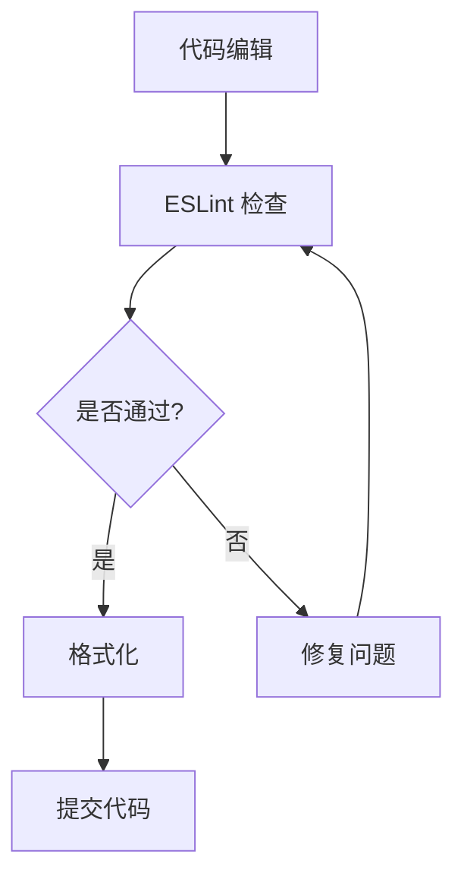
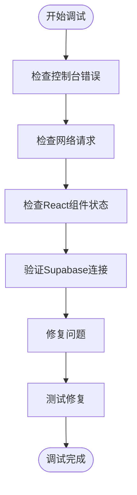

# 开发者指南

<cite>
**本文档中引用的文件**  
- [README.md](file://README.md)
- [package.json](file://package.json)
- [eslint.config.mjs](file://eslint.config.mjs)
- [next.config.ts](file://next.config.ts)
- [tsconfig.json](file://tsconfig.json)
- [src/app/page.tsx](file://src/app/page.tsx)
- [src/app/layout.tsx](file://src/app/layout.tsx)
- [src/lib/supabase.ts](file://src/lib/supabase.ts)
- [src/lib/types.ts](file://src/lib/types.ts)
- [src/components/ThemeProvider.tsx](file://src/components/ThemeProvider.tsx)
</cite>

## 目录
1. [简介](#简介)
2. [项目结构](#项目结构)
3. [环境搭建](#环境搭建)
4. [开发流程](#开发流程)
5. [代码质量与规范](#代码质量与规范)
6. [调试技巧](#调试技巧)
7. [测试策略](#测试策略)
8. [贡献流程](#贡献流程)
9. [反馈与社区参与](#反馈与社区参与)

## 简介
本指南旨在为新贡献者提供全面的入门指导，涵盖从环境配置到代码提交的完整开发流程。项目基于 Next.js 16 构建，采用现代化的前端技术栈，支持服务端渲染、静态生成和客户端交互功能。

## 项目结构

```mermaid
graph TD
A[blog-1] --> B[src/]
A --> C[supabase/]
A --> D[.gitignore]
A --> E[README.md]
A --> F[package.json]
A --> G[eslint.config.mjs]
A --> H[next.config.ts]
A --> I[tsconfig.json]
B --> J[app/]
B --> K[components/]
B --> L[lib/]
J --> M[about/]
J --> N[api/]
J --> O[blog/]
J --> P[contact/]
J --> Q[dashboard/]
J --> R[diary/]
J --> S[gallery/]
J --> T[music/]
J --> U[write/]
J --> V[globals.css]
J --> W[layout.tsx]
J --> X[page.tsx]
N --> Y[contact/]
N --> Z[subscribe/]
K --> AA[AdminProvider.tsx]
K --> AB[Animations.tsx]
K --> AC[BackgroundEffects.tsx]
K --> AD[BlogCard.tsx]
K --> AE[CodeBlock.tsx]
K --> AF[FontProvider.tsx]
K --> AG[FontSettings.tsx]
K --> AH[Footer.tsx]
K --> AI[ImageUploader.tsx]
K --> AJ[MarkdownEditor.tsx]
K --> AK[MobileEditor.tsx]
K --> AL[Navbar.tsx]
K --> AM[ParticleBackground.tsx]
K --> AN[RichEditor.tsx]
K --> AO[Sidebar.tsx]
K --> AP[SidebarContext.tsx]
K --> AQ[SubscribeForm.tsx]
K --> AR[ThemeProvider.tsx]
L --> AS[blog-store.ts]
L --> AT[email.ts]
L --> AU[storage.ts]
L --> AV[supabase-hooks.ts]
L --> AW[supabase.ts]
L --> AX[types.ts]
C --> AY[schema.sql]
```



**Diagram sources**
- [src/app/page.tsx](file://src/app/page.tsx#L1-L497)
- [src/app/layout.tsx](file://src/app/layout.tsx#L1-L100)

**Section sources**
- [src/app/page.tsx](file://src/app/page.tsx#L1-L497)
- [src/app/layout.tsx](file://src/app/layout.tsx#L1-L100)

## 环境搭建

### Node.js 版本要求
本项目需要 Node.js 18 或更高版本。建议使用 LTS 版本以确保最佳兼容性。

### 依赖安装
在项目根目录执行以下命令安装所有依赖：

```bash
npm install
```

此命令将根据 `package.json` 文件安装所有生产环境和开发环境依赖，包括：
- Next.js 16 框架核心
- React 19 和 React DOM
- Tailwind CSS 用于样式设计
- TypeScript 5 类型系统
- ESLint 代码质量检查工具

**Section sources**
- [package.json](file://package.json#L1-L40)
- [README.md](file://README.md#L1-L37)

## 开发流程

### 启动开发服务器
使用以下命令启动开发服务器：

```bash
npm run dev
```

该命令会启动 Next.js 开发服务器，默认监听 `http://localhost:3000`。开发服务器支持热重载功能，当您修改任何源文件时，页面会自动重新加载并反映最新更改。

### 热重载特性
本项目配置了完整的热模块替换（HMR）功能：
- 修改页面组件时，页面内容会即时更新而无需完全刷新
- 样式更改会立即应用到页面上
- 布局文件修改会触发整个页面的重新渲染
- API 路由更改会自动重启服务端端点

**Section sources**
- [package.json](file://package.json#L6-L7)
- [README.md](file://README.md#L5-L15)

## 代码质量与规范

### ESLint 配置
项目使用 ESLint 进行代码质量检查，配置文件位于 `eslint.config.mjs`。该配置继承了 `eslint-config-next` 的最佳实践，包括：
- Next.js 核心规则
- TypeScript 类型检查
- React 19 新特性支持
- 性能优化建议

### Prettier 集成
虽然项目未显式列出 Prettier 依赖，但通过 `eslint-config-next` 集成了代码格式化规则。所有代码提交应遵循统一的格式标准。

### 代码提交规范
为保持代码库的一致性，请遵循以下规范：
- 使用 TypeScript 编写所有新代码
- 组件文件使用 `.tsx` 扩展名
- 遵循 React 19 的函数组件和 Hooks 模式
- 使用 `@/` 别名导入 src 目录下的模块（在 `tsconfig.json` 中配置）



**Diagram sources**
- [eslint.config.mjs](file://eslint.config.mjs#L1-L19)
- [tsconfig.json](file://tsconfig.json#L1-L35)

**Section sources**
- [eslint.config.mjs](file://eslint.config.mjs#L1-L19)
- [tsconfig.json](file://tsconfig.json#L1-L35)

## 调试技巧

### 浏览器开发者工具
充分利用浏览器开发者工具进行调试：
- 使用 React DevTools 检查组件树和状态
- 通过 Network 面板监控 API 请求和响应
- 利用 Console 面板查看日志和错误信息
- 使用 Performance 面板分析页面性能

### 日志输出
在代码中使用 `console.log()` 进行调试时，请注意：
- 开发环境下可以自由使用
- 生产环境应移除或替换为适当的错误处理机制
- 对于 Supabase 相关操作，已内置错误处理和日志记录



**Diagram sources**
- [src/lib/supabase.ts](file://src/lib/supabase.ts#L1-L708)
- [src/app/page.tsx](file://src/app/page.tsx#L1-L497)

**Section sources**
- [src/lib/supabase.ts](file://src/lib/supabase.ts#L1-L708)
- [src/app/page.tsx](file://src/app/page.tsx#L1-L497)

## 测试策略

经过检查，本项目当前未包含显式的测试文件或测试框架配置。建议未来添加以下测试策略：
- 使用 Jest 和 React Testing Library 进行单元测试
- 为关键组件（如 BlogCard、Navbar）编写组件测试
- 为 Supabase 数据访问层编写集成测试
- 配置 GitHub Actions 实现持续集成

**Section sources**
- [package.json](file://package.json#L34-L35)

## 贡献流程

### 分支管理策略
采用简单的分支管理模型：
- `main` 分支：主分支，用于生产部署
- 功能分支：从 `main` 分支创建，命名格式为 `feature/功能描述`
- 修复分支：命名格式为 `fix/问题描述`

### Pull Request 流程
1. Fork 仓库到个人账户
2. 创建新的功能分支
3. 实现功能并确保代码通过 ESLint 检查
4. 提交更改并推送到远程分支
5. 在 GitHub 上创建 Pull Request
6. 等待代码审查和反馈
7. 根据反馈进行修改
8. 合并到主分支

### 代码审查要点
Pull Request 应包含：
- 清晰的标题和描述
- 相关的截图或演示（如适用）
- 测试说明
- 任何已知的限制或后续工作

**Section sources**
- [.gitignore](file://.gitignore)
- [package.json](file://package.json)

## 反馈与社区参与
我们欢迎任何形式的反馈和贡献！您可以通过以下方式参与：
- 在 GitHub 仓库中提交 Issue 报告问题或提出功能建议
- 提交 Pull Request 贡献代码
- 参与讨论和代码审查
- 分享您的使用体验

项目基于 Next.js 官方模板构建，遵循现代 Web 开发的最佳实践。感谢您对本项目的关注和贡献！

**Section sources**
- [README.md](file://README.md#L30-L31)
- [package.json](file://package.json#L2-L3)