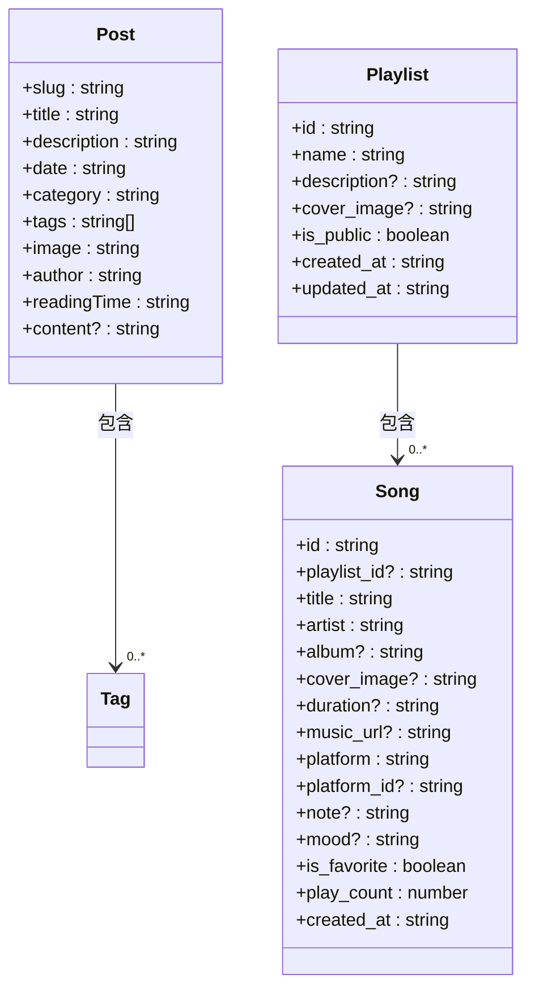
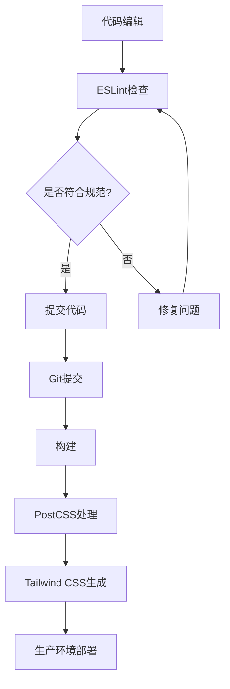

# 技术栈与依赖

<cite>
**本文档引用的文件**
- [package.json](file://package.json)
- [tsconfig.json](file://tsconfig.json)
- [next.config.ts](file://next.config.ts)
- [postcss.config.mjs](file://postcss.config.mjs)
- [eslint.config.mjs](file://eslint.config.mjs)
- [src/lib/types.ts](file://src/lib/types.ts)
- [src/lib/supabase.ts](file://src/lib/supabase.ts)
- [src/components/ThemeProvider.tsx](file://src/components/ThemeProvider.tsx)
- [src/app/layout.tsx](file://src/app/layout.tsx)
- [src/components/Animations.tsx](file://src/components/Animations.tsx)
- [src/components/MarkdownEditor.tsx](file://src/components/MarkdownEditor.tsx)
- [src/lib/supabase-hooks.ts](file://src/lib/supabase-hooks.ts)
- [src/app/blog/[slug]/page.tsx](file://src/app/blog/[slug]/page.tsx)
- [src/app/page.tsx](file://src/app/page.tsx)
</cite>

## 目录
1. [技术栈概览](#技术栈概览)
2. [Next.js 16与React 19集成优势](#nextjs-16与react-19集成优势)
3. [TypeScript类型系统](#typescript类型系统)
4. [核心依赖分析](#核心依赖分析)
5. [构建工具链配置](#构建工具链配置)
6. [依赖版本兼容性](#依赖版本兼容性)

## 技术栈概览

本项目采用现代化的全栈技术栈，以Next.js 16和React 19为核心框架，结合TypeScript提供类型安全，使用Supabase实现无服务器数据库交互。项目架构充分利用了Next.js的App Router和服务器组件特性，实现了高性能的服务器端渲染和静态生成。前端UI采用Tailwind CSS进行样式设计，配合Framer Motion实现流畅的动画效果。通过next-themes管理主题切换，react-markdown解析内容，构建了一个功能完整、性能优越的个人博客系统。

**本文档引用的文件**
- [package.json](file://package.json)
- [tsconfig.json](file://tsconfig.json)

## Next.js 16与React 19集成优势

Next.js 16与React 19的集成带来了显著的性能提升和开发体验优化。项目采用App Router架构，通过文件系统路由实现了清晰的页面结构组织。服务器组件的使用使得数据获取和渲染可以在服务器端完成，减少了客户端的JavaScript负载，提高了首屏加载速度。

App Router的嵌套路由特性在项目中得到了充分体现，如`/blog/[slug]/page.tsx`实现了动态博客文章路由，`/dashboard/page.tsx`提供了管理后台入口。这种基于文件系统的路由方式简化了路由配置，提高了代码的可维护性。

React 19的新特性，如use动作和服务器组件，使得数据获取和状态管理更加高效。在`src/app/page.tsx`中，通过服务器组件直接获取已发布的文章列表，避免了客户端的额外请求。这种架构设计不仅提升了性能，还改善了SEO效果。

**本文档引用的文件**
- [package.json](file://package.json)
- [src/app/page.tsx](file://src/app/page.tsx)
- [src/app/blog/[slug]/page.tsx](file://src/app/blog/[slug]/page.tsx)

## TypeScript类型系统

TypeScript在项目中发挥了关键的类型安全作用，通过定义清晰的接口和类型，确保了代码的健壮性和可维护性。在`src/lib/types.ts`中定义了Post接口，明确了博客文章的数据结构，包括slug、title、description等属性。

类型系统不仅用于数据模型定义，还贯穿于整个应用的开发过程。在`src/lib/supabase.ts`中，为Post、Playlist、Song等实体定义了详细的类型，确保了数据库交互的类型安全。这些类型定义在组件中被广泛引用，如`src/app/blog/[slug]/page.tsx`中的Post类型，保证了数据传递的一致性。

通过tsconfig.json的配置，项目启用了严格的类型检查模式，包括strict、noImplicitAny等选项，最大限度地减少了类型错误。路径别名`@/*`的配置简化了模块导入，提高了代码的可读性。

**图表来源**
- [src/lib/types.ts](file://src/lib/types.ts#L2-L14)
- [src/lib/supabase.ts](file://src/lib/supabase.ts#L10-L58)

**本文档引用的文件**
- [src/lib/types.ts](file://src/lib/types.ts)
- [src/lib/supabase.ts](file://src/lib/supabase.ts)
- [tsconfig.json](file://tsconfig.json)

## 核心依赖分析

### @supabase/supabase-js

@supabase/supabase-js是项目的核心依赖之一，实现了无服务器数据库交互。在`src/lib/supabase.ts`中，通过createClient创建Supabase客户端实例，封装了各种数据库操作方法。项目利用Supabase的实时功能，通过subscribeRealtime实现数据的实时同步。

数据访问层的设计遵循了良好的分层原则，将数据库操作封装在独立的模块中。getPublishedPosts、getAllPosts等函数提供了不同类型的文章获取接口，createPost、updatePost等函数实现了文章的增删改查。这种设计使得数据访问逻辑与UI组件解耦，提高了代码的可测试性和可维护性。

### framer-motion

framer-motion驱动了项目中的所有动画效果，提升了用户体验。在`src/components/Animations.tsx`中定义了多种动画变体，如fadeIn、slideUp、slideIn等，这些动画被广泛应用于页面和组件的过渡效果。

动画系统的设计体现了可复用性原则，AnimatedSection、AnimatedText等高阶组件封装了常见的动画模式。在`src/app/page.tsx`中，通过motion.div实现页面元素的渐入动画，在`src/app/blog/[slug]/page.tsx`中使用动画增强用户交互体验。

### next-themes

next-themes管理着项目的主题切换功能。在`src/components/ThemeProvider.tsx`中，通过NextThemesProvider组件提供了主题管理能力。配置中设置了attribute="class"，使得主题切换通过CSS类名实现，避免了样式闪烁问题。

主题系统支持系统级主题检测和手动切换，defaultTheme="system"的设置确保了与用户系统偏好一致。disableTransitionOnChange={false}的配置保证了主题切换时的平滑过渡效果。

### react-markdown

react-markdown负责解析和渲染Markdown内容。在`src/app/blog/[slug]/page.tsx`中，通过ReactMarkdown组件将文章内容从Markdown格式转换为HTML。配合remark-gfm插件，支持GitHub风格的Markdown语法，如表格、任务列表等。

内容解析的安全性得到了充分考虑，通过自定义components属性控制HTML标签的渲染方式。在`src/components/CodeBlock.tsx`中，为代码块提供了语法高亮支持，提升了技术文章的可读性。

**本文档引用的文件**
- [src/lib/supabase.ts](file://src/lib/supabase.ts)
- [src/components/Animations.tsx](file://src/components/Animations.tsx)
- [src/components/ThemeProvider.tsx](file://src/components/ThemeProvider.tsx)
- [src/app/blog/[slug]/page.tsx](file://src/app/blog/[slug]/page.tsx)
- [src/components/CodeBlock.tsx](file://src/components/CodeBlock.tsx)

## 构建工具链配置

### PostCSS

PostCSS配置通过postcss.config.mjs文件定义，集成了Tailwind CSS作为主要的CSS框架。配置中使用"@tailwindcss/postcss"插件，实现了Tailwind的JIT编译模式，提高了样式生成效率。

CSS架构采用功能优先的实用类方法，结合自定义的组件类名，实现了样式的高效复用。在`src/app/globals.css`中，通过@tailwind指令引入了基础、组件和实用类，构建了完整的样式体系。

### ESLint

ESLint配置在eslint.config.mjs中定义，采用了Next.js官方的配置方案。通过引入eslint-config-next/core-web-vitals和eslint-config-next/typescript，确保了代码质量和性能优化。

配置中覆盖了默认的忽略规则，明确指定了.next、out、build等构建目录的忽略模式。这种精细化的配置确保了开发环境的代码质量，同时避免了对构建产物的不必要的检查。

**图表来源**
- [postcss.config.mjs](file://postcss.config.mjs)
- [eslint.config.mjs](file://eslint.config.mjs)

**本文档引用的文件**
- [postcss.config.mjs](file://postcss.config.mjs)
- [eslint.config.mjs](file://eslint.config.mjs)

## 依赖版本兼容性

项目依赖的版本选择体现了对稳定性和新特性的平衡。Next.js 16.0.7和React 19.2.0的组合确保了对最新特性的支持，同时保持了良好的稳定性。TypeScript 5.x版本提供了最新的类型系统功能，增强了开发体验。

关键依赖的版本兼容性经过充分验证，如framer-motion 12.23.26与React 19的兼容性，react-markdown 10.1.0对最新Markdown规范的支持。开发依赖如@types/react 19与React 19的版本匹配，确保了类型定义的准确性。

升级注意事项包括：在升级Next.js版本时，需要检查App Router的API变更；升级React版本时，需关注use动作等新特性的使用方式；升级TypeScript时，需验证严格模式下的类型检查结果。建议通过渐进式升级策略，先在开发环境验证，再逐步推广到生产环境。

**本文档引用的文件**
- [package.json](file://package.json)
- [tsconfig.json](file://tsconfig.json)