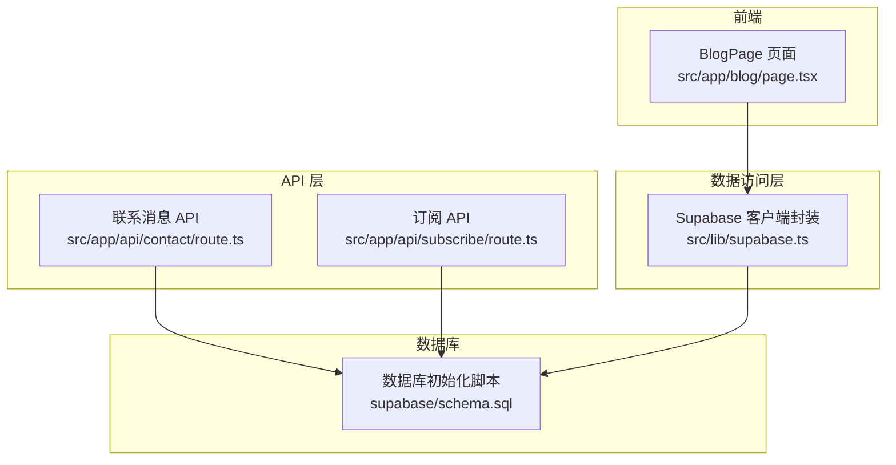
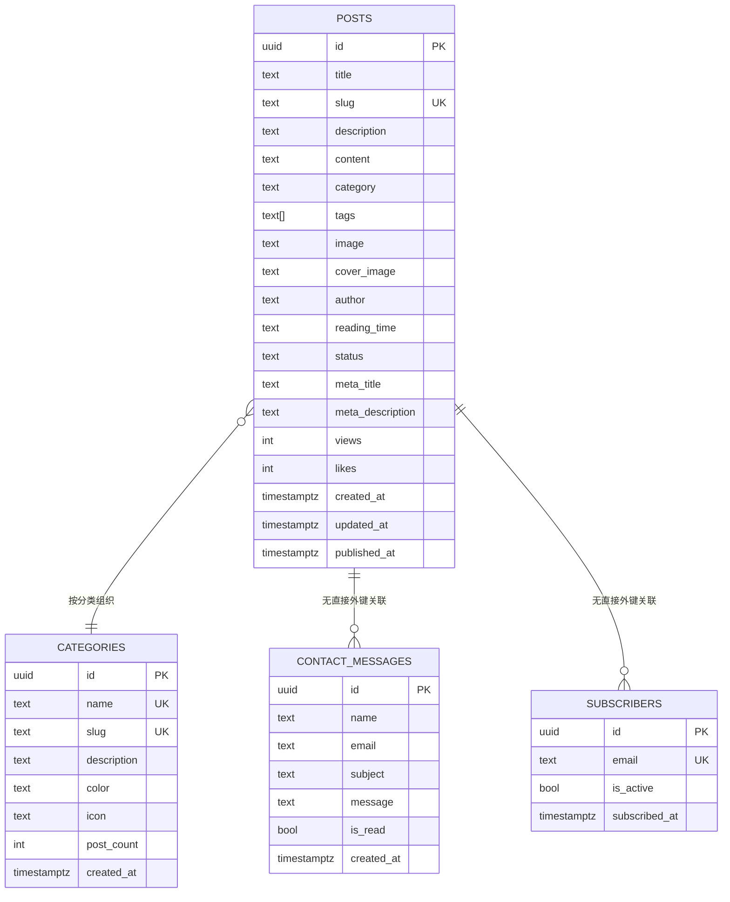
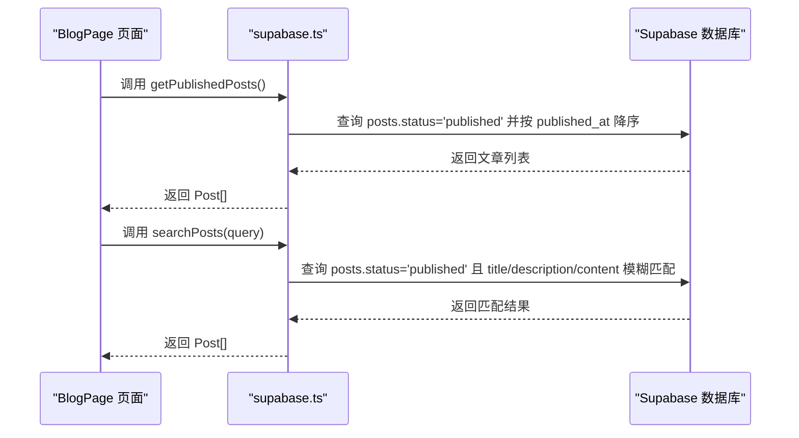
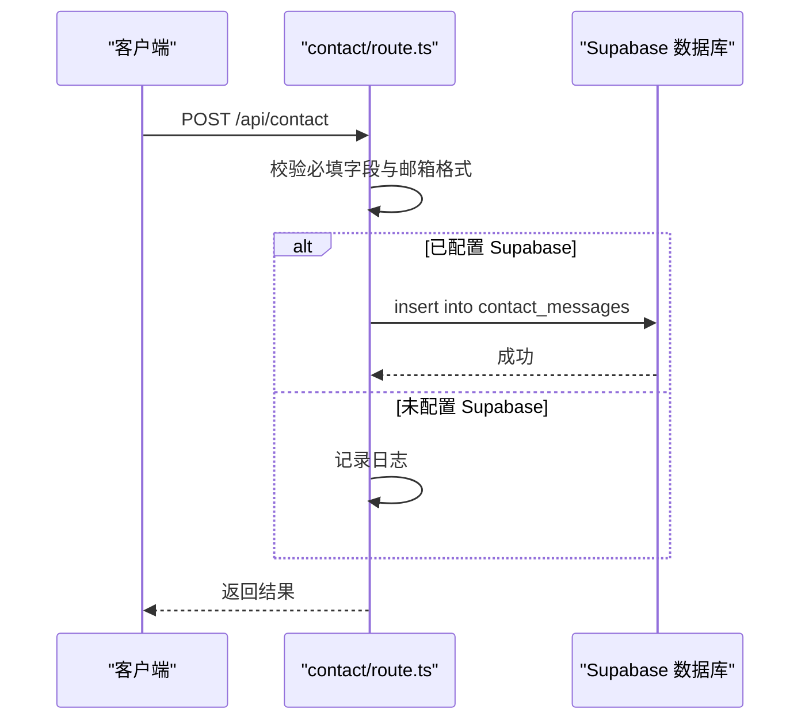
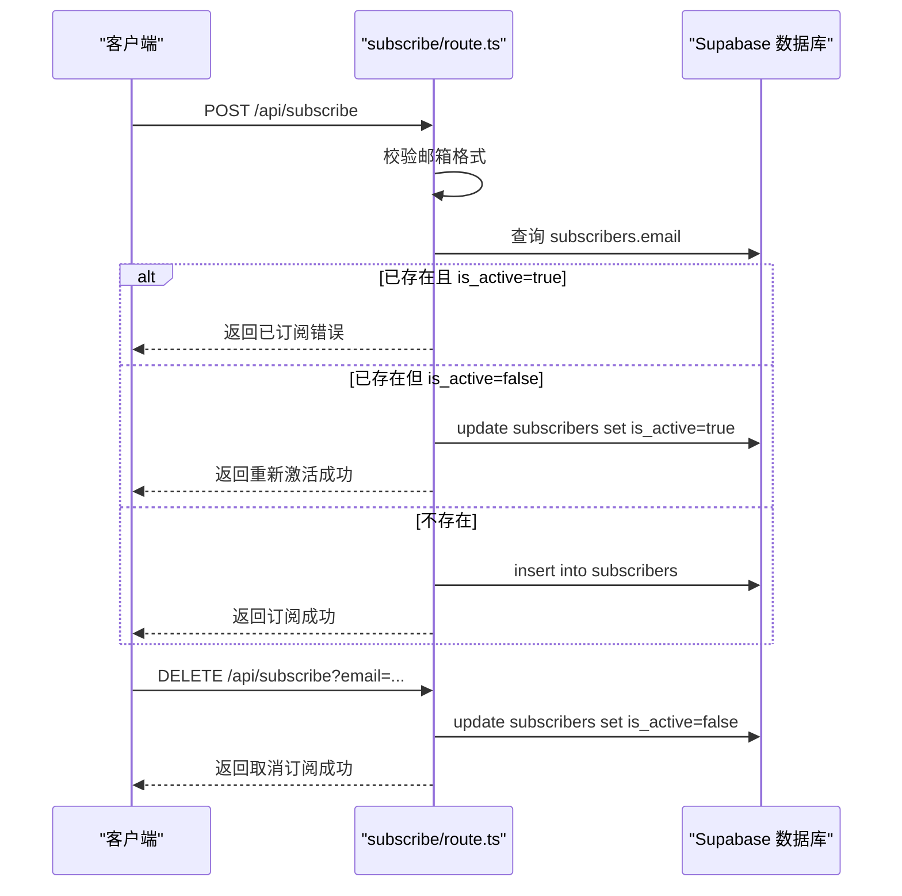
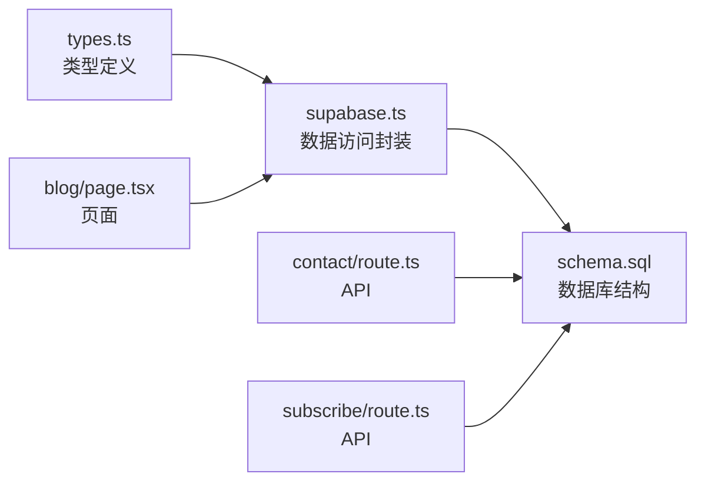

# 数据库设计

<cite>
**本文引用的文件**
- [schema.sql](file://supabase/schema.sql)
- [supabase.ts](file://src/lib/supabase.ts)
- [types.ts](file://src/lib/types.ts)
- [route.ts（联系）](file://src/app/api/contact/route.ts)
- [route.ts（订阅）](file://src/app/api/subscribe/route.ts)
- [blog/page.tsx](file://src/app/blog/page.tsx)
</cite>

## 目录
1. [简介](#简介)
2. [项目结构](#项目结构)
3. [核心数据模型](#核心数据模型)
4. [架构总览](#架构总览)
5. [组件与数据流详解](#组件与数据流详解)
6. [依赖关系分析](#依赖关系分析)
7. [性能与索引策略](#性能与索引策略)
8. [故障排查指南](#故障排查指南)
9. [结论](#结论)
10. [附录：迁移与备份恢复](#附录迁移与备份恢复)

## 简介
本文件面向数据库设计与应用集成，围绕 schema.sql 中定义的核心表（Post、ContactMessage、Subscriber 等）进行结构化说明，并结合 supabase.ts 的查询函数与前端页面的数据访问模式，解释字段语义、约束与索引策略；同时梳理 TypeScript 接口与数据库模式的映射关系，给出迁移与备份恢复建议，帮助团队在开发与运维阶段保持一致性与可维护性。

## 项目结构
- 数据库初始化脚本位于 supabase/schema.sql，包含文章、歌单、相册、日记、分类、订阅者、联系消息等表及行级安全策略（RLS）、触发器与示例数据。
- 数据访问层位于 src/lib/supabase.ts，封装了对 posts、contact_messages、subscribers 等表的 CRUD 与查询逻辑。
- 前端页面 src/app/blog/page.tsx 使用 supabase.ts 获取已发布文章并进行本地过滤与展示。
- API 层 src/app/api/contact/route.ts 与 src/app/api/subscribe/route.ts 提供联系消息提交与订阅管理的 HTTP 接口，内部可选地写入数据库。

图表来源
- [schema.sql](file://supabase/schema.sql#L1-L354)
- [supabase.ts](file://src/lib/supabase.ts#L1-L708)
- [route.ts（联系）](file://src/app/api/contact/route.ts#L1-L69)
- [route.ts（订阅）](file://src/app/api/subscribe/route.ts#L1-L145)
- [blog/page.tsx](file://src/app/blog/page.tsx#L1-L347)

章节来源
- [schema.sql](file://supabase/schema.sql#L1-L354)
- [supabase.ts](file://src/lib/supabase.ts#L1-L708)
- [blog/page.tsx](file://src/app/blog/page.tsx#L1-L347)

## 核心数据模型

### 文章表 posts
- 主键与标识：id（UUID，默认生成）
- 标题与唯一路径：title（非空），slug（唯一且非空）
- 内容与元信息：description、content、meta_title、meta_description
- 分类与标签：category（默认值）、tags（数组，默认空数组）
- 图像资源：image（默认封面）、cover_image
- 作者与阅读时长：author（默认值）、reading_time（默认值）
- 状态与时间线：status（默认 draft，检查约束仅允许 draft/published），views/likes（整数，默认 0），created_at/updated_at（时间戳，默认当前时间），published_at（发布时间）
- 索引：
  - idx_posts_slug（slug）
  - idx_posts_status（status）
  - idx_posts_category（category）

章节来源
- [schema.sql](file://supabase/schema.sql#L12-L32)
- [schema.sql](file://supabase/schema.sql#L34-L36)

### 订阅者表 subscribers
- 主键与标识：id（UUID，默认生成）
- 唯一邮箱：email（唯一且非空）
- 状态与时序：is_active（布尔，默认 true），subscribed_at（时间戳，默认当前时间）
- 约束：email 唯一

章节来源
- [schema.sql](file://supabase/schema.sql#L157-L162)

### 联系消息表 contact_messages
- 主键与标识：id（UUID，默认生成）
- 发送方信息：name、email、subject、message（均非空）
- 已读状态：is_read（布尔，默认 false）
- 时间戳：created_at（默认当前时间）
- 约束：无显式唯一约束

章节来源
- [schema.sql](file://supabase/schema.sql#L167-L175)

### 分类表 categories
- 主键与标识：id（UUID，默认生成）
- 唯一标识：name（唯一且非空）、slug（唯一且非空）
- 描述与外观：description、color、icon
- 统计字段：post_count（整数，默认 0）
- 时间戳：created_at（默认当前时间）
- 约束：name、slug 唯一

章节来源
- [schema.sql](file://supabase/schema.sql#L136-L145)

### 行级安全策略（RLS）
- 对 posts、playlists、songs、albums、photos、diaries、categories、subscribers、contact_messages 启用 RLS
- 为上述表分别创建 select/insert/update/delete 策略（示例：posts_select/posts_insert/posts_update/posts_delete 等）
- subscribers 仅允许 insert 策略，contact_messages 仅允许 insert 策略

章节来源
- [schema.sql](file://supabase/schema.sql#L247-L305)

## 架构总览
下图展示前端页面、API 层、数据访问层与数据库之间的交互关系，以及表间关系（如文章与分类）。

图表来源
- [schema.sql](file://supabase/schema.sql#L12-L32)
- [schema.sql](file://supabase/schema.sql#L136-L145)
- [schema.sql](file://supabase/schema.sql#L157-L162)
- [schema.sql](file://supabase/schema.sql#L167-L175)

## 组件与数据流详解

### 文章查询与全文搜索
- 已发布文章列表：通过 status='published' 并按 published_at 降序返回
- 全文搜索：对 title/description/content 进行模糊匹配（ilike），并按发布时间排序
- 分类过滤：按 category 字段过滤
- 标签过滤：使用 contains 判断 tags 数组包含某标签
- 浏览量与点赞：提供 RPC 函数 increment_post_views/increment_post_likes；若 RPC 不可用则回退到普通更新

图表来源
- [supabase.ts](file://src/lib/supabase.ts#L108-L208)
- [blog/page.tsx](file://src/app/blog/page.tsx#L1-L347)

章节来源
- [supabase.ts](file://src/lib/supabase.ts#L108-L208)
- [blog/page.tsx](file://src/app/blog/page.tsx#L1-L347)

### 联系消息提交流程
- 前端表单校验：必填字段与邮箱格式
- 若配置了 Supabase，则调用 insert 写入 contact_messages 表
- 若未配置，则仅记录日志

图表来源
- [route.ts（联系）](file://src/app/api/contact/route.ts#L1-L69)

章节来源
- [route.ts（联系）](file://src/app/api/contact/route.ts#L1-L69)

### 订阅流程（新增/重新激活/取消）
- 新增订阅：校验邮箱格式，若已存在则根据 is_active 决定是否重新激活
- 取消订阅：将 is_active 设为 false

图表来源
- [route.ts（订阅）](file://src/app/api/subscribe/route.ts#L1-L145)

章节来源
- [route.ts（订阅）](file://src/app/api/subscribe/route.ts#L1-L145)

### TypeScript 接口与数据库模式映射
- Post 接口字段与 posts 表字段一一对应，包含 id、title、slug、description、content、category、tags、image、cover_image、author、reading_time、status、meta_title、meta_description、views、likes、created_at、updated_at、published_at
- ContactMessage 接口字段与 contact_messages 表字段对应，包含 id、name、email、subject、message、status、created_at
- Subscriber 接口字段与 subscribers 表字段对应，包含 id、email、name、is_active、created_at
- types.ts 中的 Post 接口与 supabase.ts 中的 Post 接口略有差异（例如 types.ts 中缺少 views/likes 等字段），应以 supabase.ts 的 Post 为准进行前后端一致化

章节来源
- [supabase.ts](file://src/lib/supabase.ts#L10-L31)
- [supabase.ts](file://src/lib/supabase.ts#L251-L259)
- [supabase.ts](file://src/lib/supabase.ts#L298-L304)
- [types.ts](file://src/lib/types.ts#L1-L95)

## 依赖关系分析
- supabase.ts 依赖 @supabase/supabase-js 客户端，封装对 posts、contact_messages、subscribers 等表的查询与变更
- 前端页面 blog/page.tsx 依赖 supabase.ts 的 getPublishedPosts 等方法获取数据
- API 层 contact/route.ts 与 subscribe/route.ts 在启用时会直接写入数据库
- schema.sql 定义了表结构、索引、触发器与 RLS 策略，是数据访问层与前端的契约基础

图表来源
- [types.ts](file://src/lib/types.ts#L1-L95)
- [supabase.ts](file://src/lib/supabase.ts#L1-L708)
- [schema.sql](file://supabase/schema.sql#L1-L354)
- [blog/page.tsx](file://src/app/blog/page.tsx#L1-L347)
- [route.ts（联系）](file://src/app/api/contact/route.ts#L1-L69)
- [route.ts（订阅）](file://src/app/api/subscribe/route.ts#L1-L145)

章节来源
- [supabase.ts](file://src/lib/supabase.ts#L1-L708)
- [blog/page.tsx](file://src/app/blog/page.tsx#L1-L347)
- [route.ts（联系）](file://src/app/api/contact/route.ts#L1-L69)
- [route.ts（订阅）](file://src/app/api/subscribe/route.ts#L1-L145)
- [schema.sql](file://supabase/schema.sql#L1-L354)

## 性能与索引策略
- posts 表索引：
  - idx_posts_slug：加速按 slug 查找
  - idx_posts_status：加速按状态过滤
  - idx_posts_category：加速按分类过滤
- photos 表索引：
  - idx_photos_album：加速按相册查找
  - idx_photos_taken_at：加速按拍摄时间排序
- diaries 表索引：
  - idx_diaries_date：加速按日记日期过滤
  - idx_diaries_mood：加速按心情过滤
  - idx_diaries_public：加速按公开状态过滤
- 触发器：
  - update_updated_at_column：统一更新 updated_at 字段
  - update_album_photo_count：在照片插入/删除时同步更新相册照片计数
- RLS：
  - 为各表启用 RLS 并设置 select/insert/update/delete 策略，确保数据安全

章节来源
- [schema.sql](file://supabase/schema.sql#L34-L36)
- [schema.sql](file://supabase/schema.sql#L107-L109)
- [schema.sql](file://supabase/schema.sql#L129-L132)
- [schema.sql](file://supabase/schema.sql#L219-L245)
- [schema.sql](file://supabase/schema.sql#L247-L305)

## 故障排查指南
- 查询异常：检查 supabase.ts 中的查询参数（如 status、category、tags 等）是否与数据库字段一致
- 全文搜索无效：确认 ilike 条件拼接与字段名正确，必要时在数据库侧添加 GIN 索引以优化模糊查询
- 订阅冲突：当 email 已存在时抛出唯一约束错误，需提示用户或执行重新激活逻辑
- 取消订阅失败：检查邮箱参数与数据库连接状态
- 前端显示异常：确认 types.ts 与 supabase.ts 的 Post 接口字段一致，避免渲染错误

章节来源
- [supabase.ts](file://src/lib/supabase.ts#L108-L208)
- [supabase.ts](file://src/lib/supabase.ts#L240-L337)
- [route.ts（联系）](file://src/app/api/contact/route.ts#L1-L69)
- [route.ts（订阅）](file://src/app/api/subscribe/route.ts#L1-L145)
- [types.ts](file://src/lib/types.ts#L1-L95)

## 结论
本设计以 schema.sql 为核心契约，定义了文章、分类、相册、日记、订阅者与联系消息等核心实体及其约束与索引；supabase.ts 将数据库模式映射为 TypeScript 接口并提供稳定的查询与变更能力；前端页面通过 API 与数据访问层实现搜索、过滤与展示。配合 RLS 与触发器，系统在安全性与一致性方面具备良好基础。后续可在全文搜索与高并发场景下进一步优化索引与缓存策略。

## 附录：迁移与备份恢复

### 数据库迁移策略
- 版本化管理：将 schema.sql 作为主版本脚本，每次结构变更以补丁形式追加到脚本末尾，保留历史变更记录
- 分离初始化与增量：初始化脚本负责创建扩展、表、索引、触发器与示例数据；增量脚本仅包含新增/修改对象
- 回滚策略：为破坏性变更提供逆向脚本（如删除列/索引），并在生产环境执行前进行预演
- 环境隔离：区分开发、测试、生产环境的 RLS 策略与示例数据，避免误操作

章节来源
- [schema.sql](file://supabase/schema.sql#L1-L354)

### 备份与恢复方案
- 备份：
  - 使用 Supabase SQL Editor 导出 schema.sql 与数据快照
  - 定期导出关键表（如 posts、subscribers、contact_messages）的 CSV/JSON 备份
- 恢复：
  - 从备份导入时先执行 schema.sql 初始化，再导入业务数据
  - 恢复后验证 RLS 策略与触发器是否生效
- 灾备演练：
  - 定期进行跨环境迁移演练，验证索引与查询性能
  - 记录恢复时间目标（RTO）与恢复点目标（RPO），持续优化

章节来源
- [schema.sql](file://supabase/schema.sql#L1-L354)