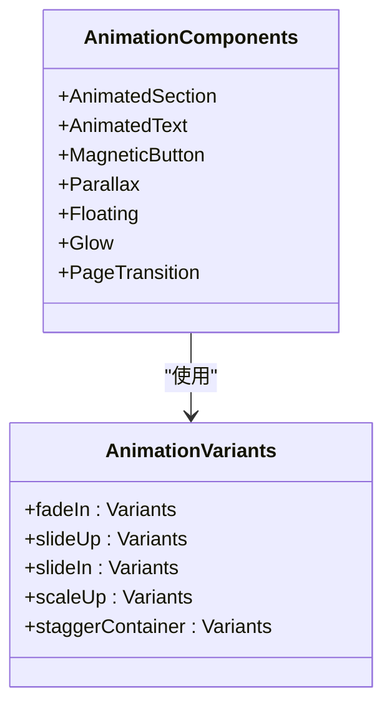
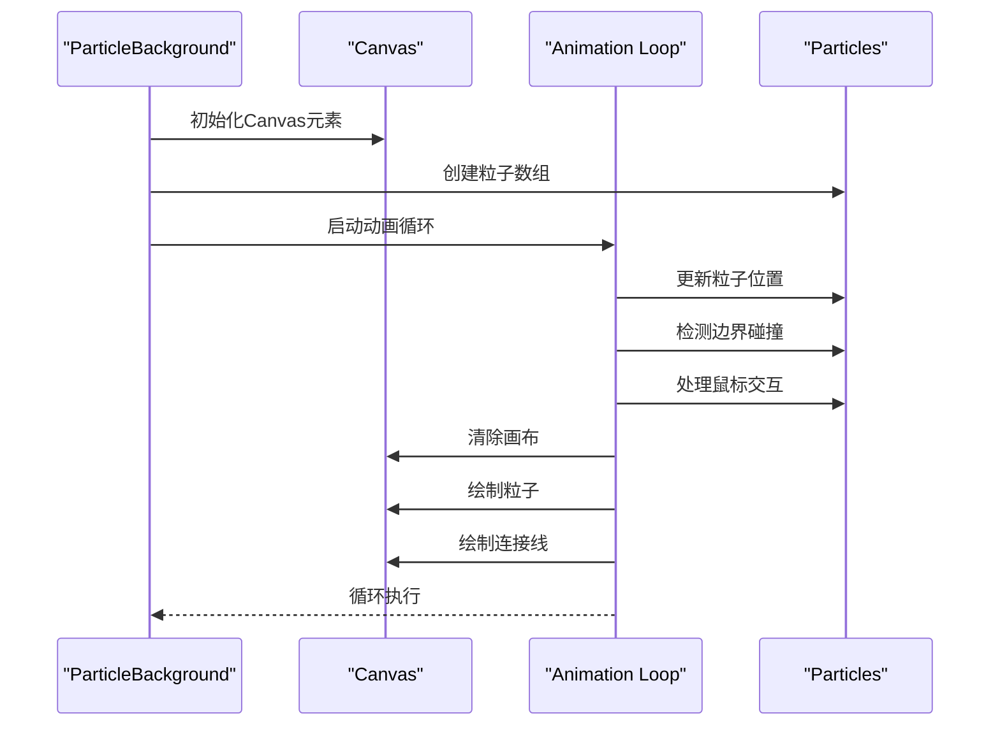

# 样式策略

<cite>
**本文档引用的文件**
- [globals.css](file://src/app/globals.css)
- [Animations.tsx](file://src/components/Animations.tsx)
- [ParticleBackground.tsx](file://src/components/ParticleBackground.tsx)
- [BackgroundEffects.tsx](file://src/components/BackgroundEffects.tsx)
- [layout.tsx](file://src/app/layout.tsx)
- [postcss.config.mjs](file://postcss.config.mjs)
- [package.json](file://package.json)
</cite>

## 目录
1. [项目样式架构概述](#项目样式架构概述)
2. [Tailwind CSS与自定义CSS混合策略](#tailwind-css与自定义css混合策略)
3. [全局样式重置与基础类定义](#全局样式重置与基础类定义)
4. [动画系统实现原理](#动画系统实现原理)
5. [Canvas特效实现](#canvas特效实现)
6. [设计系统扩展指南](#设计系统扩展指南)
7. [可访问性与性能优化](#可访问性与性能优化)

## 项目样式架构概述

本项目采用Tailwind CSS与自定义CSS相结合的混合样式架构，通过精心设计的`globals.css`文件实现全局样式重置和主题变量定义。项目利用`@layer`指令组织样式优先级，确保样式系统的可维护性和扩展性。动画系统由`Animations.tsx`和`ParticleBackground.tsx`组件构成，分别处理基于Framer Motion的声明式动画和基于Canvas的高性能粒子特效。

**Section sources**
- [globals.css](file://src/app/globals.css)
- [Animations.tsx](file://src/components/Animations.tsx)
- [ParticleBackground.tsx](file://src/components/ParticleBackground.tsx)

## Tailwind CSS与自定义CSS混合策略

项目采用Tailwind CSS作为基础样式框架，同时通过自定义CSS扩展其功能。在`postcss.config.mjs`中配置了`@tailwindcss/postcss`插件，实现了Tailwind与自定义样式的无缝集成。这种混合策略允许开发者利用Tailwind的原子化CSS优势，同时通过自定义CSS实现复杂的动画效果和特殊视觉需求。

自定义CSS主要用于实现Tailwind无法直接支持的高级效果，如流光文字、粒子背景和复杂的渐变动画。这些自定义样式与Tailwind的实用类协同工作，形成了一个强大而灵活的样式系统。

**Section sources**
- [postcss.config.mjs](file://postcss.config.mjs)
- [globals.css](file://src/app/globals.css)
- [package.json](file://package.json)

## 全局样式重置与基础类定义

`globals.css`文件通过CSS自定义属性（CSS Variables）定义了完整的主题系统，包括亮色和暗色模式下的颜色、字体和渐变方案。`:root`选择器定义了默认主题，而`.dark`类则提供了暗色模式的变量覆盖。

```css
:root {
  --background: #fafafa;
  --foreground: #1a1a1a;
  --primary: #0071e3;
  --gradient-start: #667eea;
  --gradient-end: #764ba2;
}

.dark {
  --background: #09090b;
  --foreground: #fafafa;
  --primary: #a78bfa;
  --gradient-start: #a78bfa;
  --gradient-end: #818cf8;
}
```

项目还定义了多个高级基础类，如`.glass`（玻璃态效果）、`.gradient-text`（渐变文字）和各种按钮样式（`.btn-primary`、`.btn-secondary`等）。这些基础类通过复杂的CSS渐变、阴影和过渡效果，实现了现代化的视觉设计。

**Section sources**
- [globals.css](file://src/app/globals.css#L3-L44)

## 动画系统实现原理

`Animations.tsx`组件利用Framer Motion库提供了声明式的动画系统。该系统定义了多种动画变体（Variants），包括`fadeIn`、`slideUp`、`slideIn`和`scaleUp`，这些变体可以轻松应用于任何组件。



**Diagram sources**
- [Animations.tsx](file://src/components/Animations.tsx#L6-L48)

关键动画组件包括：
- `AnimatedSection`：用于页面元素的视口动画
- `AnimatedText`：实现逐字出现的文字动画
- `MagneticButton`：创建磁性按钮悬停效果
- `Parallax`：实现视差滚动效果
- `Floating`：创建浮动动画
- `Glow`：添加发光效果
- `PageTransition`：处理页面过渡动画

这些组件通过组合使用Framer Motion的`motion`组件和自定义动画变体，实现了流畅而富有表现力的用户界面动画。

**Section sources**
- [Animations.tsx](file://src/components/Animations.tsx)

## Canvas特效实现

`ParticleBackground.tsx`组件实现了高性能的粒子背景特效，利用HTML5 Canvas API在浏览器中渲染动态粒子系统。该组件通过`useRef`管理Canvas元素和粒子状态，使用`requestAnimationFrame`实现平滑的动画循环。



**Diagram sources**
- [ParticleBackground.tsx](file://src/components/ParticleBackground.tsx)

粒子系统的关键特性包括：
- 响应式粒子数量：根据屏幕尺寸动态调整粒子数量
- 主题感知：根据当前主题（亮色/暗色）调整粒子颜色
- 鼠标交互：粒子会轻微排斥鼠标指针，创造互动感
- 粒子连接：相邻粒子之间绘制连接线，形成网络效果
- 性能优化：使用`useCallback`和`useRef`避免不必要的重新渲染

组件还监听主题变化，当用户切换主题时重新生成粒子，确保视觉一致性。

**Section sources**
- [ParticleBackground.tsx](file://src/components/ParticleBackground.tsx)

## 设计系统扩展指南

### 添加新动画

要添加新的CSS动画，应在`globals.css`中使用`@keyframes`定义关键帧，然后创建相应的类名：

```css
@keyframes new-animation {
  0% { transform: scale(1); opacity: 1; }
  50% { transform: scale(1.2); opacity: 0.8; }
  100% { transform: scale(1); opacity: 1; }
}

.animate-new-animation {
  animation: new-animation 3s ease-in-out infinite;
}
```

对于JavaScript动画，可以在`Animations.tsx`中添加新的动画变体：

```typescript
export const newAnimation: Variants = {
  hidden: { scale: 1, opacity: 1 },
  visible: { 
    scale: 1.2, 
    opacity: 0.8,
    transition: { duration: 0.5, ease: "easeInOut" } 
  },
};
```

### 修改配色方案

配色方案通过CSS自定义属性集中管理，修改时只需更新`:root`和`.dark`中的相应变量：

```css
:root {
  --primary: #新颜色值;
  --gradient-start: #新渐变起始色;
  --gradient-end: #新渐变结束色;
}

.dark {
  --primary: #新暗色模式颜色值;
  --gradient-start: #新暗色模式渐变起始色;
  --gradient-end: #新暗色模式渐变结束色;
}
```

### 调整响应式断点

项目使用Tailwind的默认断点系统，但可以通过修改`tailwind.config.js`（如果存在）或在CSS中使用媒体查询来调整：

```css
/* 自定义响应式断点 */
@media (min-width: 768px) {
  /* 平板样式 */
}

@media (min-width: 1024px) {
  /* 桌面样式 */
}
```

**Section sources**
- [globals.css](file://src/app/globals.css)
- [Animations.tsx](file://src/components/Animations.tsx)

## 可访问性与性能优化

### 可访问性（a11y）最佳实践

项目遵循WCAG可访问性标准，实施了多项最佳实践：
- 为所有交互元素提供`:focus-visible`样式
- 确保足够的颜色对比度
- 支持`prefers-reduced-motion`媒体查询
- 为动画元素提供暂停/停止选项
- 使用语义化的HTML结构

```css
:focus-visible {
  outline: 2px solid var(--primary);
  outline-offset: 2px;
}

@media (prefers-reduced-motion: reduce) {
  *,
  *::before,
  *::after {
    animation-duration: 0.01ms !important;
    animation-iteration-count: 1 !important;
    transition-duration: 0.01ms !important;
  }
}
```

### 性能优化策略

为确保动画和视觉效果的高性能，项目采用了多种优化技术：
- 使用`will-change`属性提示浏览器优化变换元素
- 避免在动画中触发布局重排（reflow）
- 使用`transform`和`opacity`进行动画，这些属性由GPU加速
- 在Canvas动画中使用`requestAnimationFrame`
- 为复杂的动画组件实现视口检测（`whileInView`）
- 使用`useMemo`和`useCallback`避免不必要的重新渲染

这些优化确保了即使在低端设备上，用户也能享受到流畅的动画体验。

**Section sources**
- [globals.css](file://src/app/globals.css#L1006-L1021)
- [Animations.tsx](file://src/components/Animations.tsx)
- [ParticleBackground.tsx](file://src/components/ParticleBackground.tsx)