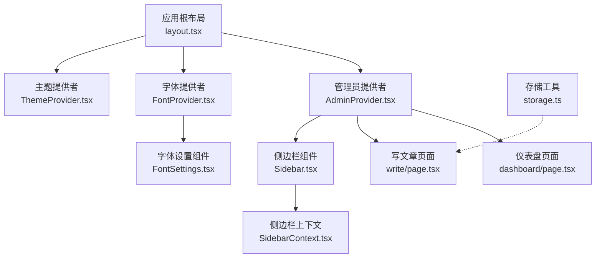
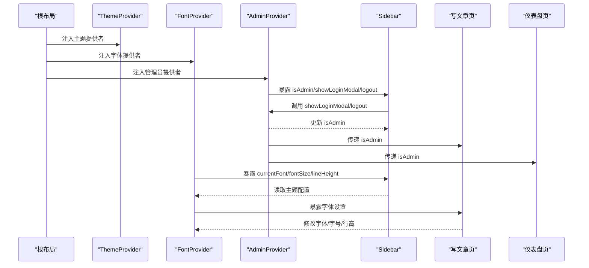
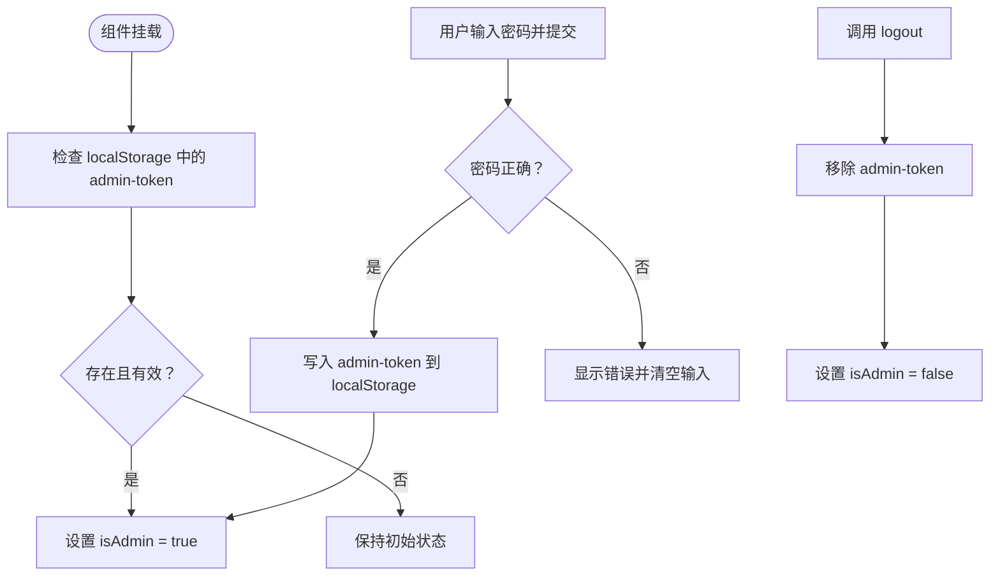
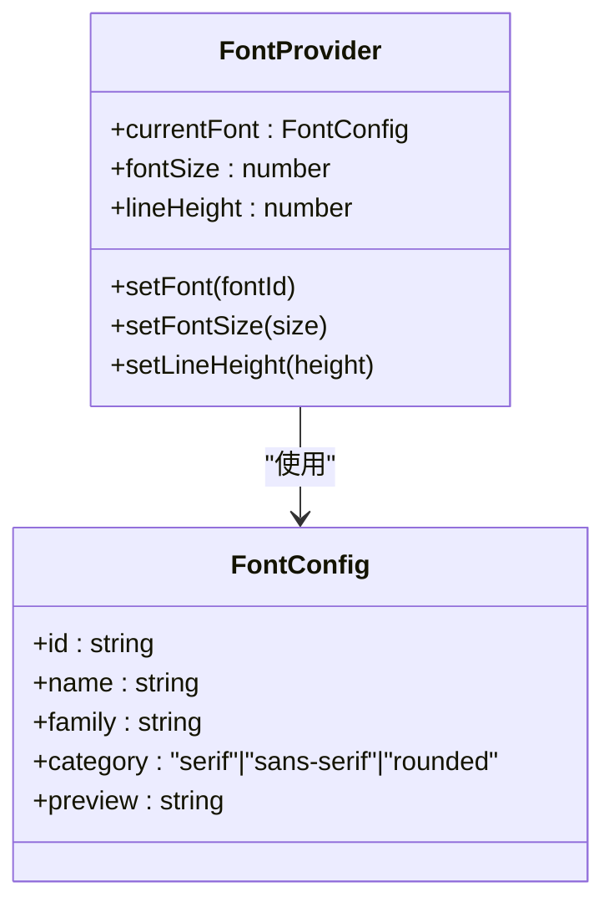
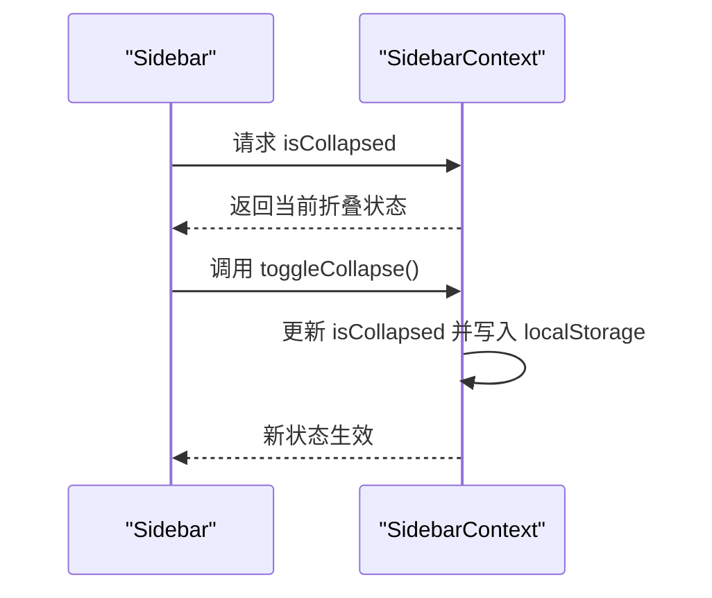
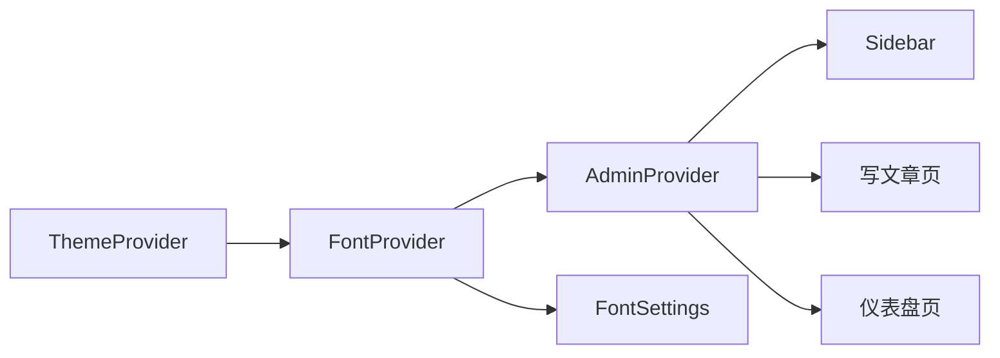

# 状态管理

<cite>
**本文引用的文件**
- [layout.tsx](file://src/app/layout.tsx)
- [AdminProvider.tsx](file://src/components/AdminProvider.tsx)
- [ThemeProvider.tsx](file://src/components/ThemeProvider.tsx)
- [FontProvider.tsx](file://src/components/FontProvider.tsx)
- [SidebarContext.tsx](file://src/components/SidebarContext.tsx)
- [Sidebar.tsx](file://src/components/Sidebar.tsx)
- [FontSettings.tsx](file://src/components/FontSettings.tsx)
- [write/page.tsx](file://src/app/write/page.tsx)
- [dashboard/page.tsx](file://src/app/dashboard/page.tsx)
- [storage.ts](file://src/lib/storage.ts)
</cite>

## 目录
1. [引言](#引言)
2. [项目结构](#项目结构)
3. [核心组件](#核心组件)
4. [架构总览](#架构总览)
5. [详细组件分析](#详细组件分析)
6. [依赖关系分析](#依赖关系分析)
7. [性能考量](#性能考量)
8. [故障排查指南](#故障排查指南)
9. [结论](#结论)
10. [附录](#附录)

## 引言
本篇文档围绕该 Next.js 博客项目的“状态管理”进行系统性梳理，重点阐述如何使用 React Context API 实现全局与局部状态共享，并结合实际组件展示以下主题：
- 管理员登录状态与敏感功能访问控制（AdminProvider）
- 主题偏好持久化（ThemeProvider）
- 字体与排版参数动态调整（FontProvider）
- 局部复杂状态的管理策略（SidebarContext）
- 状态更新性能优化建议（避免不必要重渲染）
- Context API 与 Redux 等方案的适用场景对比

## 项目结构
该项目采用“按功能域分层”的组织方式，状态管理主要分布在应用根布局与若干功能组件中：
- 根布局负责注入全局 Provider，形成状态树的根节点
- 各功能 Provider 独立管理各自领域的状态，通过 Context 对下层组件开放
- 页面级组件通过自定义 Hook 使用状态，实现细粒度控制

图表来源
- [layout.tsx](file://src/app/layout.tsx#L36-L96)
- [ThemeProvider.tsx](file://src/components/ThemeProvider.tsx#L1-L18)
- [FontProvider.tsx](file://src/components/FontProvider.tsx#L63-L118)
- [AdminProvider.tsx](file://src/components/AdminProvider.tsx#L30-L166)
- [Sidebar.tsx](file://src/components/Sidebar.tsx#L27-L120)
- [FontSettings.tsx](file://src/components/FontSettings.tsx#L13-L115)
- [SidebarContext.tsx](file://src/components/SidebarContext.tsx#L13-L31)
- [write/page.tsx](file://src/app/write/page.tsx#L39-L60)
- [dashboard/page.tsx](file://src/app/dashboard/page.tsx#L21-L38)
- [storage.ts](file://src/lib/storage.ts#L1-L41)

章节来源
- [layout.tsx](file://src/app/layout.tsx#L36-L96)

## 核心组件
- AdminProvider：管理管理员登录态、登录弹窗、登出；通过 localStorage 持久化令牌
- ThemeProvider：基于 next-themes 提供主题切换能力
- FontProvider：管理当前字体、字号、行高；从 localStorage 恢复用户偏好
- SidebarContext：管理侧边栏折叠状态；从 localStorage 恢复折叠状态
- Sidebar：消费 AdminProvider 与 ThemeProvider，控制写文章入口、主题切换、折叠/展开等行为
- FontSettings：消费 FontProvider，提供字体与排版设置面板
- 页面组件：如写文章页、仪表盘页，消费 AdminProvider 控制敏感功能访问

章节来源
- [AdminProvider.tsx](file://src/components/AdminProvider.tsx#L30-L166)
- [ThemeProvider.tsx](file://src/components/ThemeProvider.tsx#L1-L18)
- [FontProvider.tsx](file://src/components/FontProvider.tsx#L63-L118)
- [SidebarContext.tsx](file://src/components/SidebarContext.tsx#L13-L31)
- [Sidebar.tsx](file://src/components/Sidebar.tsx#L27-L120)
- [FontSettings.tsx](file://src/components/FontSettings.tsx#L13-L115)
- [write/page.tsx](file://src/app/write/page.tsx#L39-L60)
- [dashboard/page.tsx](file://src/app/dashboard/page.tsx#L21-L38)

## 架构总览
该应用采用“Provider 树 + 自定义 Hook”的 Context API 设计模式：
- 根布局注入多个 Provider，形成全局状态树
- 子组件通过 useAdmin/useFont/useSidebar 等 Hook 获取状态与方法
- 状态变更通过 Provider 的 setState 触发，影响订阅组件的渲染

图表来源
- [layout.tsx](file://src/app/layout.tsx#L71-L95)
- [ThemeProvider.tsx](file://src/components/ThemeProvider.tsx#L1-L18)
- [FontProvider.tsx](file://src/components/FontProvider.tsx#L63-L118)
- [AdminProvider.tsx](file://src/components/AdminProvider.tsx#L75-L166)
- [Sidebar.tsx](file://src/components/Sidebar.tsx#L33-L54)
- [write/page.tsx](file://src/app/write/page.tsx#L40-L45)
- [dashboard/page.tsx](file://src/app/dashboard/page.tsx#L21-L38)

## 详细组件分析

### AdminProvider：管理员登录态与敏感功能访问控制
- 状态与方法
  - 管理员登录态：isAdmin
  - 登录弹窗控制：showLoginModal
  - 登出：logout
- 生命周期与持久化
  - 首次挂载检查 localStorage 中的令牌，恢复登录态
  - 登录成功后写入令牌；登出时移除令牌
- 访问控制
  - 写文章页与仪表盘页通过 useAdmin.isAdmin 判断是否允许进入
  - 未登录时，写文章页引导用户登录；仪表盘页可按需限制
- 安全注意
  - 当前实现使用 base64 令牌存储于 localStorage，仅作演示用途；生产环境建议使用更安全的认证机制与服务端校验

图表来源
- [AdminProvider.tsx](file://src/components/AdminProvider.tsx#L38-L63)
- [AdminProvider.tsx](file://src/components/AdminProvider.tsx#L47-L63)
- [AdminProvider.tsx](file://src/components/AdminProvider.tsx#L60-L63)
- [write/page.tsx](file://src/app/write/page.tsx#L225-L252)
- [dashboard/page.tsx](file://src/app/dashboard/page.tsx#L21-L38)

章节来源
- [AdminProvider.tsx](file://src/components/AdminProvider.tsx#L30-L166)
- [write/page.tsx](file://src/app/write/page.tsx#L225-L252)
- [dashboard/page.tsx](file://src/app/dashboard/page.tsx#L21-L38)

### ThemeProvider：主题偏好持久化
- 基于 next-themes 的主题提供者，支持系统主题、浅色/深色切换
- attribute="class" 与 defaultTheme="system" 配置确保主题与系统一致
- disableTransitionOnChange=false 保留过渡动画，提升交互体验

章节来源
- [ThemeProvider.tsx](file://src/components/ThemeProvider.tsx#L1-L18)
- [Sidebar.tsx](file://src/components/Sidebar.tsx#L33-L54)

### FontProvider：动态调整字体与排版
- 状态与方法
  - currentFont：当前字体配置
  - fontSize：字号
  - lineHeight：行高
  - setFont/setFontSize/setLineHeight：更新对应状态
- 生命周期与持久化
  - 首次挂载从 localStorage 恢复用户偏好；每次更新写回 localStorage
- 字体列表
  - 内置多种字体族，包含中文字体与系统字体，便于阅读体验优化

图表来源
- [FontProvider.tsx](file://src/components/FontProvider.tsx#L52-L118)
- [FontProvider.tsx](file://src/components/FontProvider.tsx#L1-L51)

章节来源
- [FontProvider.tsx](file://src/components/FontProvider.tsx#L52-L118)
- [FontSettings.tsx](file://src/components/FontSettings.tsx#L13-L115)

### SidebarContext：局部复杂状态的管理策略
- 状态与方法
  - isCollapsed：侧边栏折叠状态
  - setIsCollapsed/toggleCollapse：更新状态
- 生命周期与持久化
  - 首次挂载从 localStorage 恢复折叠状态；切换时写回 localStorage
- 与 Sidebar 的协作
  - Sidebar 内部也维护了本地状态，但通过 SidebarContext 将折叠状态与持久化解耦，避免重复逻辑

图表来源
- [SidebarContext.tsx](file://src/components/SidebarContext.tsx#L13-L31)
- [Sidebar.tsx](file://src/components/Sidebar.tsx#L33-L54)

章节来源
- [SidebarContext.tsx](file://src/components/SidebarContext.tsx#L13-L31)
- [Sidebar.tsx](file://src/components/Sidebar.tsx#L33-L54)

### 页面级组件中的状态使用
- 写文章页（write/page.tsx）
  - 通过 useAdmin.isAdmin 控制是否允许访问写文章功能
  - 未登录时展示登录提示与入口
- 仪表盘页（dashboard/page.tsx）
  - 通过 useAdmin.isAdmin 控制敏感管理入口
  - 本地过滤与状态管理（标签页、搜索、分类）由组件内部 useState 管理

章节来源
- [write/page.tsx](file://src/app/write/page.tsx#L225-L252)
- [dashboard/page.tsx](file://src/app/dashboard/page.tsx#L21-L38)

## 依赖关系分析
- Provider 注入顺序
  - ThemeProvider -> FontProvider -> AdminProvider
  - Sidebar 位于 AdminProvider 内部，作为其子树的一部分
- 组件间依赖
  - Sidebar 依赖 AdminProvider（登录态）、ThemeProvider（主题切换）
  - FontSettings 依赖 FontProvider（字体与排版）
  - 页面组件依赖 AdminProvider（访问控制）

图表来源
- [layout.tsx](file://src/app/layout.tsx#L71-L95)
- [Sidebar.tsx](file://src/components/Sidebar.tsx#L27-L54)
- [FontSettings.tsx](file://src/components/FontSettings.tsx#L13-L115)
- [write/page.tsx](file://src/app/write/page.tsx#L39-L60)
- [dashboard/page.tsx](file://src/app/dashboard/page.tsx#L21-L38)

## 性能考量
- 避免不必要的重新渲染
  - 将 Provider 的 value 保持稳定引用，避免每次渲染都产生新的对象导致子组件重渲染
  - 对于 FontProvider 的 value，建议使用 useMemo 包裹，确保对象引用稳定
  - 对于 AdminProvider 的 value，同样建议稳定引用，减少子组件订阅抖动
- 条件渲染与 Hydration
  - AdminProvider 在 mounted 之前返回 children，避免水合不一致导致的闪烁
  - Sidebar 在 mounted 之后再绑定本地状态，保证 SSR 与 CSR 的一致性
- 事件处理与防抖
  - 字体设置面板的滑块与输入框应避免高频触发 setState，可在必要时使用节流/防抖
- 本地存储与异步
  - localStorage 的读取与写入为同步操作，不会阻塞主线程；但大量写入可能影响性能，建议合并更新或延迟批量写入

章节来源
- [AdminProvider.tsx](file://src/components/AdminProvider.tsx#L71-L78)
- [Sidebar.tsx](file://src/components/Sidebar.tsx#L33-L44)
- [FontSettings.tsx](file://src/components/FontSettings.tsx#L13-L115)

## 故障排查指南
- 管理员登录无效
  - 检查 localStorage 中是否存在 admin-token，以及其值是否与预期一致
  - 确认密码输入是否正确，错误时会清空输入并提示
- 主题切换不生效
  - 确认 ThemeProvider 已正确包裹应用根布局
  - 检查浏览器 class 属性变化与 CSS 变量是否更新
- 字体设置未持久化
  - 检查 localStorage 中 article-font、article-font-size、article-line-height 是否存在
  - 确认 FontProvider 首次挂载时是否正确恢复状态
- 侧边栏折叠状态异常
  - 检查 localStorage 中 sidebar-collapsed 的值
  - 确认 Sidebar 与 SidebarContext 的状态同步逻辑

章节来源
- [AdminProvider.tsx](file://src/components/AdminProvider.tsx#L38-L63)
- [ThemeProvider.tsx](file://src/components/ThemeProvider.tsx#L1-L18)
- [FontProvider.tsx](file://src/components/FontProvider.tsx#L69-L82)
- [SidebarContext.tsx](file://src/components/SidebarContext.tsx#L16-L25)
- [Sidebar.tsx](file://src/components/Sidebar.tsx#L33-L54)

## 结论
本项目通过 Context API 实现了清晰的全局与局部状态管理：
- AdminProvider 负责管理员登录态与敏感功能访问控制
- ThemeProvider 提供主题偏好持久化
- FontProvider 提供字体与排版参数的动态调整
- SidebarContext 解决了局部复杂状态的持久化与解耦
- 页面组件通过自定义 Hook 使用状态，实现细粒度控制

在性能方面，通过稳定引用、条件渲染与 Hydration 处理，有效降低了不必要的重渲染风险。对于更大规模的状态管理需求，可考虑引入轻量状态库或 Redux Toolkit，但在当前体量下，Context API 已足够满足需求。

## 附录
- 与 Redux 的适用场景对比
  - Context API 适合中小型应用或功能相对独立的状态域，具备上手快、无需额外依赖的优势
  - Redux/Redux Toolkit 更适合大型应用、复杂状态逻辑与跨组件共享的场景，提供更强的调试能力与中间件生态
  - 本项目当前采用 Context API，若未来状态复杂度上升，可逐步引入轻量状态库或模块化拆分 Provider