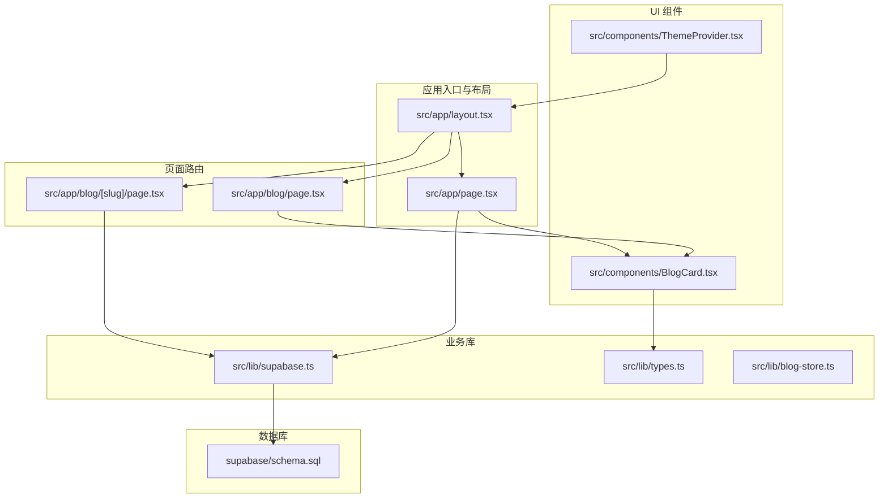
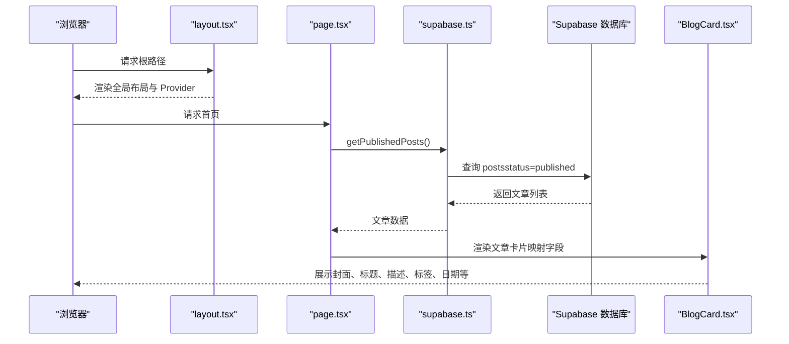
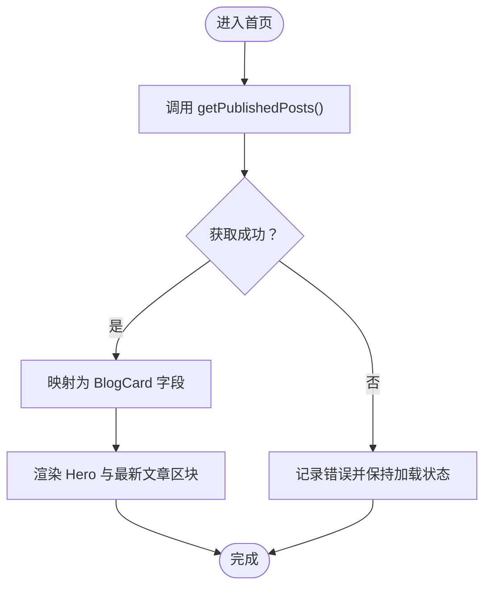
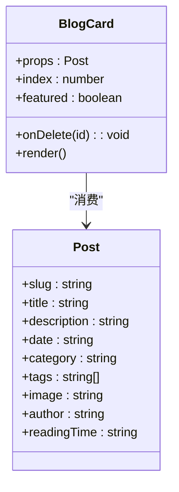
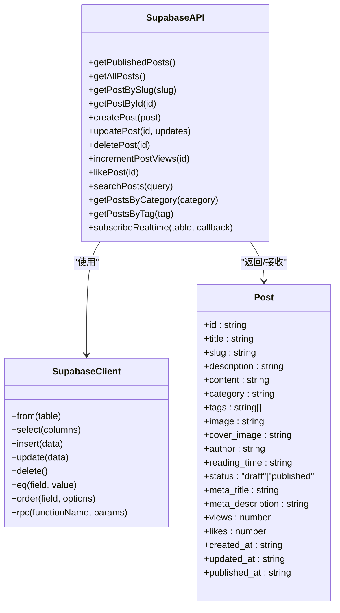
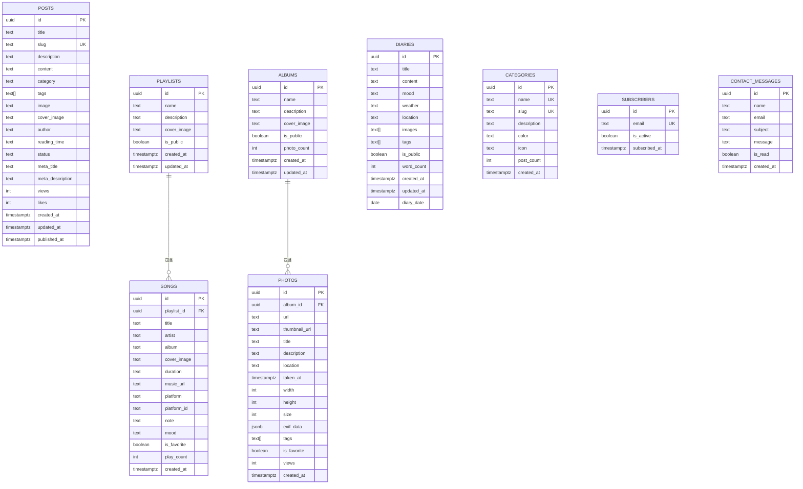
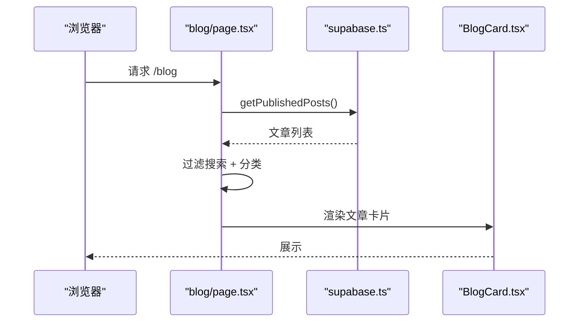
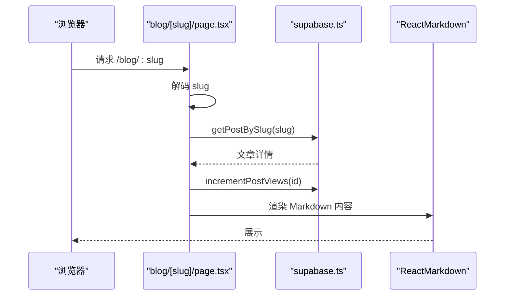
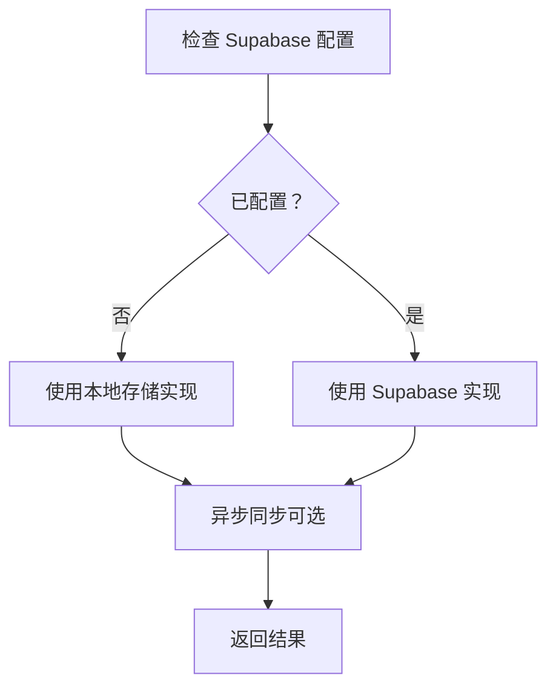
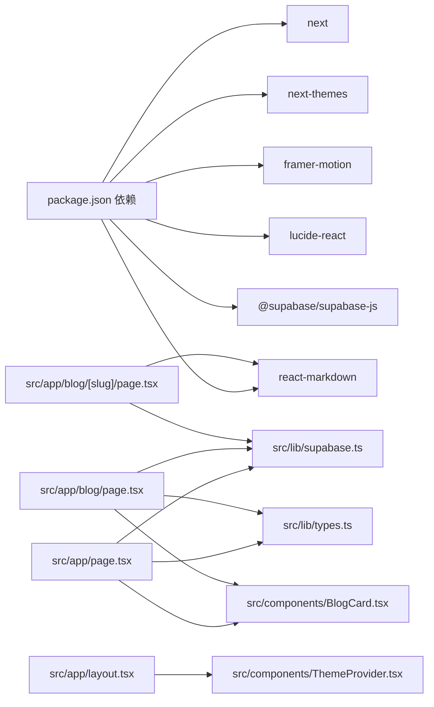

# 目录结构

<cite>
**本文引用的文件**
- [layout.tsx](file://src/app/layout.tsx)
- [page.tsx](file://src/app/page.tsx)
- [BlogCard.tsx](file://src/components/BlogCard.tsx)
- [supabase.ts](file://src/lib/supabase.ts)
- [schema.sql](file://supabase/schema.sql)
- [types.ts](file://src/lib/types.ts)
- [blog/page.tsx](file://src/app/blog/page.tsx)
- [blog/[slug]/page.tsx](file://src/app/blog/[slug]/page.tsx)
- [ThemeProvider.tsx](file://src/components/ThemeProvider.tsx)
- [blog-store.ts](file://src/lib/blog-store.ts)
- [package.json](file://package.json)
- [README.md](file://README.md)
</cite>

## 目录
1. [简介](#简介)
2. [项目结构](#项目结构)
3. [核心组件](#核心组件)
4. [架构总览](#架构总览)
5. [详细组件分析](#详细组件分析)
6. [依赖关系分析](#依赖关系分析)
7. [性能考量](#性能考量)
8. [故障排查指南](#故障排查指南)
9. [结论](#结论)
10. [附录](#附录)

## 简介
本文件面向开发者，系统性解析博客项目的目录架构与关键模块职责，重点说明：
- src/app 作为页面路由与布局的核心作用
- src/components 中 UI 组件的可复用设计理念
- src/lib 中业务逻辑与数据访问的封装方式
- app/page.tsx 作为首页的渲染机制
- BlogCard.tsx 如何展示文章摘要
- supabase.ts 如何封装数据库操作
- schema.sql 定义的数据模型

目标是帮助开发者快速定位功能模块，建立对项目组织方式的整体认知。

## 项目结构
项目采用 Next.js App Router 的目录组织方式，按“页面路由 + 组件 + 业务库”的分层组织：
- src/app：页面路由与全局布局
- src/components：通用 UI 组件
- src/lib：业务逻辑与数据访问封装

图表来源
- [layout.tsx](file://src/app/layout.tsx#L1-L100)
- [page.tsx](file://src/app/page.tsx#L1-L120)
- [blog/page.tsx](file://src/app/blog/page.tsx#L1-L120)
- [blog/[slug]/page.tsx](file://src/app/blog/[slug]/page.tsx#L1-L120)
- [BlogCard.tsx](file://src/components/BlogCard.tsx#L1-L120)
- [supabase.ts](file://src/lib/supabase.ts#L1-L120)
- [types.ts](file://src/lib/types.ts#L1-L40)
- [blog-store.ts](file://src/lib/blog-store.ts#L1-L120)
- [schema.sql](file://supabase/schema.sql#L1-L60)

章节来源
- [layout.tsx](file://src/app/layout.tsx#L1-L100)
- [page.tsx](file://src/app/page.tsx#L1-L120)
- [blog/page.tsx](file://src/app/blog/page.tsx#L1-L120)
- [blog/[slug]/page.tsx](file://src/app/blog/[slug]/page.tsx#L1-L120)
- [BlogCard.tsx](file://src/components/BlogCard.tsx#L1-L120)
- [supabase.ts](file://src/lib/supabase.ts#L1-L120)
- [types.ts](file://src/lib/types.ts#L1-L40)
- [blog-store.ts](file://src/lib/blog-store.ts#L1-L120)
- [schema.sql](file://supabase/schema.sql#L1-L60)

## 核心组件
- 页面路由与全局布局
  - src/app/layout.tsx：定义全局主题、字体、背景、侧边栏与主内容区容器，提供全局 Provider（主题、字体、管理态）。
  - src/app/page.tsx：首页渲染，调用 supabase 获取已发布文章，映射为 BlogCard 所需格式，展示最新文章与订阅区域。
- UI 组件
  - src/components/BlogCard.tsx：文章卡片组件，支持悬停 3D 效果、管理员操作、分类徽标、标签、阅读时间、日期等元信息。
- 业务库
  - src/lib/supabase.ts：封装 Supabase 客户端与 CRUD 操作（文章、联系消息、订阅者、歌单/歌曲、相册/照片、日记），提供格式化与辅助函数。
  - src/lib/types.ts：客户端使用的 Post 类型与日期格式化工具。
  - src/lib/blog-store.ts：在无 Supabase 配置时提供本地存储实现；当配置存在时，提供与 Supabase 的异步同步能力。

章节来源
- [layout.tsx](file://src/app/layout.tsx#L1-L100)
- [page.tsx](file://src/app/page.tsx#L1-L120)
- [BlogCard.tsx](file://src/components/BlogCard.tsx#L1-L120)
- [supabase.ts](file://src/lib/supabase.ts#L1-L120)
- [types.ts](file://src/lib/types.ts#L1-L40)
- [blog-store.ts](file://src/lib/blog-store.ts#L1-L120)

## 架构总览
整体采用“页面路由 + 组件 + 业务库 + 数据库”的分层架构：
- 页面路由负责请求处理与数据拉取
- 组件负责展示与交互
- 业务库负责数据访问与格式化
- 数据库通过 Supabase 提供 ORM 与实时能力

图表来源
- [layout.tsx](file://src/app/layout.tsx#L1-L100)
- [page.tsx](file://src/app/page.tsx#L1-L120)
- [supabase.ts](file://src/lib/supabase.ts#L108-L116)
- [BlogCard.tsx](file://src/components/BlogCard.tsx#L1-L120)

## 详细组件分析

### 首页渲染机制（app/page.tsx）
- 功能要点
  - 使用客户端状态管理文章列表与加载状态
  - 通过 supabase.getPublishedPosts() 拉取已发布文章
  - 将返回的字段映射为 BlogCard 所需格式（slug、title、description、date、category、tags、image、author、readingTime）
  - 使用 Framer Motion 实现滚动驱动的 Hero 区域动画
- 关键流程

图表来源
- [page.tsx](file://src/app/page.tsx#L1-L120)
- [supabase.ts](file://src/lib/supabase.ts#L108-L116)
- [BlogCard.tsx](file://src/components/BlogCard.tsx#L1-L120)

章节来源
- [page.tsx](file://src/app/page.tsx#L1-L120)
- [supabase.ts](file://src/lib/supabase.ts#L108-L116)
- [BlogCard.tsx](file://src/components/BlogCard.tsx#L1-L120)

### 文章卡片组件（BlogCard.tsx）
- 设计理念
  - 可复用：接收 Post 类型 props，支持“精选”与“列表”两种尺寸
  - 交互丰富：悬停 3D 效果、鼠标跟随发光、管理员编辑/删除入口
  - 响应式：移动端与桌面端不同布局与动效
- 关键实现
  - 使用 Framer Motion 实现入场动画与悬停效果
  - 使用 useMotionValue/useSpring/useTransform 实现 3D 倾斜与发光
  - 支持管理员态 AdminProvider 的可见性控制
  - 分类颜色映射与标签截断显示

图表来源
- [BlogCard.tsx](file://src/components/BlogCard.tsx#L1-L120)
- [types.ts](file://src/lib/types.ts#L1-L40)

章节来源
- [BlogCard.tsx](file://src/components/BlogCard.tsx#L1-L120)
- [types.ts](file://src/lib/types.ts#L1-L40)

### 数据访问封装（supabase.ts）
- 职责
  - 初始化 Supabase 客户端
  - 定义数据模型接口（Post、Playlist、Song、Album、Photo、Diary、ContactMessage、Subscriber）
  - 提供 CRUD 与查询方法（文章、联系消息、订阅者、歌单/歌曲、相册/照片、日记）
  - 提供格式化与辅助函数（日期格式化、阅读时长计算、分类/天气/平台图标映射）
- 关键点
  - 文章点赞与浏览量通过 RPC 或回退逻辑保证兼容性
  - 支持全文检索与分类/标签过滤
  - 提供实时订阅通道

图表来源
- [supabase.ts](file://src/lib/supabase.ts#L1-L220)

章节来源
- [supabase.ts](file://src/lib/supabase.ts#L1-L220)

### 数据模型（schema.sql）
- 模型概览
  - posts：文章表，包含标题、slug、描述、内容、分类、标签、封面、作者、状态、阅读时长、浏览/点赞数、时间戳
  - playlists/songs：歌单与歌曲，支持平台、封面、时长、收藏、播放次数
  - albums/photos：相册与照片，支持 EXIF、标签、收藏、浏览数
  - diaries：日记，支持心情、天气、标签、公开性、字数统计、日期
  - categories/subscribers/contact_messages：分类、订阅者、联系消息
- 关键约束
  - UUID 主键与唯一索引
  - RLS 行级安全策略
  - 触发器自动维护 updated_at 与相册照片计数

图表来源
- [schema.sql](file://supabase/schema.sql#L1-L160)

章节来源
- [schema.sql](file://supabase/schema.sql#L1-L160)

### 博客列表页（blog/page.tsx）
- 功能要点
  - 拉取已发布文章，支持搜索、分类筛选、视图切换（网格/列表）
  - 管理态下显示“写文章”按钮与删除操作
  - 将文章映射为 BlogCard 所需格式并渲染
- 关键流程

图表来源
- [blog/page.tsx](file://src/app/blog/page.tsx#L1-L120)
- [supabase.ts](file://src/lib/supabase.ts#L108-L116)
- [BlogCard.tsx](file://src/components/BlogCard.tsx#L1-L120)

章节来源
- [blog/page.tsx](file://src/app/blog/page.tsx#L1-L120)
- [supabase.ts](file://src/lib/supabase.ts#L108-L116)
- [BlogCard.tsx](file://src/components/BlogCard.tsx#L1-L120)

### 文章详情页（blog/[slug]/page.tsx）
- 功能要点
  - 通过动态路由参数 slug 获取文章详情，解码 URL 编码的 slug
  - 加载后调用 incrementPostViews 增加浏览量
  - 使用 React Markdown 渲染内容，支持 GFM 与代码高亮组件
  - 管理态下提供编辑与删除入口
- 关键流程

图表来源
- [blog/[slug]/page.tsx](file://src/app/blog/[slug]/page.tsx#L1-L120)
- [supabase.ts](file://src/lib/supabase.ts#L127-L145)
- [supabase.ts](file://src/lib/supabase.ts#L178-L180)

章节来源
- [blog/[slug]/page.tsx](file://src/app/blog/[slug]/page.tsx#L1-L120)
- [supabase.ts](file://src/lib/supabase.ts#L127-L145)
- [supabase.ts](file://src/lib/supabase.ts#L178-L180)

### 本地存储与云端同步（blog-store.ts）
- 设计思路
  - 当环境变量配置了 Supabase 时，优先使用云端；否则回退到本地存储
  - 提供同步接口：保存、删除、发布/取消发布，并在云端可用时异步同步
- 关键点
  - 生成唯一 ID 与 slug
  - 计算阅读时长
  - 分类信息与图标映射

图表来源
- [blog-store.ts](file://src/lib/blog-store.ts#L1-L120)
- [blog-store.ts](file://src/lib/blog-store.ts#L232-L337)

章节来源
- [blog-store.ts](file://src/lib/blog-store.ts#L1-L120)
- [blog-store.ts](file://src/lib/blog-store.ts#L232-L337)

## 依赖关系分析
- 外部依赖
  - Next.js 16、Next Themes、Framer Motion、Lucide React、Supabase JS、React Markdown、Tailwind CSS 等
- 内部依赖
  - 页面路由依赖业务库与 UI 组件
  - UI 组件依赖类型定义与 Provider
  - 业务库依赖 Supabase 客户端与数据库模型

图表来源
- [package.json](file://package.json#L1-L40)
- [page.tsx](file://src/app/page.tsx#L1-L120)
- [blog/page.tsx](file://src/app/blog/page.tsx#L1-L120)
- [blog/[slug]/page.tsx](file://src/app/blog/[slug]/page.tsx#L1-L120)
- [types.ts](file://src/lib/types.ts#L1-L40)
- [supabase.ts](file://src/lib/supabase.ts#L1-L120)
- [BlogCard.tsx](file://src/components/BlogCard.tsx#L1-L120)
- [ThemeProvider.tsx](file://src/components/ThemeProvider.tsx#L1-L18)

章节来源
- [package.json](file://package.json#L1-L40)
- [page.tsx](file://src/app/page.tsx#L1-L120)
- [blog/page.tsx](file://src/app/blog/page.tsx#L1-L120)
- [blog/[slug]/page.tsx](file://src/app/blog/[slug]/page.tsx#L1-L120)
- [types.ts](file://src/lib/types.ts#L1-L40)
- [supabase.ts](file://src/lib/supabase.ts#L1-L120)
- [BlogCard.tsx](file://src/components/BlogCard.tsx#L1-L120)
- [ThemeProvider.tsx](file://src/components/ThemeProvider.tsx#L1-L18)

## 性能考量
- 首屏性能
  - 首页仅拉取必要字段（已发布文章），避免一次性加载过多数据
  - 使用骨架屏与懒加载图片减少首屏阻塞
- 交互性能
  - 使用 Framer Motion 的 useTransform 与 useSpring，避免重排重绘
  - 卡片悬停效果通过 CSS 与受控动画实现，降低计算开销
- 数据访问
  - Supabase 查询使用索引字段（slug/status/category/tags）进行过滤
  - 文章浏览量通过 RPC 原子更新，避免竞态
- 本地存储
  - 在无云端配置时，使用本地存储减少网络请求，提高可用性

## 故障排查指南
- Supabase 配置问题
  - 确认 NEXT_PUBLIC_SUPABASE_URL 与 NEXT_PUBLIC_SUPABASE_ANON_KEY 已正确设置
  - 若云端异常，系统会回退到本地存储，检查本地数据是否正常
- 文章加载失败
  - 首页与列表页均捕获错误并记录日志，确认网络连通性与权限策略
- 文章详情 404
  - 检查 slug 是否正确编码与解码，确认数据库中是否存在对应记录
- 管理员操作不可见
  - 确认 AdminProvider 的上下文已正确包裹，且当前用户具备管理员权限

章节来源
- [blog-store.ts](file://src/lib/blog-store.ts#L1-L120)
- [blog/[slug]/page.tsx](file://src/app/blog/[slug]/page.tsx#L1-L120)
- [page.tsx](file://src/app/page.tsx#L1-L120)
- [blog/page.tsx](file://src/app/blog/page.tsx#L1-L120)

## 结论
该项目以清晰的分层架构实现了现代化博客系统：
- src/app 作为页面路由与全局布局的核心，统一注入主题、字体与背景
- src/components 提供高度可复用的 UI 组件，强调交互体验与可维护性
- src/lib 将业务逻辑与数据访问集中封装，既支持云端也支持本地存储
- 数据模型通过 schema.sql 明确约束与索引，配合 RLS 保障安全

通过以上设计，开发者可以快速定位功能模块、扩展新页面与组件，并在云端与本地之间平滑切换。

## 附录
- 快速定位指引
  - 首页渲染：src/app/page.tsx
  - 文章卡片：src/components/BlogCard.tsx
  - 数据访问：src/lib/supabase.ts
  - 数据模型：supabase/schema.sql
  - 列表页：src/app/blog/page.tsx
  - 详情页：src/app/blog/[slug]/page.tsx
  - 布局与 Provider：src/app/layout.tsx、src/components/ThemeProvider.tsx
  - 本地存储与同步：src/lib/blog-store.ts
- 开发与部署
  - 开发命令参考 README.md
  - 依赖项参考 package.json

章节来源
- [README.md](file://README.md#L1-L37)
- [package.json](file://package.json#L1-L40)