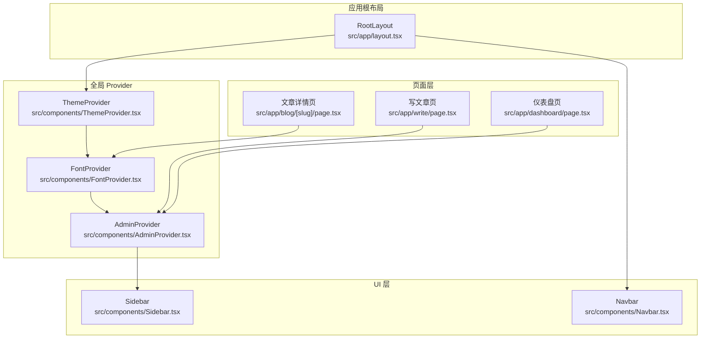
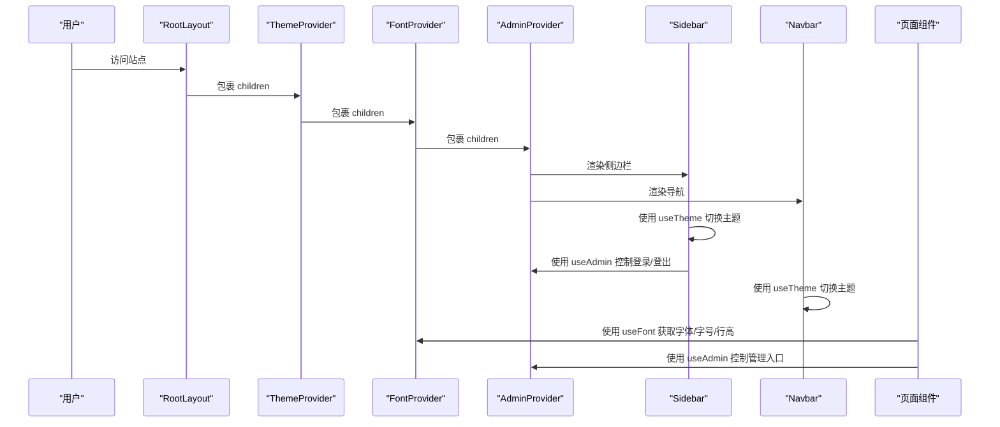
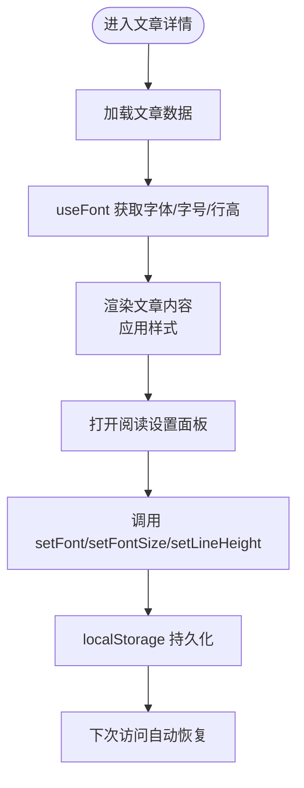
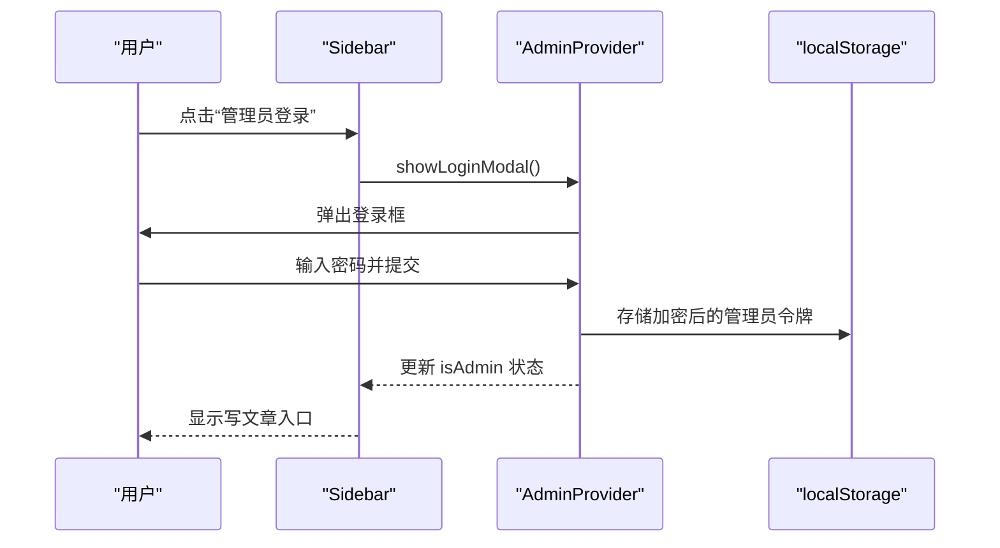
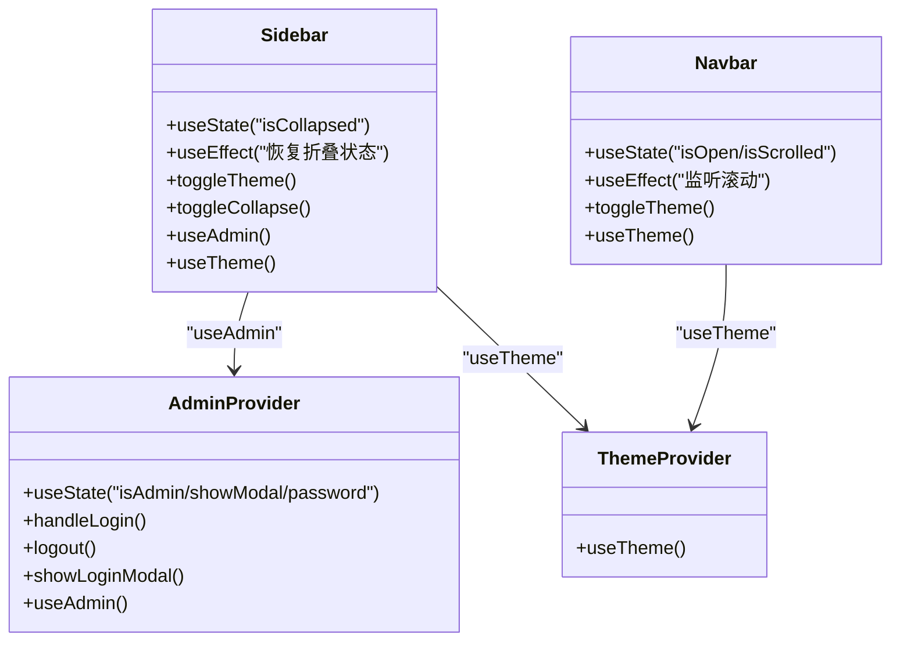
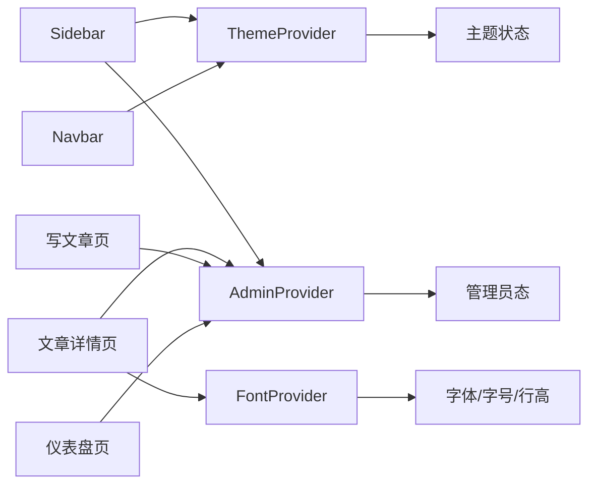

# 组件架构

<cite>
**本文引用的文件**
- [layout.tsx](file://src/app/layout.tsx)
- [ThemeProvider.tsx](file://src/components/ThemeProvider.tsx)
- [FontProvider.tsx](file://src/components/FontProvider.tsx)
- [AdminProvider.tsx](file://src/components/AdminProvider.tsx)
- [Sidebar.tsx](file://src/components/Sidebar.tsx)
- [Navbar.tsx](file://src/components/Navbar.tsx)
- [SidebarContext.tsx](file://src/components/SidebarContext.tsx)
- [FontSettings.tsx](file://src/components/FontSettings.tsx)
- [blog/[slug]/page.tsx](file://src/app/blog/[slug]/page.tsx)
- [write/page.tsx](file://src/app/write/page.tsx)
- [dashboard/page.tsx](file://src/app/dashboard/page.tsx)
- [supabase.ts](file://src/lib/supabase.ts)
- [storage.ts](file://src/lib/storage.ts)
</cite>

## 目录
1. [引言](#引言)
2. [项目结构](#项目结构)
3. [核心组件](#核心组件)
4. [架构总览](#架构总览)
5. [详细组件分析](#详细组件分析)
6. [依赖分析](#依赖分析)
7. [性能考虑](#性能考虑)
8. [故障排查指南](#故障排查指南)
9. [结论](#结论)
10. [附录](#附录)

## 引言
本文件围绕博客应用的组件化架构展开，重点解析 RootLayout 中 ThemeProvider、FontProvider 和 AdminProvider 的组合模式及其对全局状态的影响；阐述 Sidebar 与 Navbar 如何通过 Context API 与状态管理器通信，实现主题、字体与管理员权限的动态响应；并结合代码片段路径展示组件间的父子关系与数据流传递机制。同时给出高阶组件 AdminProvider 的封装思路与最佳实践，指导开发者如何安全地扩展新的全局状态管理器。

## 项目结构
应用采用 Next.js App Router 结构，根布局负责注入全局 Provider，并承载侧边栏与主内容区。各页面按需消费 Provider 提供的状态与能力。

图表来源
- [layout.tsx](file://src/app/layout.tsx#L36-L99)
- [ThemeProvider.tsx](file://src/components/ThemeProvider.tsx#L1-L18)
- [FontProvider.tsx](file://src/components/FontProvider.tsx#L63-L118)
- [AdminProvider.tsx](file://src/components/AdminProvider.tsx#L30-L166)
- [Sidebar.tsx](file://src/components/Sidebar.tsx#L1-L767)
- [Navbar.tsx](file://src/components/Navbar.tsx#L1-L346)
- [blog/[slug]/page.tsx](file://src/app/blog/[slug]/page.tsx#L1-L372)
- [write/page.tsx](file://src/app/write/page.tsx#L1-L696)
- [dashboard/page.tsx](file://src/app/dashboard/page.tsx#L1-L485)

章节来源
- [layout.tsx](file://src/app/layout.tsx#L36-L99)

## 核心组件
- ThemeProvider：基于 next-themes 的主题提供器，统一管理明暗主题与系统偏好。
- FontProvider：维护字体家族、字号与行高的全局配置，持久化到本地存储。
- AdminProvider：封装管理员登录态与弹窗交互，提供受保护的管理界面入口。
- Sidebar：侧边栏导航、主题切换、折叠控制、管理员入口等。
- Navbar：顶部导航、主题切换、移动端菜单等。
- FontSettings：阅读设置面板，与 FontProvider 协作调整排版参数。
- 页面组件：文章详情、写文章、仪表盘等，按需消费 Provider。

章节来源
- [ThemeProvider.tsx](file://src/components/ThemeProvider.tsx#L1-L18)
- [FontProvider.tsx](file://src/components/FontProvider.tsx#L1-L135)
- [AdminProvider.tsx](file://src/components/AdminProvider.tsx#L1-L166)
- [Sidebar.tsx](file://src/components/Sidebar.tsx#L1-L767)
- [Navbar.tsx](file://src/components/Navbar.tsx#L1-L346)
- [FontSettings.tsx](file://src/components/FontSettings.tsx#L1-L115)

## 架构总览
RootLayout 作为应用根节点，自上而下注入三层 Provider：ThemeProvider -> FontProvider -> AdminProvider，随后渲染 Sidebar 与主内容区。Sidebar 与 Navbar 通过 next-themes 与自定义 Context 实现主题与权限的双向联动；页面组件则按需消费 FontProvider 与 AdminProvider 的状态。

图表来源
- [layout.tsx](file://src/app/layout.tsx#L71-L95)
- [ThemeProvider.tsx](file://src/components/ThemeProvider.tsx#L1-L18)
- [FontProvider.tsx](file://src/components/FontProvider.tsx#L63-L118)
- [AdminProvider.tsx](file://src/components/AdminProvider.tsx#L30-L166)
- [Sidebar.tsx](file://src/components/Sidebar.tsx#L1-L767)
- [Navbar.tsx](file://src/components/Navbar.tsx#L1-L346)
- [blog/[slug]/page.tsx](file://src/app/blog/[slug]/page.tsx#L1-L372)
- [write/page.tsx](file://src/app/write/page.tsx#L1-L696)

## 详细组件分析

### RootLayout 中 Provider 组合模式
- 组合顺序：ThemeProvider -> FontProvider -> AdminProvider，确保主题优先于字体，再由管理员权限控制管理界面可见性。
- 全局背景与粒子效果在 AdminProvider 外层，避免被登录弹窗遮挡。
- 侧边栏位于 AdminProvider 内部，保证登录态变化时能即时影响侧边栏行为。

章节来源
- [layout.tsx](file://src/app/layout.tsx#L71-L95)

### ThemeProvider：主题状态管理
- 基于 next-themes，通过 attribute="class" 与系统偏好联动，启用过渡动画。
- 与 Sidebar/Navbar 的主题切换按钮配合，实现明暗模式互切。

章节来源
- [ThemeProvider.tsx](file://src/components/ThemeProvider.tsx#L1-L18)
- [Sidebar.tsx](file://src/components/Sidebar.tsx#L339-L383)
- [Navbar.tsx](file://src/components/Navbar.tsx#L75-L77)

### FontProvider：阅读体验全局配置
- 状态字段：currentFont、fontSize、lineHeight；持久化到 localStorage。
- 提供 setFont、setFontSize、setLineHeight 与 useFont Hook。
- 文章详情页通过 useFont 动态应用字体家族、字号与行高，FontSettings 作为 UI 面板进行调整。

图表来源
- [FontProvider.tsx](file://src/components/FontProvider.tsx#L63-L118)
- [FontSettings.tsx](file://src/components/FontSettings.tsx#L1-L115)
- [blog/[slug]/page.tsx](file://src/app/blog/[slug]/page.tsx#L23-L35)

章节来源
- [FontProvider.tsx](file://src/components/FontProvider.tsx#L1-L135)
- [FontSettings.tsx](file://src/components/FontSettings.tsx#L1-L115)
- [blog/[slug]/page.tsx](file://src/app/blog/[slug]/page.tsx#L23-L35)

### AdminProvider：管理员权限与登录态
- 状态：isAdmin、showLoginModal、logout；登录态持久化到 localStorage。
- 登录流程：输入密码 -> 校验 -> 成功后写入 token -> 关闭弹窗 -> 触发重渲染。
- 侧边栏与写文章页通过 useAdmin 控制“写文章”按钮与页面访问权限；仪表盘页同样依赖管理员态。

图表来源
- [AdminProvider.tsx](file://src/components/AdminProvider.tsx#L30-L166)
- [Sidebar.tsx](file://src/components/Sidebar.tsx#L266-L333)
- [write/page.tsx](file://src/app/write/page.tsx#L226-L252)

章节来源
- [AdminProvider.tsx](file://src/components/AdminProvider.tsx#L1-L166)
- [Sidebar.tsx](file://src/components/Sidebar.tsx#L266-L333)
- [write/page.tsx](file://src/app/write/page.tsx#L226-L252)
- [dashboard/page.tsx](file://src/app/dashboard/page.tsx#L1-L485)

### Sidebar 与 Navbar：Context 通信与主题/权限联动
- Sidebar
  - 使用 next-themes 的 useTheme 切换主题；使用 useAdmin 控制写文章按钮与登录/登出。
  - 本地持久化侧边栏折叠状态，动态更新 CSS 变量以控制宽度。
- Navbar
  - 同样使用 useTheme 切换主题；提供移动端菜单与磁吸按钮等交互。

图表来源
- [Sidebar.tsx](file://src/components/Sidebar.tsx#L1-L767)
- [Navbar.tsx](file://src/components/Navbar.tsx#L1-L346)
- [AdminProvider.tsx](file://src/components/AdminProvider.tsx#L1-L166)
- [ThemeProvider.tsx](file://src/components/ThemeProvider.tsx#L1-L18)

章节来源
- [Sidebar.tsx](file://src/components/Sidebar.tsx#L1-L767)
- [Navbar.tsx](file://src/components/Navbar.tsx#L1-L346)

### 页面组件的数据流与权限控制
- 文章详情页
  - 使用 useFont 动态应用排版；使用 useAdmin 控制编辑/删除按钮。
- 写文章页
  - 非管理员直接跳转到登录提示；管理员才允许进入编辑器。
- 仪表盘页
  - 管理员态用于控制文章管理功能与可见性。

章节来源
- [blog/[slug]/page.tsx](file://src/app/blog/[slug]/page.tsx#L1-L372)
- [write/page.tsx](file://src/app/write/page.tsx#L1-L696)
- [dashboard/page.tsx](file://src/app/dashboard/page.tsx#L1-L485)

## 依赖分析
- 组件耦合
  - Sidebar/Navbar 依赖 ThemeProvider（主题）与 AdminProvider（权限）。
  - 文章详情页依赖 FontProvider（排版）与 AdminProvider（管理入口）。
  - 写文章页依赖 AdminProvider（权限校验）。
- 外部依赖
  - next-themes：主题切换。
  - lucide-react：图标。
  - framer-motion：动画。
  - localStorage：状态持久化。
- 数据持久化
  - FontProvider：article-font、article-font-size、article-line-height。
  - AdminProvider：admin-token（base64 编码）。
  - Sidebar：sidebar-collapsed。

图表来源
- [ThemeProvider.tsx](file://src/components/ThemeProvider.tsx#L1-L18)
- [FontProvider.tsx](file://src/components/FontProvider.tsx#L63-L118)
- [AdminProvider.tsx](file://src/components/AdminProvider.tsx#L30-L166)
- [Sidebar.tsx](file://src/components/Sidebar.tsx#L1-L767)
- [Navbar.tsx](file://src/components/Navbar.tsx#L1-L346)
- [blog/[slug]/page.tsx](file://src/app/blog/[slug]/page.tsx#L1-L372)
- [write/page.tsx](file://src/app/write/page.tsx#L1-L696)
- [dashboard/page.tsx](file://src/app/dashboard/page.tsx#L1-L485)

章节来源
- [FontProvider.tsx](file://src/components/FontProvider.tsx#L63-L118)
- [AdminProvider.tsx](file://src/components/AdminProvider.tsx#L30-L166)
- [Sidebar.tsx](file://src/components/Sidebar.tsx#L1-L767)

## 性能考虑
- Provider 层级较浅，渲染开销可控；建议保持 Provider 组合顺序不变，避免不必要的重渲染。
- FontProvider 在挂载阶段一次性从 localStorage 恢复设置，减少首次渲染抖动。
- AdminProvider 在挂载阶段检查本地存储的登录态，避免重复登录。
- Sidebar 的折叠状态与宽度通过 CSS 变量动态设置，减少复杂计算。
- 动画库使用按需引入，避免全量打包。

## 故障排查指南
- 主题不生效
  - 检查 ThemeProvider 是否包裹到 RootLayout 的 children。
  - 确认浏览器未禁用 CSS 自定义属性或 class 切换。
- 字体设置未持久化
  - 确认 localStorage 可用且未被清理。
  - 检查 FontProvider 的 setFont/setFontSize/setLineHeight 是否被调用。
- 管理员登录无效
  - 确认 localStorage 中存在 admin-token 且与预期一致。
  - 检查 AdminProvider 的 handleLogin 逻辑与密码常量。
- 侧边栏折叠状态异常
  - 检查 localStorage 中 sidebar-collapsed 的值是否正确。
  - 确认 CSS 变量 --sidebar-width 是否被正确设置。

章节来源
- [ThemeProvider.tsx](file://src/components/ThemeProvider.tsx#L1-L18)
- [FontProvider.tsx](file://src/components/FontProvider.tsx#L63-L118)
- [AdminProvider.tsx](file://src/components/AdminProvider.tsx#L30-L166)
- [Sidebar.tsx](file://src/components/Sidebar.tsx#L1-L767)

## 结论
该架构通过三层 Provider 的组合，将主题、字体与管理员权限解耦为独立的全局状态域，Sidebar 与 Navbar 通过 Context API 与 next-themes 实现响应式联动。页面组件按需消费状态，形成清晰的数据流与职责边界。AdminProvider 作为高阶组件，将认证逻辑封装在 Provider 内部，既简化了页面逻辑，也便于扩展新的全局状态管理器。

## 附录

### 扩展新的全局状态管理器最佳实践
- 设计原则
  - 单一职责：每个 Provider 管理一类全局状态。
  - 最小暴露：仅暴露必要的状态与方法，避免过度透传。
  - 安全持久化：敏感状态（如 token）应加密存储并限制作用域。
- 实现步骤
  - 定义 Context 与初始状态。
  - 在 RootLayout 中按需插入 Provider。
  - 提供 Hook 以便组件消费状态。
  - 在组件中使用 Hook 并绑定 UI 事件。
  - 对外暴露持久化策略与恢复逻辑。
- 示例参考
  - AdminProvider：封装登录态与弹窗交互。
  - FontProvider：封装字体与排版参数。
  - ThemeProvider：封装主题切换。

章节来源
- [AdminProvider.tsx](file://src/components/AdminProvider.tsx#L1-L166)
- [FontProvider.tsx](file://src/components/FontProvider.tsx#L1-L135)
- [ThemeProvider.tsx](file://src/components/ThemeProvider.tsx#L1-L18)
- [layout.tsx](file://src/app/layout.tsx#L71-L95)