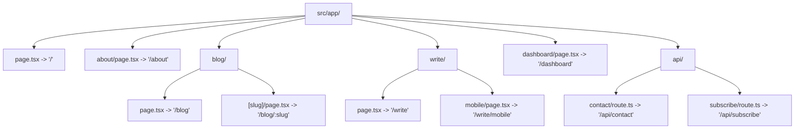
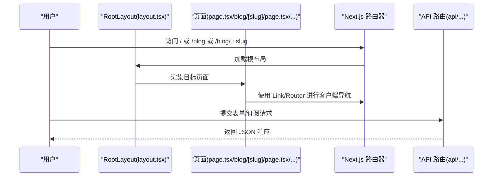
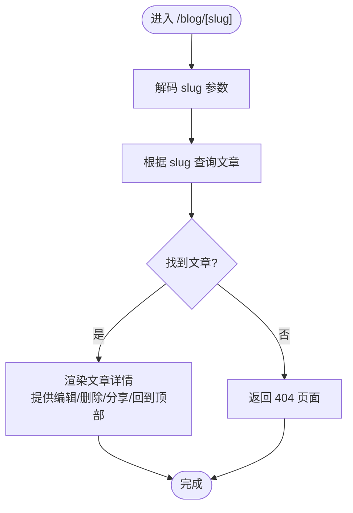
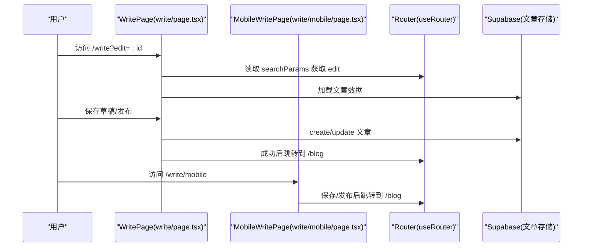
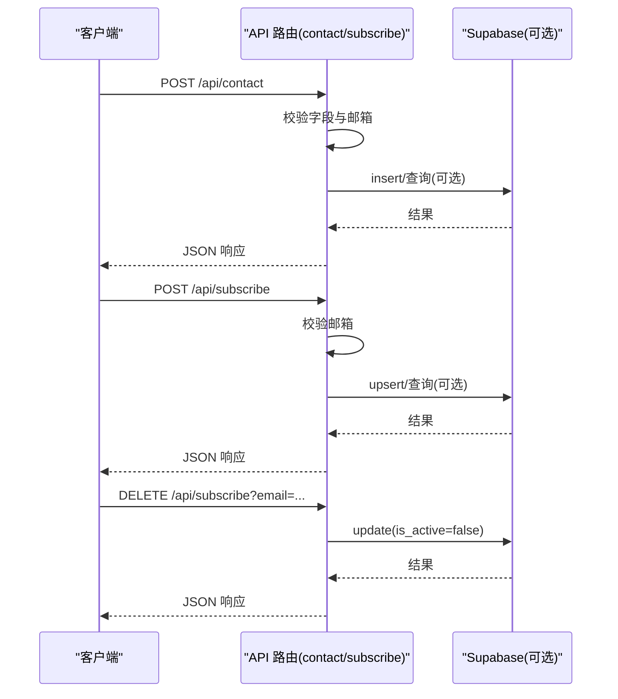
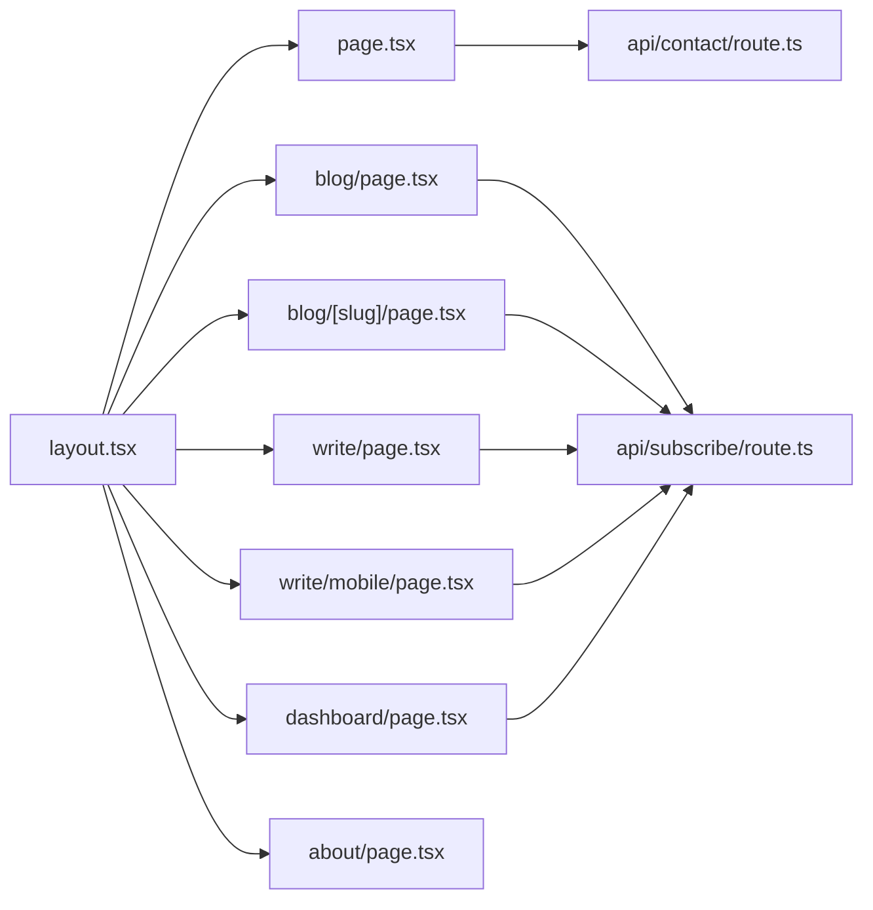

# 路由与导航

<cite>
**本文引用的文件**
- [src/app/layout.tsx](file://src/app/layout.tsx)
- [src/app/page.tsx](file://src/app/page.tsx)
- [src/app/blog/page.tsx](file://src/app/blog/page.tsx)
- [src/app/blog/[slug]/page.tsx](file://src/app/blog/[slug]/page.tsx)
- [src/app/write/page.tsx](file://src/app/write/page.tsx)
- [src/app/write/mobile/page.tsx](file://src/app/write/mobile/page.tsx)
- [src/app/dashboard/page.tsx](file://src/app/dashboard/page.tsx)
- [src/app/about/page.tsx](file://src/app/about/page.tsx)
- [src/app/api/contact/route.ts](file://src/app/api/contact/route.ts)
- [src/app/api/subscribe/route.ts](file://src/app/api/subscribe/route.ts)
- [next.config.ts](file://next.config.ts)
- [tsconfig.json](file://tsconfig.json)
- [package.json](file://package.json)
</cite>

## 目录
1. [简介](#简介)
2. [项目结构](#项目结构)
3. [核心组件](#核心组件)
4. [架构总览](#架构总览)
5. [详细组件分析](#详细组件分析)
6. [依赖关系分析](#依赖关系分析)
7. [性能考量](#性能考量)
8. [故障排查指南](#故障排查指南)
9. [结论](#结论)
10. [附录](#附录)

## 简介
本文件系统性地文档化该 Next.js App Router 项目的路由机制与导航工作流，重点解释：
- 静态路由（如 /about）与动态路由（如 /blog/[slug]）的实现方式与差异
- layout.tsx 如何定义全局共享布局结构，并影响页面渲染
- 不同页面（写作页 write、仪表盘 dashboard、博客详情 blog/[slug]）如何继承并定制布局
- 客户端导航与服务端渲染的协同工作流程
- 动态参数提取、嵌套路由与并行路由的使用场景
- 新增页面的正确配置方法，确保 SEO 友好性与用户体验一致性

## 项目结构
该项目采用 Next.js App Router 的文件系统路由约定，页面按目录层级映射到 URL 路径。根目录下的页面文件作为顶层路由，动态段通过方括号命名的目录实现。

图表来源
- [src/app/layout.tsx](file://src/app/layout.tsx#L1-L100)
- [src/app/page.tsx](file://src/app/page.tsx#L1-L497)
- [src/app/about/page.tsx](file://src/app/about/page.tsx#L1-L325)
- [src/app/blog/page.tsx](file://src/app/blog/page.tsx#L1-L347)
- [src/app/blog/[slug]/page.tsx](file://src/app/blog/[slug]/page.tsx#L1-L372)
- [src/app/write/page.tsx](file://src/app/write/page.tsx#L1-L696)
- [src/app/write/mobile/page.tsx](file://src/app/write/mobile/page.tsx#L1-L344)
- [src/app/dashboard/page.tsx](file://src/app/dashboard/page.tsx#L1-L485)
- [src/app/api/contact/route.ts](file://src/app/api/contact/route.ts#L1-L69)
- [src/app/api/subscribe/route.ts](file://src/app/api/subscribe/route.ts#L1-L145)

章节来源
- [src/app/layout.tsx](file://src/app/layout.tsx#L1-L100)
- [src/app/page.tsx](file://src/app/page.tsx#L1-L497)
- [src/app/blog/page.tsx](file://src/app/blog/page.tsx#L1-L347)
- [src/app/blog/[slug]/page.tsx](file://src/app/blog/[slug]/page.tsx#L1-L372)
- [src/app/write/page.tsx](file://src/app/write/page.tsx#L1-L696)
- [src/app/write/mobile/page.tsx](file://src/app/write/mobile/page.tsx#L1-L344)
- [src/app/dashboard/page.tsx](file://src/app/dashboard/page.tsx#L1-L485)
- [src/app/about/page.tsx](file://src/app/about/page.tsx#L1-L325)
- [src/app/api/contact/route.ts](file://src/app/api/contact/route.ts#L1-L69)
- [src/app/api/subscribe/route.ts](file://src/app/api/subscribe/route.ts#L1-L145)

## 核心组件
- 全局布局与主题：layout.tsx 提供全局 HTML 结构、主题与字体上下文、全局背景与侧边栏容器，所有页面共享该布局骨架。
- 首页与导航：page.tsx 作为根路由，包含导航链接至 /blog 与 /about，体现静态路由的使用。
- 博客列表与详情：blog/page.tsx 展示文章列表；blog/[slug]/page.tsx 使用动态段 [slug] 实现文章详情页。
- 写作与移动端适配：write/page.tsx 为桌面端写作入口；write/mobile/page.tsx 为移动端写作入口，二者通过参数控制行为。
- 仪表盘：dashboard/page.tsx 提供文章管理界面，包含筛选、发布/下架、删除等操作。
- API 路由：api/contact/route.ts 与 api/subscribe/route.ts 提供服务端接口，支持表单提交与订阅管理。
- 构建配置：next.config.ts 配置图片远程来源；tsconfig.json 配置路径别名与严格模式；package.json 指定 Next.js 版本与依赖。

章节来源
- [src/app/layout.tsx](file://src/app/layout.tsx#L1-L100)
- [src/app/page.tsx](file://src/app/page.tsx#L1-L497)
- [src/app/blog/page.tsx](file://src/app/blog/page.tsx#L1-L347)
- [src/app/blog/[slug]/page.tsx](file://src/app/blog/[slug]/page.tsx#L1-L372)
- [src/app/write/page.tsx](file://src/app/write/page.tsx#L1-L696)
- [src/app/write/mobile/page.tsx](file://src/app/write/mobile/page.tsx#L1-L344)
- [src/app/dashboard/page.tsx](file://src/app/dashboard/page.tsx#L1-L485)
- [src/app/api/contact/route.ts](file://src/app/api/contact/route.ts#L1-L69)
- [src/app/api/subscribe/route.ts](file://src/app/api/subscribe/route.ts#L1-L145)
- [next.config.ts](file://next.config.ts#L1-L24)
- [tsconfig.json](file://tsconfig.json#L1-L35)
- [package.json](file://package.json#L1-L40)

## 架构总览
App Router 的路由与导航工作流如下：
- 路由解析：根据 URL 匹配文件系统中的页面文件或动态段。
- 布局继承：layout.tsx 作为根布局，包裹所有页面，提供统一的头部、主题、字体与全局背景。
- 客户端导航：页面内使用 next/link 或 next/navigation 的 useRouter 实现客户端跳转，避免整页刷新。
- 服务端渲染：API 路由在服务端执行，返回 JSON 响应，不触发客户端水合。
- 动态参数：动态段 [slug] 在运行时解析为 params，用于查询数据库或渲染详情。

图表来源
- [src/app/layout.tsx](file://src/app/layout.tsx#L1-L100)
- [src/app/page.tsx](file://src/app/page.tsx#L1-L497)
- [src/app/blog/[slug]/page.tsx](file://src/app/blog/[slug]/page.tsx#L1-L372)
- [src/app/api/contact/route.ts](file://src/app/api/contact/route.ts#L1-L69)
- [src/app/api/subscribe/route.ts](file://src/app/api/subscribe/route.ts#L1-L145)

## 详细组件分析

### 布局系统与共享结构（layout.tsx）
- 全局元数据与字体：定义站点标题、描述、Open Graph 等元数据；加载多套字体资源，保证中英文排版体验。
- 主题与字体上下文：ThemeProvider、FontProvider、AdminProvider 提供主题切换、字体设置与管理员权限上下文。
- 全局背景与侧边栏：固定背景层、粒子背景、侧边栏容器，主内容区通过 main 包裹 children。
- 作用域：作为根布局，所有页面共享该结构，确保一致的视觉与交互体验。

章节来源
- [src/app/layout.tsx](file://src/app/layout.tsx#L1-L100)

### 静态路由示例：首页与关于页
- 首页（/）：page.tsx 使用客户端组件，包含导航链接至 /blog 与 /about，展示特性卡片、最新文章与订阅模块。
- 关于页（/about）：about/page.tsx 展示个人信息、技能、经历与兴趣，使用动画组件增强交互。

章节来源
- [src/app/page.tsx](file://src/app/page.tsx#L1-L497)
- [src/app/about/page.tsx](file://src/app/about/page.tsx#L1-L325)

### 动态路由示例：博客详情（/blog/[slug]）
- 动态段 [slug]：通过 [slug]/page.tsx 实现动态路由，params 中包含 slug。
- 参数解析：使用 use(params) 解析动态参数，decodeURIComponent 处理 URL 编码的 slug。
- 数据加载：调用 getPostBySlug 获取文章详情，同时增加浏览量。
- 管理功能：管理员可编辑或删除文章；提供复制链接、回到顶部、字体设置等交互。

图表来源
- [src/app/blog/[slug]/page.tsx](file://src/app/blog/[slug]/page.tsx#L1-L372)

章节来源
- [src/app/blog/[slug]/page.tsx](file://src/app/blog/[slug]/page.tsx#L1-L372)

### 写作流程与参数传递（/write 与 /write/mobile）
- 桌面端写入（/write）：write/page.tsx 支持富文本编辑、封面上传、SEO 设置、标签管理、草稿保存与发布；通过 useSearchParams 读取 edit 参数以支持编辑模式。
- 移动端写入（/write/mobile）：write/mobile/page.tsx 提供简化编辑器与分类选择，逻辑与桌面端类似，但 UI 更适合移动端。
- 权限控制：均通过 useAdmin 判断管理员权限，非管理员引导登录。
- 导航与反馈：使用 useRouter 进行页面跳转与返回，使用通知组件反馈操作结果。

图表来源
- [src/app/write/page.tsx](file://src/app/write/page.tsx#L1-L696)
- [src/app/write/mobile/page.tsx](file://src/app/write/mobile/page.tsx#L1-L344)

章节来源
- [src/app/write/page.tsx](file://src/app/write/page.tsx#L1-L696)
- [src/app/write/mobile/page.tsx](file://src/app/write/mobile/page.tsx#L1-L344)

### 仪表盘与文章管理（/dashboard）
- 数据来源：dashboard/page.tsx 通过本地存储（blog-store）读取文章列表，提供筛选、排序与状态切换。
- 操作能力：支持发布/下架、删除、查看、编辑等操作；通过 Link 与 Router 实现导航。
- 用户体验：使用动画组件提升交互流畅度，提供通知与模态框。

章节来源
- [src/app/dashboard/page.tsx](file://src/app/dashboard/page.tsx#L1-L485)

### API 路由与服务端协作
- 联系表单（/api/contact）：接收 JSON 请求体，校验必填字段与邮箱格式，若配置了 Supabase 则写入数据库，否则记录日志。
- 订阅管理（/api/subscribe）：POST 新增订阅，检查重复；DELETE 取消订阅，更新状态。

图表来源
- [src/app/api/contact/route.ts](file://src/app/api/contact/route.ts#L1-L69)
- [src/app/api/subscribe/route.ts](file://src/app/api/subscribe/route.ts#L1-L145)

章节来源
- [src/app/api/contact/route.ts](file://src/app/api/contact/route.ts#L1-L69)
- [src/app/api/subscribe/route.ts](file://src/app/api/subscribe/route.ts#L1-L145)

### 客户端导航与服务端渲染协同
- 客户端导航：页面内使用 next/link 与 next/navigation 的 useRouter 实现无刷新跳转，提升交互性能。
- 服务端渲染：API 路由在服务端执行，返回 JSON，不触发客户端水合，降低首屏负担。
- 动态参数：动态段 [slug] 在运行时解析为 params，用于查询与渲染，确保 SEO 友好与缓存友好。

章节来源
- [src/app/page.tsx](file://src/app/page.tsx#L1-L497)
- [src/app/blog/[slug]/page.tsx](file://src/app/blog/[slug]/page.tsx#L1-L372)
- [src/app/api/contact/route.ts](file://src/app/api/contact/route.ts#L1-L69)
- [src/app/api/subscribe/route.ts](file://src/app/api/subscribe/route.ts#L1-L145)

## 依赖关系分析
- 路由依赖：Next.js 文件系统路由约定决定 URL 与页面文件的映射关系；动态段 [slug] 依赖运行时参数解析。
- 组件依赖：各页面依赖 layout.tsx 提供的全局上下文（主题、字体、权限），并通过 next/link 与 next/navigation 实现导航。
- 数据依赖：博客详情与写作页依赖 Supabase 存储；API 路由依赖 Supabase 客户端进行数据持久化。
- 构建与类型：tsconfig.json 配置路径别名与严格模式；next.config.ts 配置图片远程来源；package.json 指定 Next.js 版本与依赖。

图表来源
- [src/app/layout.tsx](file://src/app/layout.tsx#L1-L100)
- [src/app/page.tsx](file://src/app/page.tsx#L1-L497)
- [src/app/blog/page.tsx](file://src/app/blog/page.tsx#L1-L347)
- [src/app/blog/[slug]/page.tsx](file://src/app/blog/[slug]/page.tsx#L1-L372)
- [src/app/write/page.tsx](file://src/app/write/page.tsx#L1-L696)
- [src/app/write/mobile/page.tsx](file://src/app/write/mobile/page.tsx#L1-L344)
- [src/app/dashboard/page.tsx](file://src/app/dashboard/page.tsx#L1-L485)
- [src/app/about/page.tsx](file://src/app/about/page.tsx#L1-L325)
- [src/app/api/contact/route.ts](file://src/app/api/contact/route.ts#L1-L69)
- [src/app/api/subscribe/route.ts](file://src/app/api/subscribe/route.ts#L1-L145)

章节来源
- [src/app/layout.tsx](file://src/app/layout.tsx#L1-L100)
- [src/app/page.tsx](file://src/app/page.tsx#L1-L497)
- [src/app/blog/page.tsx](file://src/app/blog/page.tsx#L1-L347)
- [src/app/blog/[slug]/page.tsx](file://src/app/blog/[slug]/page.tsx#L1-L372)
- [src/app/write/page.tsx](file://src/app/write/page.tsx#L1-L696)
- [src/app/write/mobile/page.tsx](file://src/app/write/mobile/page.tsx#L1-L344)
- [src/app/dashboard/page.tsx](file://src/app/dashboard/page.tsx#L1-L485)
- [src/app/about/page.tsx](file://src/app/about/page.tsx#L1-L325)
- [src/app/api/contact/route.ts](file://src/app/api/contact/route.ts#L1-L69)
- [src/app/api/subscribe/route.ts](file://src/app/api/subscribe/route.ts#L1-L145)

## 性能考量
- 图片优化：next.config.ts 配置了允许的远程图片来源，减少跨域与安全风险。
- 严格类型与路径别名：tsconfig.json 启用严格模式与路径别名，有助于构建期优化与 IDE 支持。
- 客户端水合：页面使用 'use client'，仅在必要处启用客户端逻辑，避免过度水合。
- 动态段与懒加载：动态段 [slug] 在运行时解析，结合 Suspense 与条件渲染，减少首屏压力。
- 动画与滚动：使用 Framer Motion 控制动画与滚动行为，注意在移动端的性能开销。

章节来源
- [next.config.ts](file://next.config.ts#L1-L24)
- [tsconfig.json](file://tsconfig.json#L1-L35)
- [src/app/write/page.tsx](file://src/app/write/page.tsx#L1-L696)
- [src/app/blog/[slug]/page.tsx](file://src/app/blog/[slug]/page.tsx#L1-L372)

## 故障排查指南
- 动态参数为空或异常：
  - 确认 URL 中的 slug 是否正确编码；在 [slug]/page.tsx 中使用 decodeURIComponent 解码。
  - 检查 getPostBySlug 的实现与数据库连接。
- 写作权限问题：
  - 非管理员访问 /write 会弹出登录提示；确保 useAdmin 正确初始化。
- API 路由错误：
  - /api/contact：检查必填字段与邮箱格式；若未配置 Supabase，将仅记录日志。
  - /api/subscribe：检查邮箱格式与重复订阅逻辑；DELETE 需提供 email 查询参数。
- 图片加载失败：
  - 确认 next.config.ts 中的 remotePatterns 是否包含目标域名。

章节来源
- [src/app/blog/[slug]/page.tsx](file://src/app/blog/[slug]/page.tsx#L1-L372)
- [src/app/write/page.tsx](file://src/app/write/page.tsx#L1-L696)
- [src/app/api/contact/route.ts](file://src/app/api/contact/route.ts#L1-L69)
- [src/app/api/subscribe/route.ts](file://src/app/api/subscribe/route.ts#L1-L145)
- [next.config.ts](file://next.config.ts#L1-L24)

## 结论
该系统基于 Next.js App Router 的文件系统路由实现了清晰的静态与动态路由结构，layout.tsx 提供统一的全局布局与上下文，页面通过客户端导航与服务端 API 路由协同工作。动态段 [slug] 与参数解析确保了博客详情页的 SEO 友好与可扩展性；写作与仪表盘页面提供了完整的创作与管理体验。通过合理的依赖与配置，系统在性能与可维护性之间取得了良好平衡。

## 附录
- 新增页面步骤建议：
  1. 在 src/app 下创建目标目录与 page.tsx。
  2. 在页面中使用 next/link 或 next/navigation 进行导航。
  3. 若为动态路由，使用 [param]/page.tsx 并在页面中解析 params。
  4. 如需 API 能力，新增 /api/xxx/route.ts 并在页面中调用。
  5. 确保 SEO：在页面中设置合适的标题、描述与 Open Graph 元数据。
  6. 遵循现有布局与上下文（ThemeProvider、FontProvider、AdminProvider）以保持一致性。
- SEO 与用户体验要点：
  - 使用语义化的标题与描述，避免过长或重复。
  - 为动态路由提供稳定的 slug 规则，避免频繁变更。
  - 为关键页面提供面包屑或返回导航，提升可发现性。
  - 对图片与第三方资源进行安全与性能优化配置。