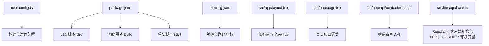
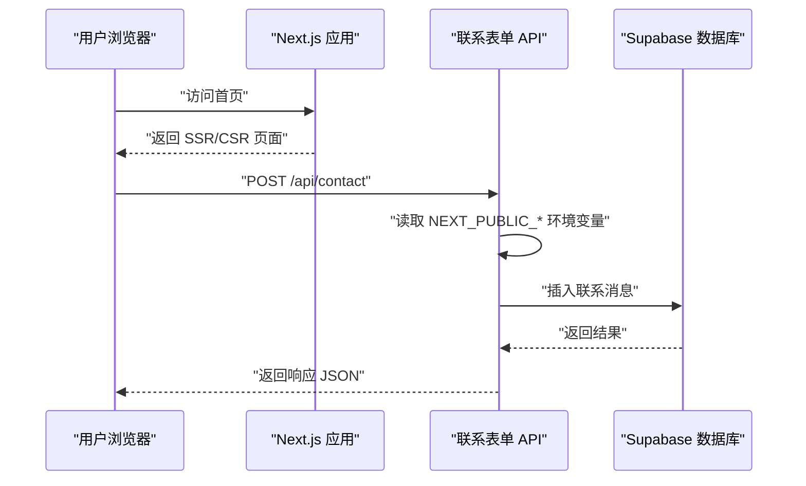
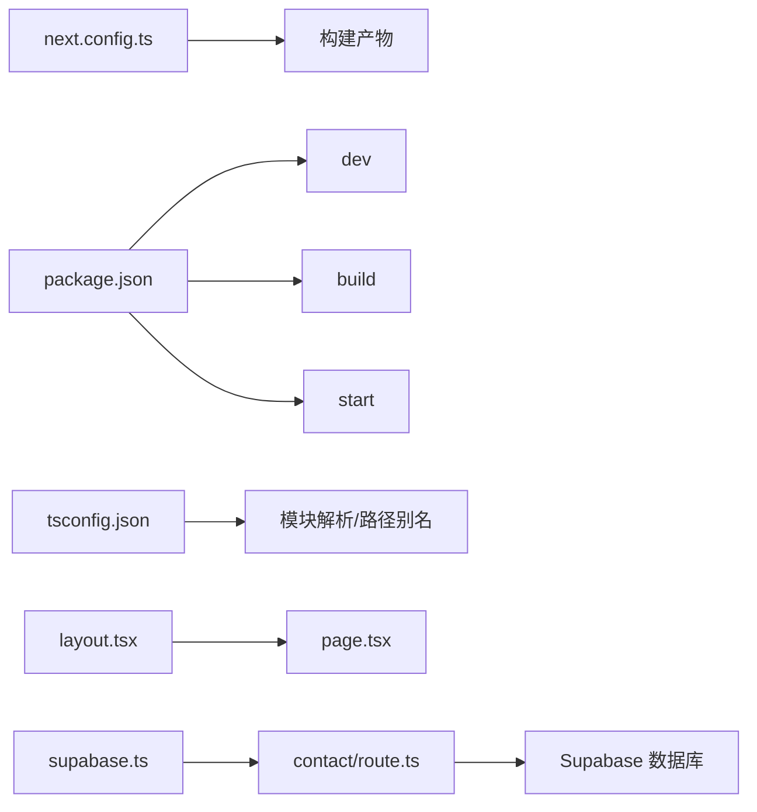

# 部署与构建

<cite>
**本文引用的文件**
- [next.config.ts](file://next.config.ts)
- [package.json](file://package.json)
- [tsconfig.json](file://tsconfig.json)
- [README.md](file://README.md)
- [src/app/layout.tsx](file://src/app/layout.tsx)
- [src/app/page.tsx](file://src/app/page.tsx)
- [src/app/api/contact/route.ts](file://src/app/api/contact/route.ts)
- [src/lib/supabase.ts](file://src/lib/supabase.ts)
</cite>

## 目录
1. [简介](#简介)
2. [项目结构](#项目结构)
3. [核心组件](#核心组件)
4. [架构总览](#架构总览)
5. [详细组件分析](#详细组件分析)
6. [依赖关系分析](#依赖关系分析)
7. [性能考虑](#性能考虑)
8. [故障排查指南](#故障排查指南)
9. [结论](#结论)
10. [附录](#附录)

## 简介
本指南围绕该项目的构建与部署展开，重点解析 next.config.ts 中的关键配置项（输出目标、图像优化、远程图片白名单），梳理 package.json 中构建脚本（dev、build、start）的执行流程，并提供在 Vercel、Netlify 等平台进行 CI/CD 自动化部署的实践建议。同时给出环境区分（开发、预发布、生产）的最佳实践，以及性能优化策略（代码分割、静态生成 SSG、增量静态再生 ISR）的配置思路与常见部署问题排查步骤。

## 项目结构
该项目采用 Next.js App Router 结构，核心目录与文件如下：
- next.config.ts：Next.js 构建配置入口，包含图像优化相关设置。
- package.json：定义开发、构建与启动脚本，声明运行时依赖与开发依赖。
- tsconfig.json：TypeScript 编译选项与路径别名配置。
- src/app/*：页面与 API 路由，例如首页、联系表单 API、博客列表页等。
- src/lib/supabase.ts：Supabase 客户端初始化与数据访问封装，使用 NEXT_PUBLIC_* 前缀的客户端环境变量。

图表来源
- [next.config.ts](file://next.config.ts#L1-L24)
- [package.json](file://package.json#L1-L40)
- [tsconfig.json](file://tsconfig.json#L1-L35)
- [src/app/layout.tsx](file://src/app/layout.tsx#L1-L100)
- [src/app/page.tsx](file://src/app/page.tsx#L1-L497)
- [src/app/api/contact/route.ts](file://src/app/api/contact/route.ts#L1-L68)
- [src/lib/supabase.ts](file://src/lib/supabase.ts#L1-L10)

章节来源
- [next.config.ts](file://next.config.ts#L1-L24)
- [package.json](file://package.json#L1-L40)
- [tsconfig.json](file://tsconfig.json#L1-L35)
- [src/app/layout.tsx](file://src/app/layout.tsx#L1-L100)
- [src/app/page.tsx](file://src/app/page.tsx#L1-L497)
- [src/app/api/contact/route.ts](file://src/app/api/contact/route.ts#L1-L68)
- [src/lib/supabase.ts](file://src/lib/supabase.ts#L1-L10)

## 核心组件
- 构建配置（next.config.ts）
  - 图像优化：启用未优化模式并配置远程图片白名单，允许从指定域名加载图片资源。
- 构建脚本（package.json）
  - dev：启动开发服务器。
  - build：执行 Next.js 构建，生成静态产物与运行时代码。
  - start：启动生产服务器，加载构建产物。
- TypeScript 配置（tsconfig.json）
  - 设置模块解析为 bundler，启用严格模式与增量编译，配置路径别名 @/* 指向 src/*。
- 根布局（src/app/layout.tsx）
  - 提供全局样式、主题与字体提供器，定义站点元数据。
- 首页（src/app/page.tsx）
  - 展示主页内容，调用 Supabase 获取已发布文章列表。
- 联系表单 API（src/app/api/contact/route.ts）
  - 使用 NEXT_PUBLIC_* 环境变量初始化 Supabase 客户端，接收表单提交并写入数据库或记录日志。
- Supabase 客户端（src/lib/supabase.ts）
  - 初始化客户端，导出常用数据访问函数；读取 NEXT_PUBLIC_* 环境变量。

章节来源
- [next.config.ts](file://next.config.ts#L1-L24)
- [package.json](file://package.json#L1-L40)
- [tsconfig.json](file://tsconfig.json#L1-L35)
- [src/app/layout.tsx](file://src/app/layout.tsx#L1-L100)
- [src/app/page.tsx](file://src/app/page.tsx#L1-L497)
- [src/app/api/contact/route.ts](file://src/app/api/contact/route.ts#L1-L68)
- [src/lib/supabase.ts](file://src/lib/supabase.ts#L1-L10)

## 架构总览
下图展示了从浏览器请求到页面渲染与 API 调用的整体流程，包括开发、构建与生产阶段的关键节点。

图表来源
- [src/app/api/contact/route.ts](file://src/app/api/contact/route.ts#L1-L68)
- [src/lib/supabase.ts](file://src/lib/supabase.ts#L1-L10)

## 详细组件分析

### 构建配置（next.config.ts）
- 输出目标与图像优化
  - 当前配置启用未优化模式，并通过 remotePatterns 白名单允许从指定域名加载图片资源。这适用于需要直接使用外部图片链接的场景。
- 环境变量处理
  - 本仓库未在 next.config.ts 中显式声明环境变量，但应用通过 NEXT_PUBLIC_* 前缀在运行时注入客户端可用的环境变量（例如 Supabase URL 与匿名密钥）。

章节来源
- [next.config.ts](file://next.config.ts#L1-L24)
- [src/lib/supabase.ts](file://src/lib/supabase.ts#L1-L10)

### 构建脚本（package.json）
- 开发脚本 dev
  - 启动 Next.js 开发服务器，支持热更新与调试。
- 构建脚本 build
  - 执行 Next.js 构建，生成静态页面与运行时代码，准备生产环境部署。
- 启动脚本 start
  - 在生产环境中加载构建产物，启动服务器对外提供服务。

章节来源
- [package.json](file://package.json#L1-L40)

### TypeScript 配置（tsconfig.json）
- 模块解析与路径别名
  - moduleResolution 设置为 bundler，便于现代打包器正确解析模块。
  - paths 配置 @/* 指向 src/*，简化导入路径书写。
- 编译选项
  - strict 严格模式提升类型安全；incremental 增量编译提升开发体验；noEmit 禁止输出 JS 文件（由 Next.js 负责）。

章节来源
- [tsconfig.json](file://tsconfig.json#L1-L35)

### 根布局（src/app/layout.tsx）
- 全局样式与主题
  - 引入全局样式与主题提供器，确保页面具备统一的主题与字体体系。
- 元数据与字体
  - 定义站点标题、描述与 Open Graph 元信息；引入多套中英文字体以优化排版与可读性。

章节来源
- [src/app/layout.tsx](file://src/app/layout.tsx#L1-L100)

### 首页（src/app/page.tsx）
- 功能概览
  - 展示主页内容，包含特性卡片、统计信息、最新文章区块与订阅表单区域。
  - 通过 Supabase 获取已发布文章列表，映射为页面所需的数据结构。
- 性能注意
  - 首屏渲染可通过静态生成（SSG）或服务端渲染（SSR）优化；若文章列表不频繁变化，建议优先考虑 SSG 以降低运行时开销。

章节来源
- [src/app/page.tsx](file://src/app/page.tsx#L1-L497)
- [src/lib/supabase.ts](file://src/lib/supabase.ts#L108-L125)

### 联系表单 API（src/app/api/contact/route.ts）
- 请求处理流程
  - 解析请求体，校验必填字段与邮箱格式。
  - 若配置了 Supabase URL 与匿名密钥，则创建客户端并写入数据库；否则仅记录日志。
  - 返回标准化的响应状态与消息。
- 环境变量使用
  - 读取 NEXT_PUBLIC_* 环境变量初始化 Supabase 客户端，确保在客户端可见。

章节来源
- [src/app/api/contact/route.ts](file://src/app/api/contact/route.ts#L1-L68)
- [src/lib/supabase.ts](file://src/lib/supabase.ts#L1-L10)

### Supabase 客户端（src/lib/supabase.ts）
- 初始化与导出
  - 从 NEXT_PUBLIC_* 环境变量读取 Supabase URL 与匿名密钥，创建客户端实例。
  - 导出常用数据访问函数，如获取已发布文章、联系消息、相册与歌曲等。
- 错误处理
  - 对数据库操作返回的错误进行抛出或转换，便于上层捕获与展示。

章节来源
- [src/lib/supabase.ts](file://src/lib/supabase.ts#L1-L10)
- [src/lib/supabase.ts](file://src/lib/supabase.ts#L108-L125)

## 依赖关系分析
- 组件耦合与职责
  - next.config.ts 与 package.json 分别负责构建配置与脚本生命周期。
  - tsconfig.json 影响编译与模块解析，间接影响构建产物与运行时行为。
  - layout.tsx 作为根布局，承载全局样式与主题；page.tsx 依赖 Supabase 获取数据。
  - contact API 与 Supabase 客户端紧密耦合，共同完成表单提交与数据持久化。
- 外部依赖
  - Next.js 版本与 React 生态；Supabase 客户端；字体与动画库等。

图表来源
- [next.config.ts](file://next.config.ts#L1-L24)
- [package.json](file://package.json#L1-L40)
- [tsconfig.json](file://tsconfig.json#L1-L35)
- [src/app/layout.tsx](file://src/app/layout.tsx#L1-L100)
- [src/app/page.tsx](file://src/app/page.tsx#L1-L497)
- [src/app/api/contact/route.ts](file://src/app/api/contact/route.ts#L1-L68)
- [src/lib/supabase.ts](file://src/lib/supabase.ts#L1-L10)

## 性能考虑
- 代码分割
  - 利用 Next.js 的路由级代码分割，将非首屏组件按需加载，减少初始包体积。
- 静态生成（SSG）
  - 对于内容稳定且无需实时数据的页面（如静态博客列表页），可使用 SSG 生成静态 HTML，显著降低运行时压力。
- 增量静态再生（ISR）
  - 对需要定期更新的内容（如博客列表），可结合 ISR 在后台增量更新静态页面，兼顾时效性与性能。
- 图像优化
  - 当前 next.config.ts 已配置远程图片白名单；如需更优的图像体验，可考虑启用官方图像优化器并配合现代格式（WebP/JPEG XL）与尺寸裁剪。
- 构建与缓存
  - 使用 package.json 中的 build 脚本生成产物，结合平台缓存策略（如 Vercel 的构建缓存）加速部署。

[本节为通用性能建议，不直接分析具体文件，故无章节来源]

## 故障排查指南
- 构建失败
  - 检查 package.json 中的脚本是否正确；确认 Node 版本与依赖安装完整。
  - 若出现 TypeScript 相关错误，检查 tsconfig.json 的编译选项与路径别名配置。
- 图像加载异常
  - 确认 next.config.ts 中 remotePatterns 是否包含目标域名；检查图片 URL 协议与路径是否匹配。
- 环境变量缺失
  - 联系表单 API 依赖 NEXT_PUBLIC_* 环境变量；在本地或平台 CI 中补齐对应变量值。
- Supabase 连接问题
  - 确认 Supabase URL 与匿名密钥配置正确；检查网络连通性与防火墙设置。
- 首页数据为空
  - 检查 Supabase 表是否存在已发布文章；确认 getPublishedPosts 查询条件与排序逻辑。

章节来源
- [package.json](file://package.json#L1-L40)
- [tsconfig.json](file://tsconfig.json#L1-L35)
- [next.config.ts](file://next.config.ts#L1-L24)
- [src/app/api/contact/route.ts](file://src/app/api/contact/route.ts#L1-L68)
- [src/lib/supabase.ts](file://src/lib/supabase.ts#L108-L125)

## 结论
本项目基于 Next.js App Router 构建，具备清晰的配置与脚本分工。通过合理配置 next.config.ts 的图像优化与白名单、规范 package.json 的构建与启动脚本、以及在平台 CI/CD 中正确注入环境变量，可实现稳定高效的自动化部署。结合 SSG/ISR 等策略可进一步提升性能与用户体验。

[本节为总结性内容，不直接分析具体文件，故无章节来源]

## 附录

### 平台部署与 CI/CD 配置建议
- Vercel
  - 使用平台默认的 Next.js 集成，自动识别构建命令与输出目录。
  - 在环境变量中配置 NEXT_PUBLIC_* 与后端服务所需的密钥。
  - 可开启边缘函数与 ISR 支持以优化性能。
- Netlify
  - 使用 Next.js 构建产物作为静态站点部署；如需 API，可使用 Netlify Functions 或托管在 Supabase Edge Functions。
  - 在构建设置中配置环境变量与构建命令。
- 通用最佳实践
  - 区分环境：开发（local）、预发布（staging）、生产（prod），分别使用不同的环境变量与域名。
  - 安全：仅将 NEXT_PUBLIC_* 暴露给客户端，敏感密钥置于服务端环境变量。
  - 缓存：利用平台缓存与 CDN，减少重复构建与传输成本。

[本节为通用部署建议，不直接分析具体文件，故无章节来源]