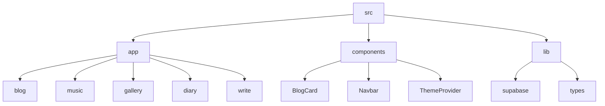
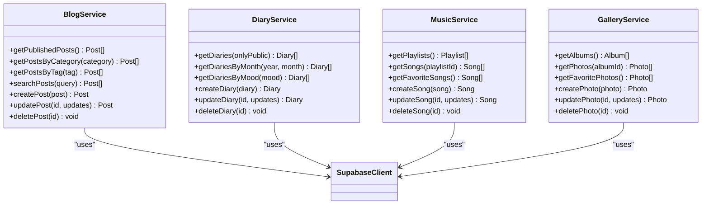
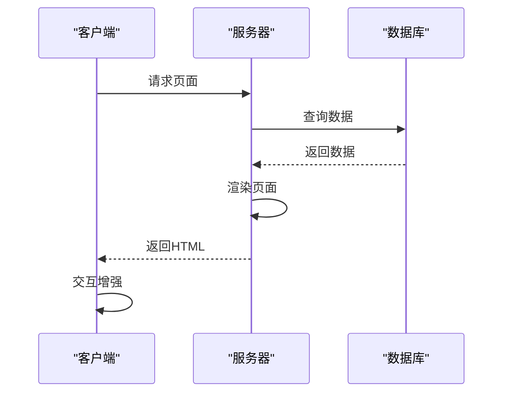
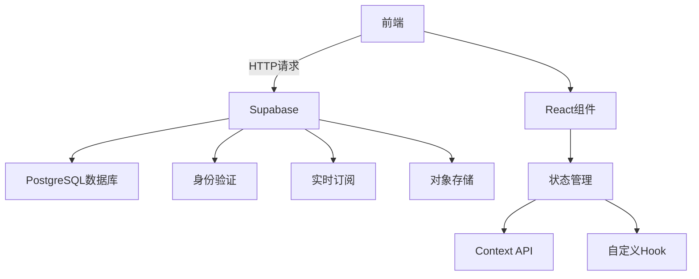

# 项目概述

<cite>
**本文档引用的文件**   
- [page.tsx](file://src/app/page.tsx)
- [layout.tsx](file://src/app/layout.tsx)
- [supabase.ts](file://src/lib/supabase.ts)
- [schema.sql](file://supabase/schema.sql)
- [BlogCard.tsx](file://src/components/BlogCard.tsx)
- [types.ts](file://src/lib/types.ts)
- [blog/page.tsx](file://src/app/blog/page.tsx)
- [music/page.tsx](file://src/app/music/page.tsx)
- [gallery/page.tsx](file://src/app/gallery/page.tsx)
- [diary/page.tsx](file://src/app/diary/page.tsx)
- [package.json](file://package.json)
- [next.config.ts](file://next.config.ts)
</cite>

## 目录
1. [引言](#引言)
2. [项目结构](#项目结构)
3. [核心功能](#核心功能)
4. [架构优势](#架构优势)
5. [技术选型分析](#技术选型分析)
6. [目标受众](#目标受众)
7. [结论](#结论)

## 引言

“拾光”是一个现代化的个人博客系统，旨在为内容创作者提供一个集内容创作、多类型展示和个性化阅读体验于一体的全栈应用平台。该项目基于Next.js框架构建，采用服务端渲染（SSR）和React Server Components等先进技术，为用户提供高性能的浏览体验。系统不仅支持传统的文章发布功能，还集成了日记、照片、音乐等多种内容形式，满足用户全方位的内容展示需求。

通过深入分析代码库，我们发现“拾光”博客系统的设计理念是“在文字中拾起生活的微光”，致力于帮助用户记录生活点滴，分享知识见解。系统提供了丰富的交互效果和视觉设计，如粒子背景动画、3D倾斜效果和渐变光晕等，为用户创造沉浸式的阅读体验。同时，系统还具备完善的管理功能，支持内容的分类、搜索和筛选，方便用户组织和管理自己的数字内容。

**Section sources**
- [page.tsx](file://src/app/page.tsx#L1-L497)
- [layout.tsx](file://src/app/layout.tsx#L1-L100)

## 项目结构

“拾光”博客系统的项目结构遵循Next.js的App Router模式，采用模块化设计，将不同功能的组件和页面分离。项目根目录包含标准的Next.js配置文件，如`package.json`、`next.config.ts`和`tsconfig.json`，以及用于环境管理的`.gitignore`文件。`supabase`目录包含数据库的初始化脚本，定义了所有数据表的结构和关系。

`src`目录是项目的核心，包含三个主要子目录：`app`、`components`和`lib`。`app`目录遵循Next.js的路由约定，每个子目录对应一个页面路由，如`blog`、`music`、`gallery`和`diary`等。`components`目录存放可复用的UI组件，如`BlogCard`、`Navbar`和`ThemeProvider`等。`lib`目录则包含业务逻辑和工具函数，如与Supabase数据库交互的`supabase.ts`和类型定义的`types.ts`。

**Diagram sources **
- [src/app](file://src/app)
- [src/components](file://src/components)
- [src/lib](file://src/lib)

**Section sources**
- [src](file://src)
- [supabase](file://supabase)

## 核心功能

“拾光”博客系统提供了一系列核心功能，旨在满足内容创作者的多样化需求。系统支持文章、日记、照片和音乐四种内容类型，每种类型都有专门的管理界面和展示页面。文章功能支持Markdown格式的内容编辑，包含标题、描述、分类、标签和封面图片等元数据。日记功能则更加注重个人情感的表达，允许用户记录心情、天气和位置等信息。

系统还提供了丰富的交互功能，如文章浏览量统计、点赞功能和内容搜索。通过`supabase.ts`文件中的API函数，系统实现了对各种内容的增删改查操作。例如，`getPublishedPosts`函数用于获取已发布的文章列表，`createDiary`函数用于创建新的日记条目。这些函数通过Supabase客户端与后端数据库进行通信，实现了数据的持久化存储。

**Diagram sources **
- [supabase.ts](file://src/lib/supabase.ts#L108-L643)

**Section sources**
- [supabase.ts](file://src/lib/supabase.ts#L108-L643)
- [types.ts](file://src/lib/types.ts#L1-L95)

## 架构优势

“拾光”博客系统采用了Next.js的现代架构，充分利用了服务端渲染（SSR）和React Server Components的优势。服务端渲染确保了页面在首次加载时就能呈现完整的内容，这对于搜索引擎优化（SEO）至关重要。通过在服务器端预渲染页面，系统能够提供更好的初始加载性能和更高的搜索引擎排名。

React Server Components是Next.js 13引入的一项重要特性，它允许开发者将组件标记为服务器组件，从而减少客户端的JavaScript包大小。在“拾光”系统中，大部分页面组件都是服务器组件，这不仅提高了页面加载速度，还增强了安全性，因为敏感的业务逻辑和数据库查询可以在服务器端执行，而不会暴露给客户端。

**Diagram sources **
- [page.tsx](file://src/app/page.tsx#L39-L496)
- [blog/page.tsx](file://src/app/blog/page.tsx#L22-L346)

**Section sources**
- [page.tsx](file://src/app/page.tsx#L39-L496)
- [next.config.ts](file://next.config.ts#L1-L24)

## 技术选型分析

“拾光”博客系统的技术选型体现了现代Web开发的最佳实践。前端框架选择Next.js，因为它提供了开箱即用的SSR、静态生成和API路由功能，大大简化了全栈应用的开发。状态管理采用React Context API和自定义Hook，如`useAdmin`和`useMotionValue`，实现了组件间的状态共享和动画控制。

后端服务选择Supabase而非传统的自建后端，这是一个关键的技术决策。Supabase提供了PostgreSQL数据库、身份验证、实时订阅和存储服务，开发者无需管理服务器基础设施，可以专注于业务逻辑的实现。通过`@supabase/supabase-js`客户端库，前端可以直接与Supabase API进行交互，实现了前后端的无缝集成。

**Diagram sources **
- [package.json](file://package.json#L1-L40)
- [supabase.ts](file://src/lib/supabase.ts#L1-L708)

**Section sources**
- [package.json](file://package.json#L1-L40)
- [supabase.ts](file://src/lib/supabase.ts#L1-L708)
- [schema.sql](file://supabase/schema.sql#L1-L354)

## 目标受众

“拾光”博客系统的目标受众主要包括内容创作者、开发者和技术爱好者。对于内容创作者而言，系统提供了直观的写作界面和丰富的内容展示形式，帮助他们更好地表达和分享自己的想法。对于开发者，系统展示了Next.js和Supabase的最佳实践，是一个学习现代Web开发技术的优秀范例。

技术爱好者可以通过研究“拾光”的代码库，了解如何构建一个功能完整的全栈应用。系统中的动画效果、响应式设计和性能优化技巧都值得深入学习。此外，系统的开源性质也鼓励社区贡献和二次开发，为技术爱好者提供了实践和创新的机会。

**Section sources**
- [page.tsx](file://src/app/page.tsx#L1-L497)
- [README.md](file://README.md#L1-L37)

## 结论

“拾光”个人博客系统是一个功能全面、架构先进的全栈应用，它成功地将内容创作、多类型展示和个性化阅读体验融为一体。通过采用Next.js和Supabase等现代技术栈，系统实现了高性能、高可维护性和高可扩展性。服务端渲染和React Server Components的使用，不仅提升了用户体验，还优化了SEO效果。

系统的模块化设计和清晰的代码结构，使其易于理解和维护。对于初学者，它提供了一个学习现代Web开发的优秀范例；对于高级开发者，它展示了如何在实际项目中权衡技术选型，实现最佳的开发效率和用户体验。未来，系统可以进一步扩展，如增加评论功能、社交分享和数据分析等，成为一个更加完善的个人内容管理平台。